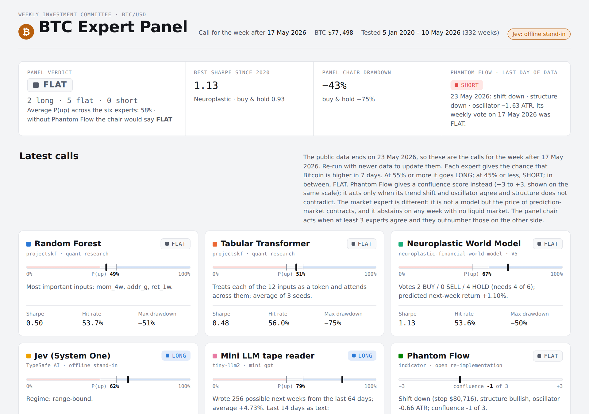

# BTC Expert Panel

A weekly "investment committee" for Bitcoin, backtested on real data. Five AI experts from three of Kwet's projects, the **Phantom Flow** trading indicator, and the **prediction market's own price** each call Bitcoin's next week LONG, FLAT or SHORT. A panel chair acts only when at least 3 agree and they outnumber the other side. Everything is tested walk-forward, out of sample, from January 2020 to May 2026.

**[Open the dashboard](dashboard/index.html)** (download and open in a browser) · **[Plain-English guide](docs/panel-guide.md)** ([Word version](docs/BTC_Expert_Panel_Guide.docx))



## The panel

| Seat | Where it comes from | How it makes its call |
|---|---|---|
| **Random Forest** | Quant research project `projectskf` (`ml exercise.py`) | 300 trees classify next-week direction from 12 inputs |
| **Tabular Transformer** | Quant research project `projectskf` (`ml nn transformer python file.py`) | Each input is a token; attention across inputs; average of 3 seeds |
| **Neuroplastic World Model** | `neuroplastic-financial-world-model` V5 | Six networks learn to predict the next "world state" and next week's return; trades only when 4 of 6 agree |
| **Jev (System One)** | TypeSafe AI decision model | Answers "Will Bitcoin be higher in 7 days?" (probability) and names the regime. **Offline stand-in in this run, not Jev** |
| **Mini LLM tape reader** | `tiny-llm2` mini GPT | Reads the last 64 days of returns written as letters (a = big fall … g = big rise), writes 256 possible next weeks, and counts how many end higher |
| **Phantom Flow** | Open re-implementation of the paid TradingView indicator's three published modules | Trend shift (trailing stop at 3 × ATR), swing structure (break of structure / change of character on 5-day pivots) and oscillator (distance from the 21-day average in ATRs), all on daily closes. LONG or SHORT only when trend and oscillator agree and structure does not contradict. No training; settings fixed in advance; no repainting |
| **Market consensus** | Polymarket / Kalshi BTC contracts — **not a model** | Reads the ladder of "will Bitcoin reach $X" contracts and compares what the crowd pays for a +10% move against an equidistant −10% move. Corrects for the three traps: touch ≠ close, a monthly clock against a weekly question, and the risk premium in any price. **Abstains** on every week with no liquid market |
| **Panel chair** | Panel rule | LONG or SHORT if at least 3 agree and outnumber the other side, otherwise FLAT. The 3-of-5 and 3-of-6 chairs are kept as benchmarks |

**Calls:** P(up) of 55% or more is LONG, 45% or less is SHORT, anything in between is FLAT.

**The 12 inputs**, all from [Coin Metrics community data](https://github.com/coinmetrics/data) (CC BY-NC 4.0) plus the CBOE VIX:
- 1-, 4-, 12- and 26-week returns
- 4-week volatility
- MVRV (market value over the average cost basis of coins)
- drawdown from the 52-week high
- 4-week change in active addresses and in hash rate
- net exchange inflows
- the VIX level and its 4-week change

## Results: 332 weeks out of sample (5 Jan 2020 – 10 May 2026)

These are after 10 bp trading costs, with no leverage.

| Seat | Total return | CAGR | Sharpe | Max drawdown | Hit rate |
|---|---|---|---|---|---|
| Neuroplastic World Model | +1,161% | 48.7% | **1.13** | −50% | 53.6% |
| **Panel chair (6 experts)** | +1,111% | 47.8% | 1.05 | −43% | 56.9% |
| Jev (offline stand-in) | +863% | 42.6% | 0.94 | −45% | 52.5% |
| Chair without Phantom Flow | +671% | 37.7% | 0.93 | **−41%** | **57.6%** |
| Buy & hold | +954% | 44.6% | 0.93 | −75% | 52.1% |
| Phantom Flow | +191% | 18.2% | 0.58 | −58% | 49.4% |
| Mini LLM tape reader | +171% | 16.9% | 0.56 | −77% | 54.8% |
| Random Forest | +122% | 13.3% | 0.50 | −51% | 53.7% |
| Tabular Transformer | +103% | 11.8% | 0.48 | −75% | 56.0% |

**What this shows:**
- **The five-expert chair matched buy-and-hold's Sharpe ratio (0.93) with roughly half the worst loss** (−41% against −75%). It also had the best hit rate. In 2022, when Bitcoin fell 65%, the chair lost 9%.
- **The market expert abstained on every week of this run**, because the Polymarket and Kalshi APIs were unreachable from the build machine. An abstaining expert changes neither the LONG nor the SHORT count, so the panel's figures above are unchanged by it. Run `python code/fetch_markets.py` to fill it in.
- **Phantom Flow was weak alone but independent, and adding it lifted the chair to a Sharpe of 1.05.** That gain may be luck: its 95% bootstrap range is −0.20 to +0.49, and excluding 2020 the two chairs score 0.55 and 0.53. Across all 9 indicator settings tried as a check (ATR × 2–4, pivots of 3–10 days), the chair stays between 0.99 and 1.14. The honest reading is "didn't hurt, may help".
- **The neuroplastic world model was the strongest single expert**, with a Sharpe of 1.13 against 0.93 for buy and hold. The Jev stand-in only just beat buy and hold (0.94).
- **The two quant-project classifiers and the mini LLM underperformed buy and hold.** The mini LLM overfitted: on new data its average surprise (4.9 bits a day) was worse than blind guessing among 7 letters (2.8 bits). Its gains came in 2020–2021, and it lost money in every year from 2022 on.
- **The experts disagree a lot**, which is what makes a panel useful. For example, the world model and the transformer made the same call in only 34% of weeks.

**Caveats:**
- This is one historical path of about 330 weeks.
- 2020–2021 was a strong bull market.
- The Jev figures come from a hand-written stand-in.
- This is research on historical data, not investment advice.

## Latest calls (week after 17 May 2026, BTC $77,498)

The public Coin Metrics files currently end on 23 May 2026, so this is the most recent week that can be scored. Re-run with newer data to update it.

| Seat | Call | P(up) | Why |
|---|---|---|---|
| Random Forest | FLAT | 49% | Most important inputs: 4-week return, active addresses, 1-week return |
| Tabular Transformer | FLAT | 51% | |
| Neuroplastic World Model | FLAT | 67%* | 2 BUY / 0 SELL / 4 HOLD; needs 4 of 6 |
| Jev (stand-in) | LONG | 62% | Regime: range-bound |
| Mini LLM | LONG | 79% | 256 simulated weeks, average +4.7% |
| Phantom Flow | FLAT | score −1 | Trend just flipped down (stop $80,716), oscillator −0.66 ATR, structure still bullish. By 23 May structure had also turned: daily SHORT |
| Market consensus | FLAT | — | Abstained: no prediction-market data fetched in this run |
| **Panel chair** | **FLAT** | 58% avg | 2 long, 4 flat, 0 short |

\* For the world model this is a vote share, (BUY + ½ HOLD) ÷ 6, not a probability.

## Run it

```bash
pip install torch scikit-learn pandas numpy
cd code
python panel_backtest.py        # downloads the data to ../data/, about 12 minutes on a laptop CPU
python fetch_markets.py         # optional: prediction-market data (needs internet)
python pf_effect.py             # did Phantom Flow really help? (bootstrap, ex-2020)
python make_dashboard.py        # rebuilds ../dashboard/index.html
pytest -q ../tests              # Phantom Flow tests, including the no-hindsight check
export TYPESAFE_API_KEY=...     # optional: use the real Jev instead of the stand-in
```

All seeds are fixed, so re-running should reproduce these numbers.

| Path | Contents |
|---|---|
| `code/panel_backtest.py` | Data, features, all six experts, walk-forward loop, metrics, Phantom Flow sensitivity |
| `code/phantom_flow.py` | The Phantom Flow re-implementation: trend shift, structure, oscillator, combined call |
| `code/prediction_market.py` | The market expert: question parsing, the touch ladder, the symmetric lean, the touch→close correction, abstention rules |
| `code/fetch_markets.py` | Builds the weekly market cache from Polymarket or Kalshi (run where there is internet) |
| `code/pf_effect.py` | Bootstrap and ex-2020 check of what Phantom Flow adds to the chair |
| `tests/test_phantom_flow.py` | 6 tests: no look-ahead, trend flips, stop ratchet, BOS/CHoCH, combo rule |
| `tests/test_prediction_market.py` | 20 tests: question parsing, a symmetric ladder giving zero lean, a common premium cancelling, abstention instead of extrapolation, the touch→close halving, and the documented API response shapes |
| `code/jev_market.py` | Jev API client and the offline stand-in |
| `code/dashboard_template.html`, `code/make_dashboard.py` | The dashboard |
| `outputs/` | `panel_results.json`, `weekly_signals.csv`, `performance_summary.csv`, `yearly_returns.csv`, `weekly_features.csv`, `phantom_flow_daily.csv`, `phantom_flow_sensitivity.csv`, `phantom_flow_effect.json` |
| `dashboard/index.html` | Self-contained dashboard; needs internet for the chart library and fonts |
| `docs/` | Plain-English guide (Markdown and Word) and dashboard screenshots |

## How the source projects were adapted

- **projectskf:**
  - The IPO dataset was replaced by weekly Bitcoin data.
  - The random forest keeps 300 trees but adds `min_samples_leaf=10` to limit overfitting on about 400–680 weekly rows.
  - The transformer keeps the original architecture, with `d_model` 32 instead of 64.
  - The transformer trains for a **fixed 60 epochs**. The original picked the best epoch on the test set, which leaks test information into the result.
- **neuroplastic-financial-world-model V5:**
  - The architecture, loss (0.3 × next state + 1.0 × next return), 180 epochs, six seeds, 4-of-6 vote and uncertainty penalty are all kept.
  - The monthly EUR/USD macro world is replaced by the weekly Bitcoin world, and the cost is 10 bp instead of 1 bp.
- **Prediction markets:** the signal is a *difference* between two symmetric contracts rather than a raw probability, which cancels the risk premium common to both legs. Touch contracts are never read as closing-price forecasts. Where the ladder does not bracket a ±10% move, the expert abstains rather than extrapolating.
- **Phantom Flow:** the proprietary Pine Script is closed, so each published module is rebuilt with the standard method. Order blocks and fair value gaps are omitted because they need intraday highs and lows. **It is not the paid indicator.**
- **tiny-llm2 mini GPT:** the same architecture, with 7 "letters" for daily-return buckets instead of text characters. It is retrained each January.

Data: Coin Metrics community data, CC BY-NC 4.0, attribution required and non-commercial use only. VIX data comes from [datasets/finance-vix](https://github.com/datasets/finance-vix). Raw data is downloaded at run time and not stored in this repository.
