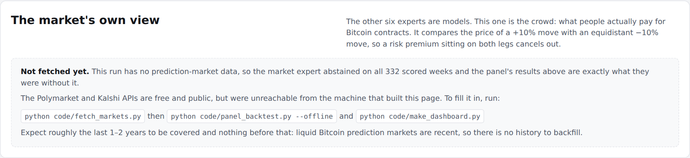
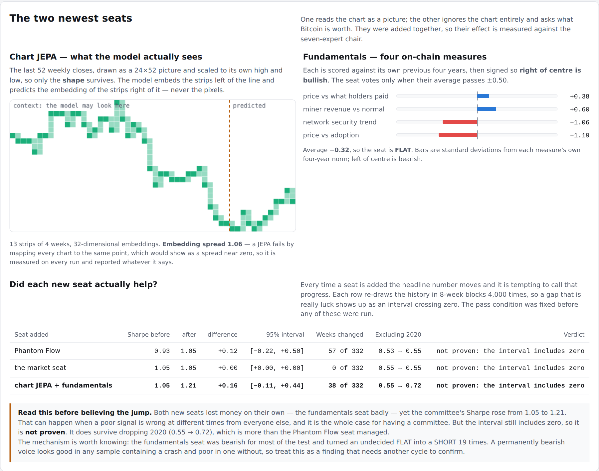

\title BTC Expert Panel
\subtitle A plain-English guide to nine experts in five families, calling Bitcoin's next week
\subtitle Walk-forward results on real data, January 2020 – May 2026

\pagebreak

\toc

\pagebreak

# 1. The idea in one minute

Investment banks rarely trust a single opinion. They use committees: several experts look at the same market from different angles, and the committee acts only when enough of them agree.

This project builds that committee for **Bitcoin**, using AI models from three of Kwet's own projects, Jev, and a trading indicator:

- **Two quant research models** from the IPO prediction project (`projectskf`): a random forest and a tabular transformer.
- **The neuroplastic world model (V5):** six small networks that learn how the Bitcoin "world" evolves.
- **Jev:** a decision model that returns a calibrated probability. This run uses an offline stand-in (see section 7).
- **The mini LLM**, built from scratch, reading the market's daily moves as if they were text.
- **Phantom Flow:** a technical indicator that combines a trend filter, market structure and momentum. This is an open re-implementation of the paid TradingView indicator (see section 3.6).
- **The market itself:** not a model at all, but the price of Bitcoin prediction-market contracts — what thousands of people are actually paying (see section 3.7).
- **A chart JEPA:** the technical-analysis seat. It draws the last year as a picture and predicts the next piece of chart, in meaning rather than in pixels (see section 3.8).
- **On-chain fundamentals:** the only seat that never looks at the price chart, asking instead what the blockchain says Bitcoin is worth (see section 3.9).

Every Sunday, each expert says whether Bitcoin will be **higher in 7 days**. A **panel chair** then acts only if at least 3 agree and they outnumber those on the other side.

Everything is tested **walk-forward**. Each January the models are retrained using only data from before that year, then used unchanged for the whole year, so no model ever sees the future. The test runs from January 2020 to May 2026: 332 weeks.

> **In one sentence:** nine different experts vote on Bitcoin each week. On its own none beats simply holding Bitcoin by much. The five-expert committee matched buy-and-hold's risk-adjusted return with roughly half the worst loss, and adding Phantom Flow lifted it further, though that gain may be luck (section 5).


# 2. The data every expert sees

All data is real. Prices and on-chain activity come from Coin Metrics' public data (CC BY-NC 4.0), and the VIX (the US stock market's "fear index") from a public dataset. Both were downloaded from GitHub.

Each week the market is summarised in **12 numbers**:

| Input | Plain meaning | Why it might matter |
|---|---|---|
| 1-, 4-, 12-, 26-week returns | How much the price moved over each period | Trends tend to persist, until they don't |
| 4-week volatility | How wild daily moves have been | Calm and panic behave differently |
| MVRV | Market value divided by the average price holders paid | Very high means holders sit on big profits and may sell; below 1 means most are at a loss |
| Drawdown from 52-week high | How far below its one-year peak the price is | Deep drawdowns mark crashes and bottoms |
| Active addresses, 4-week change | Is network use growing or shrinking? | More users can mean more demand |
| Hash rate, 4-week change | Is mining power growing? | A sign of miners' confidence |
| Net exchange inflows | Coins moving onto exchanges (often to sell) | Large inflows can precede selling |
| VIX level and 4-week change | Fear in stock markets | Risk-off moods hit Bitcoin too |

**Calls:** each expert gives a probability that Bitcoin is higher next week. At 55% or more it goes **LONG** (buys), at 45% or less it goes **SHORT** (bets on a fall), and anything in between is **FLAT** (stays out). Every change of position costs 0.10% in trading costs.

# 3. The experts

## 3.1 Random Forest (quant research project)

**What it is:** hundreds of decision trees, each asking yes/no questions such as *"Is 4-week momentum above 5%?"* and *"Is MVRV above 2.5?"*. Their votes are averaged into a probability. It was the best model in the original IPO project.

**Changes for Bitcoin:** 300 trees, and each final branch must contain at least 10 weeks of history, so the trees can't memorise individual weeks.

**Latest call:** FLAT, 49%. Its most important inputs were the 4-week return, the change in active addresses and the 1-week return.

## 3.2 Tabular Transformer (quant research project)

**What it is:** the same attention mechanism that powers large language models, applied to a table. Each of the 12 inputs becomes a "token", and the model learns which inputs to pay attention to together. Three copies with different random starting points are averaged.

**One fix to the original method:** the IPO project picked the best training round by looking at the test data, which quietly leaks test information into the result. Here the transformer trains for a fixed 60 rounds and never sees the test period.

**Latest call:** FLAT, 51%.

## 3.3 Neuroplastic World Model (V5)

**What it is:** six small networks. Each learns a compressed "state of the world" and is trained to predict two things: the next week's full set of 12 inputs, and next week's return. This is the world-model idea: understand how the world moves, not just the price.

**How it decides:** each of the six networks simulates 300 possible outcomes, and votes BUY, SELL or HOLD after subtracting trading costs and a penalty for uncertainty. The model trades only if **4 of the 6 agree**; otherwise it holds.

**Latest call:** FLAT. The vote was 2 BUY, 0 SELL, 4 HOLD, with a predicted return of +1.1% for the week. The "67%" on the dashboard is a vote share, not a probability.

## 3.4 Jev (System One)

**What it is:** a decision model from TypeSafe AI. It reads the 12 inputs as structured data and answers two questions in one call:
- **"Will Bitcoin be higher in 7 days?"**, as a probability
- **"Which market regime is this?"**: bull trend, bear trend, range-bound, capitulation or euphoria

**Important:** Jev's online service could not be reached from the build environment. In this run a **hand-written stand-in** answers instead. It follows the 12-week and 4-week trend, leans against extreme valuation (MVRV above 3.2 or below 1.0) and is cautious when the VIX is above 30. **It is not Jev.** With an API key, the same code calls the real model.

**Latest call:** LONG, 62%, with the regime labelled *range-bound*.

## 3.5 Mini LLM tape reader

**What it is:** the small GPT built from scratch in this repository. Traders call the stream of price moves "the tape", so the mini LLM reads it as text:

| Letter | Daily move |
|---|---|
| a | Biggest falls (bottom seventh of days) |
| b, c | Smaller falls |
| d | Roughly flat |
| e, f | Smaller rises |
| g | Biggest rises (top seventh of days) |

So the last 14 days before the latest call read **"ffebdefcbbfabc"**. The model learns which letters tend to follow which. To make a call, it **writes 256 possible next weeks** (7 letters each), converts them back to returns, and counts how many end higher.

**Latest call:** LONG, 79%. The average of its 256 imagined weeks was +4.7%.

**A warning sign the numbers revealed:** the model's "surprise" on new data averaged 4.9 bits per day. Blind guessing among 7 letters scores 2.8 bits. It had **memorised the past** rather than learned something general, and its results show it (section 5).

## 3.6 Phantom Flow (trading indicator)

**What it is:** Phantom Flow is a popular paid indicator for TradingView. Its makers describe three parts, plus a "combo" signal when two of them agree. Its formulas are private, so this project rebuilds each part with the standard textbook method. **It is not the proprietary script**, and its signals will differ.

| Part | What it asks | How it is calculated here |
|---|---|---|
| **Phantom Shift** (trend) | Is the trend up or down? | A trailing stop 3 × ATR away from the price (ATR = the average daily move over 10 days). In an uptrend the stop sits under the price and only moves up; a close below it flips the trend to down, and the other way round |
| **Structure** | Is the market making higher highs, or breaking down? | A "swing high" is a close higher than the 5 days either side. A close above the last swing high is a **break of structure** up if the trend was already up, or a **change of character** if it was down (a reversal). The same applies for swing lows |
| **Phantom Oscillator** (momentum) | Is the price stretched above or below normal? | How far the close is from its 21-day average, measured in ATRs |

**How it decides:** it goes **LONG** only when the trend is up **and** the oscillator is positive (Phantom Flow's "combo") **and** the structure is not bearish. SHORT is the mirror image; anything else is FLAT. On the dashboard it shows a confluence score from −3 to +3 (one point per part) instead of a probability.

**A simple example:** Bitcoin closes at $100,000. Its average daily move is $2,500, so the uptrend stop is 3 × $2,500 below the close, at $92,500, or higher if it has already ratcheted up. The 21-day average is $95,000, so the oscillator reads (100,000 − 95,000) ÷ 2,500 = +2 ATR. Last week it closed above its previous swing high: structure bullish. All three agree, so the call is LONG. If the price then falls below the stop, the trend flips to down and the call drops to FLAT at once, before the other parts have turned.

**No hindsight:**

- The indicator uses daily closes only, which is all the public data provides. So there are no order blocks or fair value gaps, which need intraday highs and lows.
- It needs no training, so it is not refitted each year.
- A swing point only counts once the 5 days after it have closed. On-chart indicators often draw a swing on the day it happened, which quietly uses future information ("repainting").
- A test checks that the value on any day is identical whether or not later data exists.

**Settings:** ATR 10 × 3, 5-day pivots and a 21-day average. These are common defaults, fixed before the backtest and never tuned on it.

**Latest call:** FLAT, confluence −1. On Sunday 17 May the trend had just flipped down (stop $80,716) and the oscillator was −0.66 ATR, but structure was still bullish. By 23 May, the last day of data, structure had also turned down, which is a daily SHORT signal.

## 3.7 Market consensus (prediction markets)

**What it is:** the only seat that is not a model. A **prediction market** is a market where you buy a contract that pays £1 if something happens and nothing if it doesn't, so its price is a probability: a contract trading at 31p means the crowd thinks there is about a 31% chance. Polymarket and Kalshi both run Bitcoin contracts, and by September 2026 the two together were trading tens of billions of dollars a month.

**Why a panel wants one.** Six models can all be wrong in the same way, because they all learn from the same history. The market is a different kind of witness: it is thousands of people with their own money at stake, and whatever they collectively know is already in the price.

**What the contracts look like.** Polymarket runs Bitcoin as a *ladder* of questions on the same expiry:

| Contract | Price | What the crowd is saying |
|---|---|---|
| Will Bitcoin reach $150,000 in March? | 0.18 | 18% chance it touches $150k |
| Will Bitcoin reach $120,000 in March? | 0.44 | 44% chance it touches $120k |
| Will Bitcoin dip to $80,000 in March? | 0.37 | 37% chance it touches $80k |
| Will Bitcoin dip to $65,000 in March? | 0.11 | 11% chance it touches $65k |

Read together, that ladder is a picture of the range the market expects.

**Three traps, and what this project does about each.** These are the reason the seat took work rather than being a one-line lookup.

| Trap | The problem | The fix here |
|---|---|---|
| **"Reach" is not "close"** | "Will Bitcoin reach $150k in March" asks whether it *ever touches* that level, not where it ends the month. A price that spikes to $150k and falls back still pays out. Mathematically (the reflection principle, for a coin-flip random walk) touching is about **twice** as likely as ending up past it, so reading the ladder as a forecast of the closing price makes every number roughly double | The vote never uses the ladder as a closing-price forecast. Where a closing probability really is needed, `touch_to_terminal()` halves it and says out loud that it assumes no drift |
| **Wrong clock** | These contracts run to a fixed month end. Sitting on 1 March, the question covers 31 days; sitting on 28 March, 3 days. The panel is asking about 7 days | The *direction* of the tilt survives a change of horizon; its *size* does not. So the tilt decides LONG, FLAT or SHORT, and nothing else is read from its magnitude |
| **A price is not a pure forecast** | Buying a contract ties up money for months and carries risk, so the price includes a premium. It is a price, not an opinion poll | The signal is a **difference** between two contracts the same distance either side of today's price. A premium sitting on both legs cancels out |

**The signal, in one line:**

> **lean = (price of a +10% move) − (price of a −10% move)**

Both legs are the same distance from today's price, on the same expiry, in the same market. A positive lean means the crowd pays more for the upside. Above +0.06 the expert votes LONG, below −0.06 SHORT, and in between FLAT.

**A worked example.** Bitcoin is at $100,000. The ladder gives a 45% chance of touching $110,000 and a 25% chance of touching $90,000. The lean is 0.45 − 0.25 = **+0.20**, comfortably past the threshold, so the seat votes LONG. Note what we did *not* do: we did not claim a 45% chance of ending the week above $110,000.

**When it says nothing.** If the ladder has fewer than two strikes on either side, or if a ±10% move falls outside the quoted strikes, the code returns nothing and the seat **abstains** (FLAT). It never extrapolates, because extrapolating a probability means inventing one.

**The honest limitation, and it is a big one.** Liquid Bitcoin prediction markets are recent. The panel's history starts in January 2020; these markets barely existed before 2024. So this seat abstains for most of the backtest, and it is judged only on the weeks it actually covered (section 5). Any claim about its record over the full 332 weeks would be meaningless.

## 3.8 Chart JEPA (technical analysis)

**The idea in one line:** draw the chart as a picture, and learn to predict what the next piece of it will *mean* rather than what it will look like.

**What a JEPA is.** A **Joint Embedding Predictive Architecture** is Yann LeCun's proposal for how a model should learn about the world. Hide part of the input; ask the model to predict the hidden part — but judge it on a compressed summary (an **embedding**) of that hidden part, not on the raw thing itself.

Why that matters here: most of a price chart is noise. A model forced to reproduce every wiggle spends all its effort on detail that was never predictable. Predicting the *meaning* lets it keep only what can actually be known. It is the difference between asking a chartist "draw me next month's candles" and asking "is this topping out or consolidating?".

**How the chart becomes a picture.**

| Step | What happens |
|---|---|
| 1 | Take the last **52 weekly closes** |
| 2 | Draw them on a **24-row by 52-column** grid, joining the dots so it is a line, not scattered points |
| 3 | Scale the window to **its own high and low** |

Step 3 is the important one. Because the picture is scaled to itself, the same pattern looks identical at $300 and at $60,000. The model can only see **shape**, never price level — which is what technical analysis claims to read, and which also stops it memorising "2021 was expensive". A test checks this: multiplying every price by 200 must produce a byte-identical picture.

**How it learns.** The picture is cut into 13 vertical strips of 4 weeks. The model sees the first 10 and must predict the embeddings of the last 3. A second copy of the encoder, updated as a slow moving average of the first, produces the answers it is scored against — the standard trick for stopping this kind of model cheating.

**How it votes.** The predictor is run one strip *past* the end of the chart, giving a predicted embedding of four weeks that have not happened. A small logistic regression turns that into P(up next week).

**The failure mode, and why it is measured.** A JEPA can cheat by mapping every chart to the same point: its predictions become perfect and completely useless. The guard against it is a term that forces the embeddings to keep some spread, and the check is the **embedding spread** printed on every run and shown on the dashboard. Near zero would mean the model had collapsed and the seat should be ignored. It is reported whatever it says.

**Honest limits.**

- About 650 weekly charts is a very small dataset for this kind of model. It is deliberately tiny — roughly 15,000 parameters — and is still the most overfit-prone seat.
- Rendering a series as a picture cannot add information that was not in the series. The only claim is that the grid emphasises shape over level.
- The panel already has a latent-dynamics model (the neuroplastic world model), so the two could agree for the wrong reasons. The agreement table is the check.

## 3.9 Fundamentals (on-chain valuation)

**The problem:** a share has earnings; Bitcoin has none. So "fundamental analysis" here means reading the **blockchain itself** — what holders paid, what miners earn, how secure the network is, and how many people use it.

**The four measures:**

| Measure | The question it asks | Reads high when |
|---|---|---|
| **MVRV** | Is the price far above what holders actually paid? | Holders are sitting on large gains — historically a cycle top |
| **Puell multiple** | Are miners unusually rich or squeezed? | Miners are earning far above normal and tend to sell into it |
| **Hash ribbon** | Is network security growing or shrinking? | Miners are switching machines on, not off |
| **Metcalfe residual** | Is the price ahead of adoption? | Price has run ahead of the number of people using the network |

**MVRV** is worth a sentence on its own. Every coin can be priced at the moment it last moved, which gives the market's true average cost basis. MVRV is today's value divided by that. An MVRV of 3 means the average coin is sitting on a 200% gain — historically the zone where people start selling.

**Metcalfe's law** says a network is worth roughly the square of its users. Fitting market cap against active addresses gives a fair value from usage alone, and the gap is how far price sits above it. On this data the fitted exponent comes out near 2, which is Metcalfe's square law almost exactly.

**A scaling bug worth recording.** The first version of this seat standardised each measure against the training period. Because Bitcoin's market cap grew roughly a thousandfold, that produced readings like *"13 standard deviations cheap"* — pure arithmetic, no signal. The fix is to score each measure against **its own previous four years**, a window that moves forward with the data. It still looks forward at nothing, and it stays on a sensible scale for ever.

**How it votes.** Each measure is signed so positive always means "cheap or improving", and the four are averaged. The seat acts only when that average passes **±0.5** — when valuation is genuinely unusual, not marginally tilted. That threshold was chosen to match the other seats' activity levels (about half of all weeks), fixed before any return was measured.

**The honest caveat, and it is the important one.** Fundamentals are **slow**. "Bitcoin is expensive against its cost basis" is a statement about the next few months, not the next seven days. As a weekly signal this seat is expected to be weak and to change its mind rarely. Out of sample it says "expensive" far more often than "cheap", which is the familiar weakness of valuation timing during a bull market. Its value to a committee is not accuracy but **independence**: its mistakes are not the momentum models' mistakes.

## 3.10 The panel chair

**What it is:** a simple rule. LONG if at least 3 experts say LONG and they outnumber those saying SHORT. SHORT is the mirror image; otherwise FLAT.

Because an abstaining expert changes neither count, a week where the market seat is silent gives exactly the answer the smaller panel would have given. The dashboard keeps every earlier chair — 5 experts, 6, and 7 — so you can see what each new seat actually added.

**One thing to watch as the panel grows.** "At least 3" meant half the panel when there were six experts. With nine it means a third, which is a looser bar. The second condition — that those agreeing must *outnumber* those on the other side — is what stops it becoming trigger-happy, and it is doing more of the work now than it used to. The rule was fixed in advance and has been left alone, but the earlier chairs are on the same chart so the effect of the change is visible rather than hidden.

**The five families.** With nine seats it helps to group them by *how* they think, because experts that reason the same way tend to fail together:

| Family | Seats | How it reasons |
|---|---|---|
| Learned from price history | Random Forest, Tabular Transformer | Statistical patterns in 12 weekly inputs |
| Decision and language models | Jev, Mini LLM tape reader | Reads the situation as structured data or as text |
| Latent world models | Neuroplastic World Model, Chart JEPA | Compresses the world to a few numbers and predicts how they move |
| Technical indicator | Phantom Flow | Fixed rules on trend, structure and momentum |
| Outside views | Market consensus, Fundamentals | Ignores the models: what others pay, and what the chain is worth |

A committee is only worth having if its members are wrong at different times, so the dashboard colours experts by family and the agreement table shows whether the independence is real.

**Latest call:** FLAT. Two experts said LONG (Jev and the mini LLM), four said FLAT, none said SHORT.

# 4. A worked example: one week

The latest call was for the week after **17 May 2026**, with Bitcoin at **$77,498**. The public data ends on 23 May 2026, so this is the most recent week the system can call.

| Expert | P(price higher) | Call | Reason |
|---|---|---|---|
| Random Forest | 49% | FLAT | Between 45% and 55% |
| Tabular Transformer | 51% | FLAT | Between 45% and 55% |
| Neuroplastic World Model | vote 2 BUY / 4 HOLD | FLAT | Needs 4 of 6 to agree |
| Jev (stand-in) | 62% | LONG | Above 55%; regime range-bound |
| Mini LLM | 79% | LONG | 203 of 256 imagined weeks ended higher |
| Phantom Flow | score −1 | FLAT | Trend down, oscillator negative, structure still bullish |
| Market consensus | — | FLAT | **Abstained:** no prediction-market data was fetched for this run (section 5) |
| Chart JEPA | see section 5 | see section 5 | Predicted the embedding of the next four weeks of chart |
| Fundamentals | see section 5 | see section 5 | Valuation score against its own four-year norm |
| **Panel chair** | — | **FLAT** | Needs 3 agreeing and a majority of those taking a side |

The committee stays out of the market. The two confident experts are the stand-in rule and the model that memorised the past, which is exactly the kind of situation where waiting for broader agreement protects you.

\pagebreak

# 5. How did they do?


## Five ways to measure

- **Total return:** what $1 became.
- **CAGR:** the average yearly growth rate.
- **Sharpe ratio:** return per unit of risk (weekly volatility). Higher is better; buy-and-hold Bitcoin scored 0.93 over this period.
- **Maximum drawdown:** the worst fall from a peak, which is what hurts investors most.
- **Hit rate:** how often a call was right, counting only weeks with a position.

## Results, 332 weeks out of sample

| Expert | Total return | CAGR | Sharpe | Max drawdown | Hit rate | Time long / short |
|---|---|---|---|---|---|---|
| **Panel chair (9 experts)** | **+2,103%** | 62.3% | **1.21** | −45% | 57.5% | 50% / 28% |
| Neuroplastic World Model | +1,161% | 48.7% | 1.13 | −50% | 53.6% | 45% / 8% |
| Chair with 7 experts | +1,111% | 47.8% | 1.05 | −43% | 56.9% | 49% / 23% |
| Buy & hold | +954% | 44.6% | 0.93 | −75% | 52.1% | 100% / 0% |
| Jev (stand-in) | +863% | 42.6% | 0.94 | −45% | 52.5% | 53% / 26% |
| Chair with 5 experts | +671% | 37.7% | 0.93 | **−41%** | **57.6%** | 45% / 14% |
| Phantom Flow | +191% | 18.2% | 0.58 | −58% | 49.4% | 38% / 33% |
| Mini LLM | +171% | 16.9% | 0.56 | −77% | 54.8% | 46% / 39% |
| Random Forest | +122% | 13.3% | 0.50 | −51% | 53.7% | 47% / 14% |
| Tabular Transformer | +103% | 11.8% | 0.48 | −75% | 56.0% | 49% / 39% |
| Chart JEPA | +4% | 0.6% | 0.16 | −51% | 48.3% | 11% / 6% |
| Fundamentals | **−88%** | −28.3% | **−0.54** | −94% | 52.3% | 7% / 45% |
| Market consensus | abstained on every week (section 5) | | | | | |

## What the results mean

1. **The committee's value is protection.** The original five-expert chair earned less than buy-and-hold, but with the same Sharpe ratio (0.93) and a worst loss of 41% instead of 75%. It also had the best hit rate.
2. **The neuroplastic world model was the strongest single expert,** with a Sharpe of 1.13 against 0.93 for buy-and-hold.
3. **The quant classifiers struggled.** Models that worked on IPO data did not carry over to weekly Bitcoin moves, which are much noisier.
4. **The mini LLM shows what overfitting looks like.** It had a spectacular 2020–2021 (+300% and +191%) and then lost money every year after.
5. **The two newest seats lost money on their own, and one lost a lot.** The chart JEPA made 4% over six years with a hit rate of 48.3% — below a coin toss — which says the shape of the chart carries very little week-ahead information. The fundamentals seat lost 88% and drew down 94%, because it was bearish through most of a bull market. Neither is a good standalone strategy and neither is presented as one.
6. **Yet the committee improved when they joined, which needs explaining rather than celebrating.** See the section below.
7. **Phantom Flow was weak alone but different.** It made +191% with a Sharpe of 0.58, well below buy-and-hold, and was right on only 49% of its calls. But it agreed with the other experts in only 36–53% of weeks. That independence is what a committee needs, and adding it lifted the chair from a Sharpe of 0.93 to 1.05. The next section tests whether that is real.

## Calendar years

| Expert | 2020 | 2021 | 2022 | 2023 | 2024 | 2025 | 2026* |
|---|---|---|---|---|---|---|---|
| Random Forest | +99% | +6% | −26% | +83% | +9% | −5% | −25% |
| Tabular Transformer | +211% | −24% | −33% | +22% | +28% | −4% | −16% |
| Neuroplastic World Model | +284% | +1% | −6% | +35% | +104% | +4% | +20% |
| Jev (stand-in) | +118% | +84% | −10% | +71% | +40% | +12% | 0% |
| Mini LLM | +300% | +191% | −21% | −27% | −41% | −5% | −28% |
| Phantom Flow | +346% | −14% | −20% | +6% | +19% | −23% | −1% |
| Chart JEPA | +54% | −23% | −22% | 0% | 0% | +12% | 0% |
| Fundamentals | −63% | −62% | −13% | −3% | −31% | −3% | +46% |
| **Panel chair (9)** | +548% | +26% | −1% | +47% | +37% | +22% | +12% |
| Chair with 7 experts | +453% | −3% | 0% | +50% | +7% | +34% | +5% |
| Chair with 5 experts | +265% | +14% | −9% | +57% | 0% | +30% | +1% |
| Buy & hold | +353% | +42% | −65% | +164% | +124% | −7% | −15% |

\* 2026 to 10 May.

**The 2022 crash is the clearest example.** Bitcoin fell 65%. The five-expert chair lost 9%, and the six-expert chair broke even. In 2025, when Bitcoin fell 7%, the chairs gained 30% and 34%.

## What the market expert did

**Nothing, in this run — and that is reported rather than hidden.** The Polymarket and Kalshi APIs are free and public, but neither was reachable from the machine that built this guide, so the seat abstained on all 332 weeks. Because an abstaining expert changes neither the LONG count nor the SHORT count, **every number in this section is exactly what the six-expert panel produced.** No result here depends on the new seat.

To fill it in, run `python code/fetch_markets.py` on a machine with internet access and re-run the panel. Expect roughly the last one to two years to be covered and nothing before that.

Once there is data, two things appear automatically:

1. **A fair sub-period table.** Every expert is re-scored on the weeks the market seat actually covered, because comparing a seat that was present for 60 weeks with one present for 332 is not a comparison.
2. **The benchmark test**, below.



## The benchmark: can the panel beat the traded price?

This is the sharpest question in the whole project, and worth more than beating buy-and-hold.

A prediction-market price is a forecast that people are paid to get right and lose money for getting wrong. If the panel's probabilities are no better than that price, then whatever the panel knows is already public. That is the **efficient-market null hypothesis**, and the honest thing is to test it rather than avoid it.

**How it is scored.** Both the panel and the market give a probability each week; then the week happens. The **Brier score** measures how far a probability was from what occurred — square the error and average it, so lower is better. Saying "50%" every week scores 0.25. The test resamples the weeks 4,000 times to put a 95% interval around the gap, exactly as was done for Phantom Flow.

**The rule is fixed before the answer is known:**

| If the interval for (panel − market) is… | Verdict |
|---|---|
| Entirely below zero | The panel genuinely beats the traded price |
| Entirely above zero | The market beats the panel |
| Straddling zero | **No measurable difference: the panel does not beat the traded price.** The panel may still be useful for sizing risk and cutting drawdowns, but it has no informational edge |

**One caveat built into the output.** Polymarket's contracts are "will it touch" bets over a month, not "where will it close in 7 days", so a probability derived from them is indicative rather than like-for-like. Kalshi's short-dated contracts quote a genuine closing-price distribution, and when those are the source the dashboard says so.

## Did the two newest seats really help?

Both lost money alone, yet the committee's Sharpe ratio rose from 1.05 to 1.21 and its total return roughly doubled. That is a suspicious-looking result and it gets the same three checks every other addition got.

| Seat added | Sharpe before → after | 95% interval for the gap | Weeks changed | Excluding 2020 | Verdict |
|---|---|---|---|---|---|
| Phantom Flow | 0.93 → 1.05 | [−0.22, +0.50] | 57 of 332 | 0.53 → 0.55 | Not proven |
| The market seat | 1.05 → 1.05 | [0.00, 0.00] | 0 of 332 | 0.55 → 0.55 | No data; abstained throughout |
| **Chart JEPA + fundamentals** | **1.05 → 1.21** | **[−0.11, +0.44]** | 38 of 332 | **0.55 → 0.72** | **Not proven** |



**How can two losing experts improve the committee?** This is exactly what a committee is for. An expert who is often wrong, but wrong *at different times from everyone else*, still adds information to a vote. The fundamentals seat was bearish while the momentum models were bullish, and on 19 occasions it converted an undecided FLAT into a SHORT. Some of those shorts landed well.

**Why it is still reported as not proven.** The 95% interval runs from −0.11 to +0.44, so it includes zero. The committee did no better in 11% of resampled histories. That is stronger evidence than Phantom Flow managed (26%), and unlike Phantom Flow it clearly survives dropping 2020 — 0.55 against 0.72 — but it does not clear the bar that was set in advance.

**The caveat that matters most.** The fundamentals seat is close to a structural short: it said "expensive" in 151 weeks and "cheap" in 23. A permanently bearish voice will look good in any sample that contains a crash and poor in one that does not. This test period contains 2022, when Bitcoin fell 65%. Another cycle is needed before the improvement can be believed, and the honest summary is **"probably helps, not proven, and partly for a reason that may not repeat."**

## Did adding Phantom Flow really help?

A better number is not the same as a real improvement, so three checks were run.

1. **Could it be luck?** The weeks were resampled 4,000 times in 8-week blocks. The chair's Sharpe gain of +0.12 has a 95% range of **−0.20 to +0.49**, and the new chair did no better in about **1 in 4** resamples. That is not strong evidence.
2. **Is it one lucky year?** Mostly, yes. The new chair beat the old one in 5 of 7 calendar years, but most of the gain came in 2020 (+453% against +265%). **Excluding 2020, the Sharpe ratios are 0.55 and 0.53**, almost the same, and buy-and-hold scores 0.56.
3. **Does it depend on the settings?** Much less than you might fear. See the table below.

| ATR multiplier | Alone: pivot 3 | Alone: pivot 5 | Alone: pivot 10 | Chair: pivot 3 | Chair: pivot 5 | Chair: pivot 10 |
|---|---|---|---|---|---|---|
| × 2 | 0.62 | 0.48 | 0.88 | 1.05 | 0.99 | 1.09 |
| × 3 | 0.55 | **0.58** | 0.98 | 1.10 | **1.05** | 1.14 |
| × 4 | 0.45 | 0.41 | 0.90 | 1.10 | 1.05 | 1.12 |

Sharpe ratios over the whole test. Bold is the setting used, fixed in advance. For comparison, the chair without Phantom Flow scores 0.93, and so does buy-and-hold.

**Every setting leaves the chair between 0.99 and 1.14, above 0.93.** Phantom Flow alone varies much more, from 0.41 to 0.98. Longer pivots (10 days) did best, but choosing them now would be tuning on the test, so the fixed setting stays.


**Verdict:** Phantom Flow earns its seat as an independent voice. It changed the chair's call in 57 of 332 weeks, and the committee did at least as well with it. But the evidence that it *improves* the committee is weak and depends mainly on 2020. The honest claim is "it didn't hurt, and it may help".

## The signal board


Reading the board: a call is right when its colour matches the market row underneath.

The experts often disagree. For example, the world model and the transformer made the same call in only 34% of weeks. This is what makes a committee useful: **independent opinions whose mistakes don't all happen at once.**

# 6. How the test was kept honest

- **Walk-forward retraining:** models are retrained every January on data before that year only.
- **No peeking:** the transformer no longer selects its best training round using test data.
- **Trading costs:** 0.10% per position change.
- **No leverage:** positions are fully in, fully out, or fully short.
- **Abstention, not guessing:** the market expert returns nothing when the ladder does not bracket a ±10% move, and the panel treats that as FLAT. It never extrapolates a price it cannot see.
- **The rules were written down first:** both the Phantom Flow check and the market benchmark had their pass/fail conditions fixed before the numbers existed.
- **Fixed indicator settings:** Phantom Flow's settings were chosen before the test and never tuned. Other settings are shown only as a check.
- **No repainting:** swing points count only after they are confirmed, and a test proves no indicator value uses later data.
- **Reproducible:** all random seeds are fixed. A second full run gave identical results, apart from rounding at the 16th decimal place.
- **Latest week excluded from scoring:** its outcome is not in the data yet.

# 7. Read this before trusting the numbers

- **One historical path.** 332 weeks is one run of history. A different period could rank the experts differently.
- **A friendly period for holding Bitcoin.** 2020–2021 was a strong bull market, so buy-and-hold is hard to beat on raw return.
- **The chart JEPA is the most overfit-prone seat.** About 650 weekly pictures is very little for a neural network, even a tiny one. Watch its embedding spread and its agreement with the neuroplastic world model: if either looks wrong, ignore the seat.
- **Fundamentals are slow and were bearish for most of the test.** A valuation signal in a rising market mostly says "expensive". That is a real property of valuation timing, not a bug, but it means this seat contributes caution rather than accuracy.
- **Nine experts loosens the chair's threshold.** "At least 3" was half the panel at six seats and is a third at nine. The majority condition is now carrying more of the load.
- **The market expert covers a short window at best.** Liquid Bitcoin prediction markets are recent, so it can never be tested over the same 332 weeks as the models. Judge it only on its own sub-period.
- **Prediction-market prices carry a risk premium** and are not pure forecasts. Taking the difference between two symmetric contracts removes most of it, but not all.
- **Phantom Flow here is not the paid indicator.** It follows the published description with standard formulas, on daily closes only. Its gain for the committee may be luck (section 5).
- **The Jev results are not Jev.** They come from a hand-written trend-and-valuation rule. Re-run with an API key to test the real model.
- **Weekly shorting assumes it is possible and cheap.** Real short positions cost funding and borrowing fees that are not included.
- **The data ends in May 2026**, because Coin Metrics' public GitHub files stop there. The "latest call" is therefore four months old.
- **Research, not advice.** Nothing here is investment advice.

# 8. How to run it

```
cd btc-expert-panel/code
pip install torch scikit-learn pandas numpy
python panel_backtest.py      # downloads data, trains, tests (about 10 minutes)
python fetch_markets.py       # optional: prediction-market data (needs internet; adds expert 7)
python pf_effect.py           # did Phantom Flow help? (bootstrap, ex-2020)
python chair_effect.py        # did EVERY added seat help? (the full ladder)
python make_dashboard.py      # rebuilds ../dashboard/index.html
pytest -q ../tests            # Phantom Flow tests, including the no-hindsight check
export TYPESAFE_API_KEY=...   # optional: use the real Jev
```

# 9. How to present it

> "I put models from three of my projects on one committee for Bitcoin and tested them honestly: annual walk-forward retraining, costs included, no look-ahead. I even fixed a test-set leak in my own earlier code. The finding I'd highlight isn't the best single model; it's that a simple committee vote kept buy-and-hold's risk-adjusted return while cutting the worst loss from 75% to 41%. When I added a popular trading indicator, Phantom Flow, it was weak on its own but lifted the committee's Sharpe from 0.93 to 1.05. I then showed that gain is statistically weak and mostly from one year, so I report it as 'didn't hurt, may help'. The seventh seat is a prediction market rather than a model, which lets me ask the question I actually care about: can the panel beat a price that people are paid to get right? I set the pass condition before seeing the answer, and I had to handle the fact that those contracts pay on touching a level rather than closing past it — about a factor of two if you read them naively. I'd also point out the mini LLM's failure: it memorised the past, and its surprise score on new data was a warning sign I could have used to switch it off."

# 10. Glossary

| Term | Plain meaning |
|---|---|
| Walk-forward test | Retraining on the past and testing on the next period, repeatedly, so the model never sees the future |
| Out of sample | Data the model was not trained on |
| LONG / SHORT / FLAT | Own Bitcoin / bet on a fall / stay out |
| Sharpe ratio | Return divided by volatility; a measure of reward per unit of risk |
| Drawdown | Fall from a previous peak |
| Hit rate | Share of calls that were right |
| MVRV | Market value divided by the average price holders paid (realised value) |
| Hash rate | Total computing power securing the Bitcoin network |
| VIX | A measure of expected volatility in US stocks, often called the fear index |
| Overfitting | Learning the noise of the past so well that the model fails on new data |
| Bits of surprise | How hard a language model finds new data to predict; above blind guessing means it is confused |
| World model | A model that learns how the whole environment changes, not just one target |
| ATR (average true range) | The average size of a daily move; used to size stops and scale the oscillator |
| Trailing stop | A level that follows the price in one direction only; crossing it ends the trend |
| Break of structure (BOS) | Price closes beyond the last swing point in the direction of the trend: continuation |
| Change of character (CHoCH) | Price closes beyond the last swing point against the trend: a possible reversal |
| Repainting | An indicator redrawing its past signals with information that was not available at the time |
| Block bootstrap | Re-drawing the history in chunks many times to see how much a result could vary by luck |
| Prediction market | A market in contracts that pay £1 if something happens, so the price reads as a probability |
| Touch (barrier) contract | Pays out if the price *ever* reaches a level, not just if it ends there — roughly twice as likely |
| Terminal contract | Pays out on where the price *closes* at a set moment; Kalshi's Bitcoin ranges are these |
| Lean | The gap between what the crowd pays for an up move and for an equal-sized down move |
| Brier score | How far a probability was from what happened: lower is better, and always saying 50% scores 0.25 |
| Efficient-market null | The assumption that a traded price already contains everything knowable, so no model should beat it |
| JEPA | Joint Embedding Predictive Architecture: learns by predicting a compressed summary of hidden input, not the raw input |
| Embedding | A short list of numbers standing for the meaning of something larger, here a piece of chart |
| Embedding collapse | The failure where a model maps every input to the same point, making its predictions perfect and useless |
| MVRV | Market value divided by realised value: today's price against what holders actually paid |
| Realised value | Every coin priced at the moment it last moved — the market's true cost basis |
| Puell multiple | Today's newly issued coins in dollars against their own yearly average: how rich miners are |
| Hash ribbon | The 30-day average hash rate over the 60-day: whether miners are switching machines on or off |
| Metcalfe's law | The idea that a network is worth roughly the square of its number of users |
