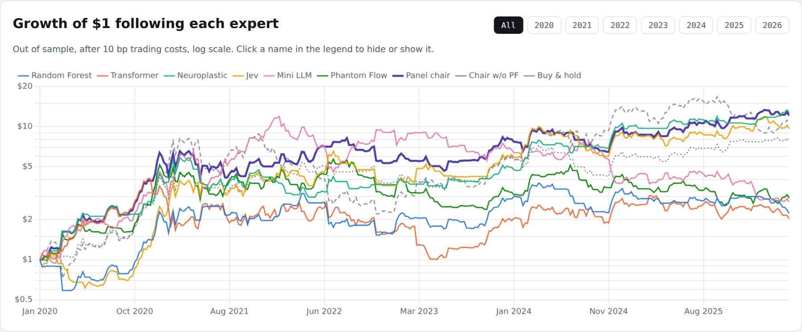
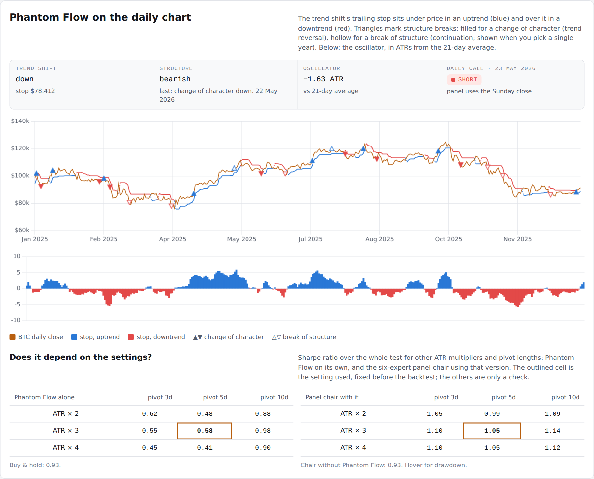
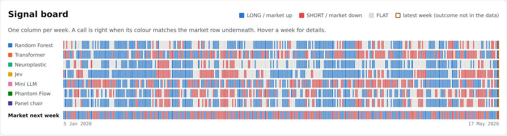

\title BTC Expert Panel
\subtitle A plain-English guide to six experts, including the Phantom Flow indicator, calling Bitcoin's next week
\subtitle Walk-forward results on real data, January 2020 – May 2026

\pagebreak

\toc

\pagebreak

# 1. The idea in one minute

Investment banks rarely trust a single opinion. They use committees: several experts look at the same market from different angles, and the committee acts only when enough of them agree.

This project builds that committee for **Bitcoin**, using AI models from three of Kwet's own projects, Jev, and a trading indicator:

- **Two quant research models** from the IPO prediction project (`projectskf`): a random forest and a tabular transformer.
- **The neuroplastic world model (V5):** six small networks that learn how the Bitcoin "world" evolves.
- **Jev:** a decision model that returns a calibrated probability. This run uses an offline stand-in (see section 7).
- **The mini LLM**, built from scratch, reading the market's daily moves as if they were text.
- **Phantom Flow:** a technical indicator that combines a trend filter, market structure and momentum. This is an open re-implementation of the paid TradingView indicator (see section 3.6).

Every Sunday, each expert says whether Bitcoin will be **higher in 7 days**. A **panel chair** then acts only if at least 3 of the 6 agree and they outnumber those on the other side.

Everything is tested **walk-forward**. Each January the models are retrained using only data from before that year, then used unchanged for the whole year, so no model ever sees the future. The test runs from January 2020 to May 2026: 332 weeks.

> **In one sentence:** six different experts vote on Bitcoin each week. On its own none beats simply holding Bitcoin by much. The five-expert committee matched buy-and-hold's risk-adjusted return with roughly half the worst loss, and adding Phantom Flow lifted it further, though that gain may be luck (section 5).


# 2. The data every expert sees

All data is real. Prices and on-chain activity come from Coin Metrics' public data (CC BY-NC 4.0), and the VIX (the US stock market's "fear index") from a public dataset. Both were downloaded from GitHub.

Each week the market is summarised in **12 numbers**:

| Input | Plain meaning | Why it might matter |
|---|---|---|
| 1-, 4-, 12-, 26-week returns | How much the price moved over each period | Trends tend to persist, until they don't |
| 4-week volatility | How wild daily moves have been | Calm and panic behave differently |
| MVRV | Market value divided by the average price holders paid | Very high means holders sit on big profits and may sell; below 1 means most are at a loss |
| Drawdown from 52-week high | How far below its one-year peak the price is | Deep drawdowns mark crashes and bottoms |
| Active addresses, 4-week change | Is network use growing or shrinking? | More users can mean more demand |
| Hash rate, 4-week change | Is mining power growing? | A sign of miners' confidence |
| Net exchange inflows | Coins moving onto exchanges (often to sell) | Large inflows can precede selling |
| VIX level and 4-week change | Fear in stock markets | Risk-off moods hit Bitcoin too |

**Calls:** each expert gives a probability that Bitcoin is higher next week. At 55% or more it goes **LONG** (buys), at 45% or less it goes **SHORT** (bets on a fall), and anything in between is **FLAT** (stays out). Every change of position costs 0.10% in trading costs.

# 3. The experts

## 3.1 Random Forest (quant research project)

**What it is:** hundreds of decision trees, each asking yes/no questions such as *"Is 4-week momentum above 5%?"* and *"Is MVRV above 2.5?"*. Their votes are averaged into a probability. It was the best model in the original IPO project.

**Changes for Bitcoin:** 300 trees, and each final branch must contain at least 10 weeks of history, so the trees can't memorise individual weeks.

**Latest call:** FLAT, 49%. Its most important inputs were the 4-week return, the change in active addresses and the 1-week return.

## 3.2 Tabular Transformer (quant research project)

**What it is:** the same attention mechanism that powers large language models, applied to a table. Each of the 12 inputs becomes a "token", and the model learns which inputs to pay attention to together. Three copies with different random starting points are averaged.

**One fix to the original method:** the IPO project picked the best training round by looking at the test data, which quietly leaks test information into the result. Here the transformer trains for a fixed 60 rounds and never sees the test period.

**Latest call:** FLAT, 51%.

## 3.3 Neuroplastic World Model (V5)

**What it is:** six small networks. Each learns a compressed "state of the world" and is trained to predict two things: the next week's full set of 12 inputs, and next week's return. This is the world-model idea: understand how the world moves, not just the price.

**How it decides:** each of the six networks simulates 300 possible outcomes, and votes BUY, SELL or HOLD after subtracting trading costs and a penalty for uncertainty. The model trades only if **4 of the 6 agree**; otherwise it holds.

**Latest call:** FLAT. The vote was 2 BUY, 0 SELL, 4 HOLD, with a predicted return of +1.1% for the week. The "67%" on the dashboard is a vote share, not a probability.

## 3.4 Jev (System One)

**What it is:** a decision model from TypeSafe AI. It reads the 12 inputs as structured data and answers two questions in one call:
- **"Will Bitcoin be higher in 7 days?"**, as a probability
- **"Which market regime is this?"**: bull trend, bear trend, range-bound, capitulation or euphoria

**Important:** Jev's online service could not be reached from the build environment. In this run a **hand-written stand-in** answers instead. It follows the 12-week and 4-week trend, leans against extreme valuation (MVRV above 3.2 or below 1.0) and is cautious when the VIX is above 30. **It is not Jev.** With an API key, the same code calls the real model.

**Latest call:** LONG, 62%, with the regime labelled *range-bound*.

## 3.5 Mini LLM tape reader

**What it is:** the small GPT built from scratch in this repository. Traders call the stream of price moves "the tape", so the mini LLM reads it as text:

| Letter | Daily move |
|---|---|
| a | Biggest falls (bottom seventh of days) |
| b, c | Smaller falls |
| d | Roughly flat |
| e, f | Smaller rises |
| g | Biggest rises (top seventh of days) |

So the last 14 days before the latest call read **"ffebdefcbbfabc"**. The model learns which letters tend to follow which. To make a call, it **writes 256 possible next weeks** (7 letters each), converts them back to returns, and counts how many end higher.

**Latest call:** LONG, 79%. The average of its 256 imagined weeks was +4.7%.

**A warning sign the numbers revealed:** the model's "surprise" on new data averaged 4.9 bits per day. Blind guessing among 7 letters scores 2.8 bits. It had **memorised the past** rather than learned something general, and its results show it (section 5).

## 3.6 Phantom Flow (trading indicator)

**What it is:** Phantom Flow is a popular paid indicator for TradingView. Its makers describe three parts, plus a "combo" signal when two of them agree. Its formulas are private, so this project rebuilds each part with the standard textbook method. **It is not the proprietary script**, and its signals will differ.

| Part | What it asks | How it is calculated here |
|---|---|---|
| **Phantom Shift** (trend) | Is the trend up or down? | A trailing stop 3 × ATR away from the price (ATR = the average daily move over 10 days). In an uptrend the stop sits under the price and only moves up; a close below it flips the trend to down, and the other way round |
| **Structure** | Is the market making higher highs, or breaking down? | A "swing high" is a close higher than the 5 days either side. A close above the last swing high is a **break of structure** up if the trend was already up, or a **change of character** if it was down (a reversal). The same applies for swing lows |
| **Phantom Oscillator** (momentum) | Is the price stretched above or below normal? | How far the close is from its 21-day average, measured in ATRs |

**How it decides:** it goes **LONG** only when the trend is up **and** the oscillator is positive (Phantom Flow's "combo") **and** the structure is not bearish. SHORT is the mirror image; anything else is FLAT. On the dashboard it shows a confluence score from −3 to +3 (one point per part) instead of a probability.

**A simple example:** Bitcoin closes at $100,000. Its average daily move is $2,500, so the uptrend stop is 3 × $2,500 below the close, at $92,500, or higher if it has already ratcheted up. The 21-day average is $95,000, so the oscillator reads (100,000 − 95,000) ÷ 2,500 = +2 ATR. Last week it closed above its previous swing high: structure bullish. All three agree, so the call is LONG. If the price then falls below the stop, the trend flips to down and the call drops to FLAT at once, before the other parts have turned.

**No hindsight:**

- The indicator uses daily closes only, which is all the public data provides. So there are no order blocks or fair value gaps, which need intraday highs and lows.
- It needs no training, so it is not refitted each year.
- A swing point only counts once the 5 days after it have closed. On-chart indicators often draw a swing on the day it happened, which quietly uses future information ("repainting").
- A test checks that the value on any day is identical whether or not later data exists.

**Settings:** ATR 10 × 3, 5-day pivots and a 21-day average. These are common defaults, fixed before the backtest and never tuned on it.

**Latest call:** FLAT, confluence −1. On Sunday 17 May the trend had just flipped down (stop $80,716) and the oscillator was −0.66 ATR, but structure was still bullish. By 23 May, the last day of data, structure had also turned down, which is a daily SHORT signal.

## 3.7 The panel chair

**What it is:** a simple rule. LONG if at least 3 of the 6 experts say LONG and they outnumber those saying SHORT. SHORT is the mirror image; otherwise FLAT.

When Phantom Flow is FLAT, this is exactly the old 3-of-5 rule. So any difference in results comes from Phantom Flow's vote. The old chair is kept on the dashboard as "Chair without Phantom Flow".

**Latest call:** FLAT. Two experts said LONG (Jev and the mini LLM), four said FLAT, none said SHORT.

# 4. A worked example: one week

The latest call was for the week after **17 May 2026**, with Bitcoin at **$77,498**. The public data ends on 23 May 2026, so this is the most recent week the system can call.

| Expert | P(price higher) | Call | Reason |
|---|---|---|---|
| Random Forest | 49% | FLAT | Between 45% and 55% |
| Tabular Transformer | 51% | FLAT | Between 45% and 55% |
| Neuroplastic World Model | vote 2 BUY / 4 HOLD | FLAT | Needs 4 of 6 to agree |
| Jev (stand-in) | 62% | LONG | Above 55%; regime range-bound |
| Mini LLM | 79% | LONG | 203 of 256 imagined weeks ended higher |
| Phantom Flow | score −1 | FLAT | Trend down, oscillator negative, structure still bullish |
| **Panel chair** | — | **FLAT** | Only 2 of 6 LONG; needs 3 |

The committee stays out of the market. The two confident experts are the stand-in rule and the model that memorised the past, which is exactly the kind of situation where waiting for broader agreement protects you.

\pagebreak

# 5. How did they do?



## Five ways to measure

- **Total return:** what $1 became.
- **CAGR:** the average yearly growth rate.
- **Sharpe ratio:** return per unit of risk (weekly volatility). Higher is better; buy-and-hold Bitcoin scored 0.93 over this period.
- **Maximum drawdown:** the worst fall from a peak, which is what hurts investors most.
- **Hit rate:** how often a call was right, counting only weeks with a position.

## Results, 332 weeks out of sample

| Expert | Total return | CAGR | Sharpe | Max drawdown | Hit rate | Time long / short |
|---|---|---|---|---|---|---|
| Neuroplastic World Model | +1,161% | 48.7% | **1.13** | −50% | 53.6% | 45% / 8% |
| **Panel chair (6 experts)** | +1,111% | 47.8% | 1.05 | −43% | 56.9% | 49% / 23% |
| Jev (stand-in) | +863% | 42.6% | 0.94 | −45% | 52.5% | 53% / 26% |
| Chair without Phantom Flow | +671% | 37.7% | 0.93 | **−41%** | **57.6%** | 45% / 14% |
| Buy & hold | +954% | 44.6% | 0.93 | −75% | 52.1% | 100% / 0% |
| Phantom Flow | +191% | 18.2% | 0.58 | −58% | 49.4% | 38% / 33% |
| Mini LLM | +171% | 16.9% | 0.56 | −77% | 54.8% | 46% / 39% |
| Random Forest | +122% | 13.3% | 0.50 | −51% | 53.7% | 47% / 14% |
| Tabular Transformer | +103% | 11.8% | 0.48 | −75% | 56.0% | 49% / 39% |

## What the results mean

1. **The committee's value is protection.** The original five-expert chair earned less than buy-and-hold, but with the same Sharpe ratio (0.93) and a worst loss of 41% instead of 75%. It also had the best hit rate.
2. **The neuroplastic world model was the strongest single expert,** with a Sharpe of 1.13 against 0.93 for buy-and-hold.
3. **The quant classifiers struggled.** Models that worked on IPO data did not carry over to weekly Bitcoin moves, which are much noisier.
4. **The mini LLM shows what overfitting looks like.** It had a spectacular 2020–2021 (+300% and +191%) and then lost money every year after.
5. **Phantom Flow was weak alone but different.** It made +191% with a Sharpe of 0.58, well below buy-and-hold, and was right on only 49% of its calls. But it agreed with the other experts in only 36–53% of weeks. That independence is what a committee needs, and adding it lifted the chair from a Sharpe of 0.93 to 1.05. The next section tests whether that is real.

## Calendar years

| Expert | 2020 | 2021 | 2022 | 2023 | 2024 | 2025 | 2026* |
|---|---|---|---|---|---|---|---|
| Random Forest | +99% | +6% | −26% | +83% | +9% | −5% | −25% |
| Tabular Transformer | +211% | −24% | −33% | +22% | +28% | −4% | −16% |
| Neuroplastic World Model | +284% | +1% | −6% | +35% | +104% | +4% | +20% |
| Jev (stand-in) | +118% | +84% | −10% | +71% | +40% | +12% | 0% |
| Mini LLM | +300% | +191% | −21% | −27% | −41% | −5% | −28% |
| Phantom Flow | +346% | −14% | −20% | +6% | +19% | −23% | −1% |
| **Panel chair (6)** | +453% | −3% | 0% | +50% | +7% | +34% | +5% |
| Chair without Phantom Flow | +265% | +14% | −9% | +57% | 0% | +30% | +1% |
| Buy & hold | +353% | +42% | −65% | +164% | +124% | −7% | −15% |

\* 2026 to 10 May.

**The 2022 crash is the clearest example.** Bitcoin fell 65%. The five-expert chair lost 9%, and the six-expert chair broke even. In 2025, when Bitcoin fell 7%, the chairs gained 30% and 34%.

## Did adding Phantom Flow really help?

A better number is not the same as a real improvement, so three checks were run.

1. **Could it be luck?** The weeks were resampled 4,000 times in 8-week blocks. The chair's Sharpe gain of +0.12 has a 95% range of **−0.20 to +0.49**, and the new chair did no better in about **1 in 4** resamples. That is not strong evidence.
2. **Is it one lucky year?** Mostly, yes. The new chair beat the old one in 5 of 7 calendar years, but most of the gain came in 2020 (+453% against +265%). **Excluding 2020, the Sharpe ratios are 0.55 and 0.53**, almost the same, and buy-and-hold scores 0.56.
3. **Does it depend on the settings?** Much less than you might fear. See the table below.

| ATR multiplier | Alone: pivot 3 | Alone: pivot 5 | Alone: pivot 10 | Chair: pivot 3 | Chair: pivot 5 | Chair: pivot 10 |
|---|---|---|---|---|---|---|
| × 2 | 0.62 | 0.48 | 0.88 | 1.05 | 0.99 | 1.09 |
| × 3 | 0.55 | **0.58** | 0.98 | 1.10 | **1.05** | 1.14 |
| × 4 | 0.45 | 0.41 | 0.90 | 1.10 | 1.05 | 1.12 |

Sharpe ratios over the whole test. Bold is the setting used, fixed in advance. For comparison, the chair without Phantom Flow scores 0.93, and so does buy-and-hold.

**Every setting leaves the chair between 0.99 and 1.14, above 0.93.** Phantom Flow alone varies much more, from 0.41 to 0.98. Longer pivots (10 days) did best, but choosing them now would be tuning on the test, so the fixed setting stays.



**Verdict:** Phantom Flow earns its seat as an independent voice. It changed the chair's call in 57 of 332 weeks, and the committee did at least as well with it. But the evidence that it *improves* the committee is weak and depends mainly on 2020. The honest claim is "it didn't hurt, and it may help".

## The signal board



Reading the board: a call is right when its colour matches the market row underneath.

The experts often disagree. For example, the world model and the transformer made the same call in only 34% of weeks. This is what makes a committee useful: **independent opinions whose mistakes don't all happen at once.**

# 6. How the test was kept honest

- **Walk-forward retraining:** models are retrained every January on data before that year only.
- **No peeking:** the transformer no longer selects its best training round using test data.
- **Trading costs:** 0.10% per position change.
- **No leverage:** positions are fully in, fully out, or fully short.
- **Fixed indicator settings:** Phantom Flow's settings were chosen before the test and never tuned. Other settings are shown only as a check.
- **No repainting:** swing points count only after they are confirmed, and a test proves no indicator value uses later data.
- **Reproducible:** all random seeds are fixed. A second full run gave identical results, apart from rounding at the 16th decimal place.
- **Latest week excluded from scoring:** its outcome is not in the data yet.

# 7. Read this before trusting the numbers

- **One historical path.** 332 weeks is one run of history. A different period could rank the experts differently.
- **A friendly period for holding Bitcoin.** 2020–2021 was a strong bull market, so buy-and-hold is hard to beat on raw return.
- **Phantom Flow here is not the paid indicator.** It follows the published description with standard formulas, on daily closes only. Its gain for the committee may be luck (section 5).
- **The Jev results are not Jev.** They come from a hand-written trend-and-valuation rule. Re-run with an API key to test the real model.
- **Weekly shorting assumes it is possible and cheap.** Real short positions cost funding and borrowing fees that are not included.
- **The data ends in May 2026**, because Coin Metrics' public GitHub files stop there. The "latest call" is therefore four months old.
- **Research, not advice.** Nothing here is investment advice.

# 8. How to run it

```
cd btc-expert-panel/code
pip install torch scikit-learn pandas numpy
python panel_backtest.py      # downloads data, trains, tests (about 10 minutes)
python pf_effect.py           # did Phantom Flow help? (bootstrap, ex-2020)
python make_dashboard.py      # rebuilds ../dashboard/index.html
pytest -q ../tests            # Phantom Flow tests, including the no-hindsight check
export TYPESAFE_API_KEY=...   # optional: use the real Jev
```

# 9. How to present it

> "I put models from three of my projects on one committee for Bitcoin and tested them honestly: annual walk-forward retraining, costs included, no look-ahead. I even fixed a test-set leak in my own earlier code. The finding I'd highlight isn't the best single model; it's that a simple committee vote kept buy-and-hold's risk-adjusted return while cutting the worst loss from 75% to 41%. When I added a popular trading indicator, Phantom Flow, it was weak on its own but lifted the committee's Sharpe from 0.93 to 1.05. I then showed that gain is statistically weak and mostly from one year, so I report it as 'didn't hurt, may help'. I'd also point out the mini LLM's failure: it memorised the past, and its surprise score on new data was a warning sign I could have used to switch it off."

# 10. Glossary

| Term | Plain meaning |
|---|---|
| Walk-forward test | Retraining on the past and testing on the next period, repeatedly, so the model never sees the future |
| Out of sample | Data the model was not trained on |
| LONG / SHORT / FLAT | Own Bitcoin / bet on a fall / stay out |
| Sharpe ratio | Return divided by volatility; a measure of reward per unit of risk |
| Drawdown | Fall from a previous peak |
| Hit rate | Share of calls that were right |
| MVRV | Market value divided by the average price holders paid (realised value) |
| Hash rate | Total computing power securing the Bitcoin network |
| VIX | A measure of expected volatility in US stocks, often called the fear index |
| Overfitting | Learning the noise of the past so well that the model fails on new data |
| Bits of surprise | How hard a language model finds new data to predict; above blind guessing means it is confused |
| World model | A model that learns how the whole environment changes, not just one target |
| ATR (average true range) | The average size of a daily move; used to size stops and scale the oscillator |
| Trailing stop | A level that follows the price in one direction only; crossing it ends the trend |
| Break of structure (BOS) | Price closes beyond the last swing point in the direction of the trend: continuation |
| Change of character (CHoCH) | Price closes beyond the last swing point against the trend: a possible reversal |
| Repainting | An indicator redrawing its past signals with information that was not available at the time |
| Block bootstrap | Re-drawing the history in chunks many times to see how much a result could vary by luck |
