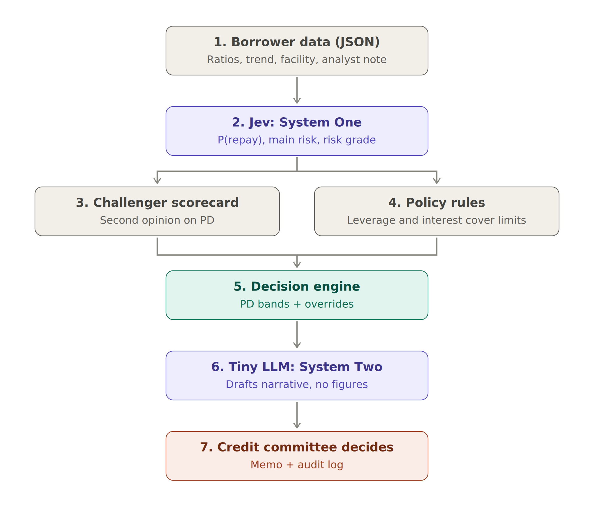

# Jev + mini LLM: credit decision support

This project uses **Jev**, TypeSafe AI's "System One" decision model, to estimate a corporate borrower's **probability of repaying** a loan facility. A spam filter scores an email as spam or not; the same kind of calibrated yes/no question here scores ability to repay. The **mini LLM** drafts the memo narrative. Fixed policy rules and a second-opinion scorecard turn the result into a recommendation, and the credit committee decides.

> Synthetic borrowers, educational code. Read the **[plain-English guide](docs/jev-credit-model-guide.md)** ([Word version](docs/Jev_LLM_Credit_Model_Guide.docx)) first.



## How a recommendation is reached

1. **Borrower data (JSON):** latest ratios, 4-quarter changes, leverage history, facility terms, analyst note.
2. **Jev** answers three questions in one call:
   - `can_repay` (noul): the probability of meeting every payment for 12 months, so PD = 1 − P(repay)
   - `main_risk` (choice): leverage, liquidity, profitability, outlook, or none
   - `risk_grade` (score): 1 to 5
3. **Challenger scorecard:** logistic regression trained on 600 labelled borrowers.
4. **Decision engine:**
   - PD below 3% → APPROVE; 3–10% → REFER; above 10% → DECLINE.
   - A breach of a policy limit (leverage above 6.0x, interest cover below 1.5x) forces REFER.
   - So does a disagreement of more than 10 points with the challenger.
5. **Mini LLM** drafts the narrative. It writes no figures; every number comes from source data.
6. **Audit log** with model versions and an empty field for the committee's decision.

## Results on 400 test borrowers (offline stand-in, not Jev)

| Model | AUC | Brier score |
|---|---|---|
| Stand-in (no training labels) | 0.665 | 0.075 |
| Challenger scorecard (600 labels) | 0.673 | 0.043 |
| Best possible (true synthetic PD) | 0.731 | 0.040 |

The stand-in ranked borrowers about as well as the trained scorecard, but it overstated risk at the top: an average 39% PD where 6.7% defaulted. The calibration check exists to catch exactly that. The tiny LLM also invented facts in one memo, which is why its narrative is marked for review and never contains figures.

**Open-source alternative:** [`laya-vs-jev-credit`](../laya-vs-jev-credit/) runs Laya, an Apache-2.0 model you host yourself, against Jev on these same borrowers.

## Run it

```bash
pip install torch scikit-learn numpy
cd code
export TYPESAFE_API_KEY=...          # calls the real Jev API
python credit_jev_llm.py             # or --offline for the stand-in
```

Jev is a third-party API, so real client data needs vendor due diligence, a data-protection review and model-risk approval first. Lending to companies is outside the EU AI Act's high-risk list; scoring individuals would be high-risk.
