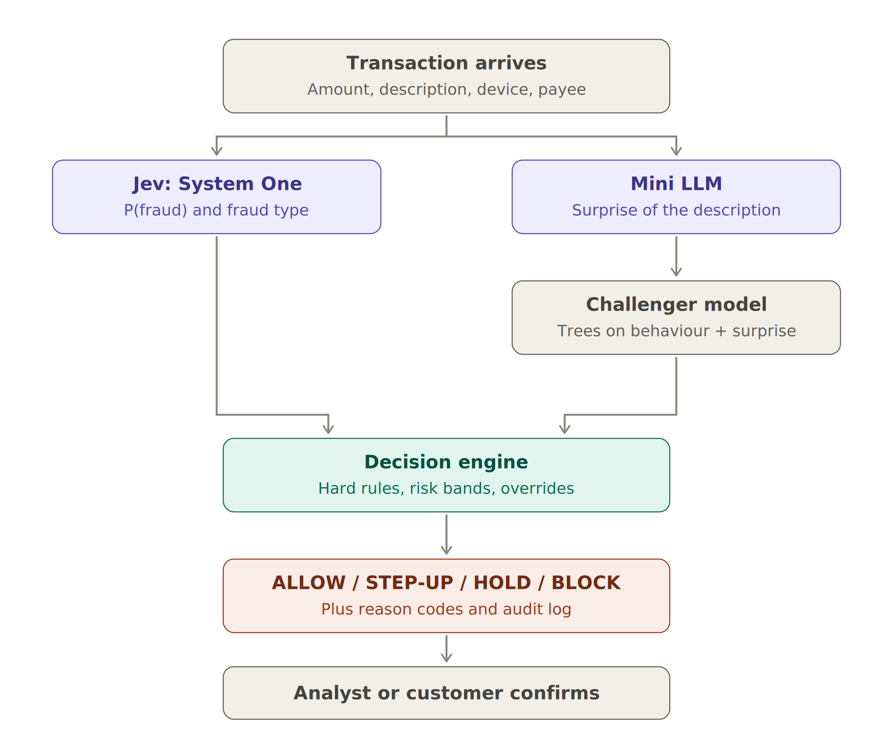
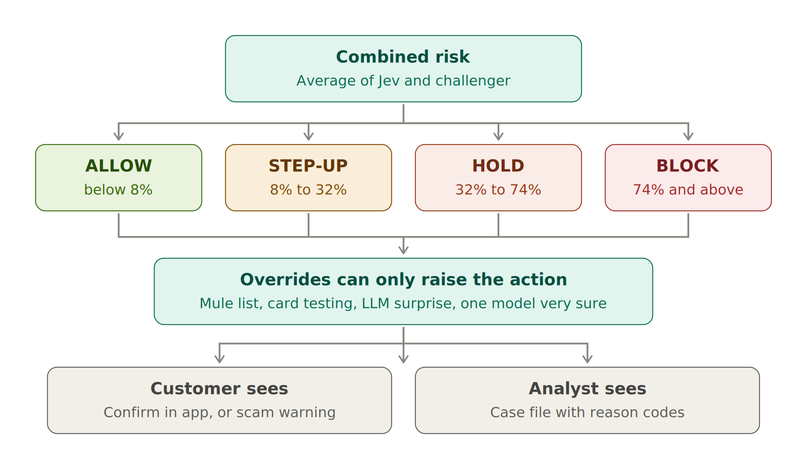
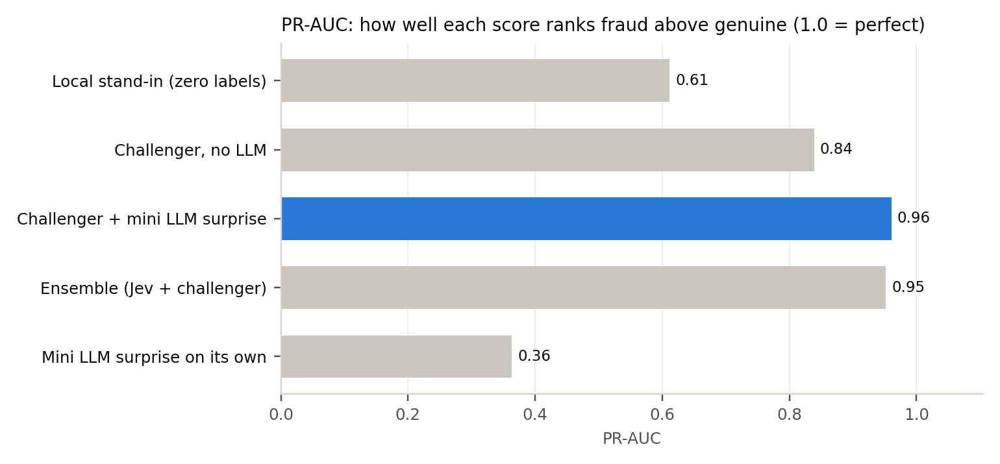
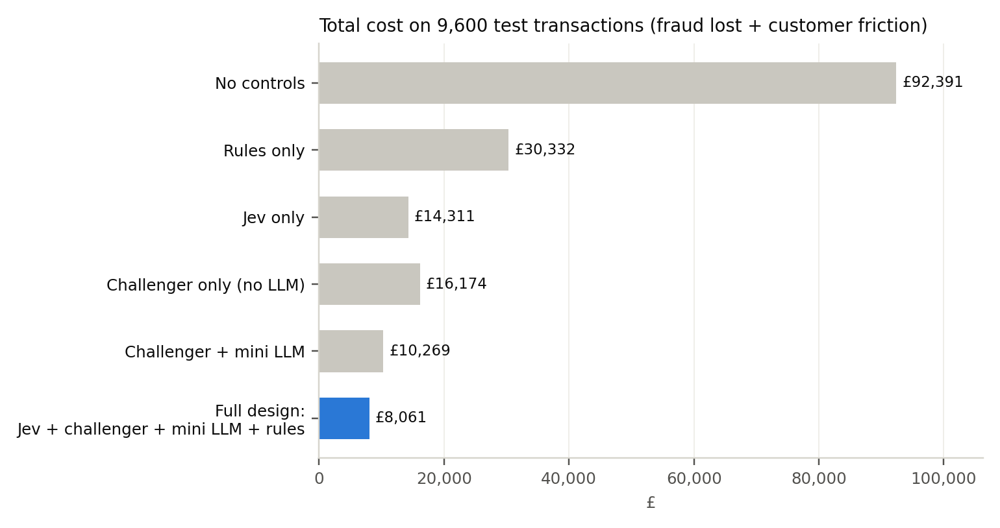

\title Jev + Mini LLM Fraud Detection
\subtitle A plain-English guide to how the system spots fraudulent transactions and decides what to do
\subtitle With simple examples · September 2026

\pagebreak

\toc

\pagebreak

# 1. The idea in one minute

A spam filter looks at an email and answers one question: **"Is this spam?"** It gives a number, such as *97% likely spam*, and the email is filed accordingly.

This system does the same for every card payment and bank transfer: **"Is this transaction fraud or a scam?"** It has about a tenth of a second to answer, because the customer is waiting at a till or in their banking app.

Two AI models work together:

- **Jev** is a new kind of AI from TypeSafe AI, released in September 2026. It reads the transaction and returns a calibrated probability of fraud and the most likely type of fraud. It does not write text. It is built to give fast, reliable numbers.
- **The mini LLM** is the small language model built from scratch in this repository. It has read tens of thousands of *normal* payment descriptions ("TESCO STORES 2291 LONDON", "RENT OCT", "J SMITH"). It notices when a new description looks nothing like normal banking text, such as "SAFE ACCOUNT TRANSFER".

Around them sit a **second-opinion model**, the bank's **hard rules**, and a **decision engine** that picks one of four actions:

| Action | What happens | Everyday comparison |
|---|---|---|
| **ALLOW** | The payment goes through | The shop assistant waves you through |
| **STEP-UP** | The customer must confirm in their app; push payments to new payees also show a scam warning | "Can I see some ID?" |
| **HOLD** | The payment is paused and a fraud analyst calls the customer | "Please wait while I call the manager" |
| **BLOCK** | The payment is stopped and the card or session is frozen | The card is declined |

> **In one sentence:** Jev and the mini LLM each notice different warning signs; a second model checks them; fixed rules catch the obvious cases; and the decision engine chooses the lightest action that keeps the customer safe.

# 2. The kinds of fraud it looks for

| Type | What happens | Typical warning signs | Simple example |
|---|---|---|---|
| **Card fraud (card not present)** | Stolen card details are used online | Many payments in a short time, a new device, a merchant abroad, odd hours | Seven gift-card purchases in an hour from a new laptop |
| **Account takeover** | A criminal gets into the customer's online banking | New device, password just reset, a payment minutes after logging in, a new payee whose account was opened recently | A password reset at 22:00, then £750 to a new payee 5 minutes after login |
| **Authorised push payment (APP) scam** | The real customer is tricked into sending money | The customer's own phone, a large payment to a new payee, a recently opened receiving account, and often tell-tale wording | "Your bank's security team" persuades someone to pay £842 with the reference "SAFE ACCOUNT TRANSFER" |

**APP scams are the hardest.** The customer really is making the payment, on their own phone, at a normal time, so most behavioural alarms stay quiet. This is where reading the payment description helps most.

**Why UK banks care so much:** since 7 October 2024, UK payment firms must reimburse APP scam victims up to £85,000 per claim, with the cost shared between the sending and receiving banks. Every scam stopped is money the bank would otherwise refund.

# 3. How it works, step by step



## Step 1 — The transaction arrives with its context

A transaction on its own says little: £750 could be rent or a robbery. So each transaction is compared with **the customer's own normal behaviour**:

| Signal | What it means | Example |
|---|---|---|
| Amount vs the customer's median | How big this is for *this* customer | £750 for someone whose usual payment is £37 → **20x** |
| New payee or merchant | First time paying this recipient | First payment to "D NOWAK" |
| Payee account age | How long ago the receiving account was opened | Opened **32 days ago** (a typical sign of a money-mule account) |
| New device | First time this phone or computer has been used | A new laptop |
| Password reset | Password changed in the last 24 hours | Reset yesterday evening |
| Minutes since login | How quickly the payment followed the login | **5 minutes** |
| Transactions in the last hour | Payment speed | **7** card payments in an hour |
| Abroad, unusual hour | Location and time compared with this customer's habits | 03:00, merchant in Hong Kong |
| Description | The merchant name or the payment reference the customer typed | "SAFE ACCOUNT TRANSFER" |

## Step 2 — Jev asks two questions in one call

Jev can answer different kinds of question. This system uses two:

| Question | Type | Everyday version | Answer returned |
|---|---|---|---|
| `is_fraud` | **Noul** (yes/no) | "Is this email spam?" | A probability, e.g. **0.877** = 87.7% likely fraud |
| `fraud_type` | **Choice** | "Is this ticket about billing, hardware or software?" | One label, e.g. **account takeover** |

Each question comes with written instructions and a definition of what counts as "yes" and "no". **Jev needs no training data.** It judges from the instructions, which helps with brand-new fraud patterns that no model has seen before.

## Step 3 — The mini LLM measures how "surprising" the description is

This is the mini LLM's only job. It is trained on normal payment descriptions and learns to predict the next letter. When it reads a new description, we measure **how hard it was to predict**, in *bits per character*:

- **Familiar text is easy to predict:** low surprise, around 0.3–1 bit per character.
- **Text it has never seen anything like is hard to predict:** high surprise, 4–6 bits per character or more.

**Real examples from the test run:**

| Description | Surprise (bits/char) | Reading |
|---|---|---|
| ONE4ALL GIFT CARD | 0.34 | Very familiar — people buy gift cards all the time |
| CAR PURCHASE DEALER | 0.48 | Familiar |
| HOUSE DEPOSIT | 0.65 | Familiar |
| DRINKS LATE | 1.65 | A bit unusual (customers' own free text) |
| **SAFE ACCOUNT TRANSFER** | **6.18** | **Rarer than every normal description it has seen** |

**Average surprise by type:** genuine 1.0, account takeover 2.0, card fraud 2.4, **APP scams 4.1** bits per character.

**Why not ask the LLM to write something, or to judge the payment itself?** A tiny LLM makes things up (see the credit-model guide, where it invented a refinancing problem). A surprise score can't invent anything: it is just a measurement. All customer messages and reason codes are fixed templates.

**Speed:** scoring one description takes about **1 millisecond** on an ordinary laptop processor, fast enough for real-time payments.

## Step 4 — A second opinion from the challenger model

The challenger is a **gradient-boosted tree model**. It learns from thousands of past transactions whose outcome is known (fraud or genuine). Its inputs are the behavioural signals from Step 1 **plus the mini LLM's surprise score**.

Why have it?

1. **Independence.** Two different methods that agree give more confidence, and disagreement is a warning.
2. **It uses the bank's own history,** while Jev works from instructions alone.
3. **It shows what the mini LLM adds.** The same model is trained with and without the surprise score (see section 5).

## Step 5 — The decision engine chooses an action



**1. Combine the two opinions.** Combined risk = the average of Jev's probability and the challenger's probability.

Example: Jev 87.7%, challenger 99.3% → combined **93.5%**.

**2. Place it in a band.** The cut-offs are set so each action fits what the bank can handle:

| Action | Combined risk | Sized so that it affects about |
|---|---|---|
| ALLOW | below 8% | the other 96% of transactions |
| STEP-UP | 8% to 32% | 2.8% of transactions |
| HOLD | 32% to 74% | 0.8% of transactions — about what the analyst team can phone |
| BLOCK | 74% and above | 0.4% of transactions |

**3. Apply the overrides.** They can only make an action *stricter*, never softer:

| Override | Minimum action | Why |
|---|---|---|
| Payee is on the shared list of known mule accounts | BLOCK | Other banks have already reported this account |
| 10 or more card payments in the last hour | BLOCK | Classic "card testing" by criminals |
| Large payment (5x usual or more) to a new payee with a description in the top 0.5% for surprise | STEP-UP | The mini LLM's early warning for scams |
| Either model is at least 90% sure it's fraud | HOLD | One confident expert is enough to ask a human |

## Step 6 — Tell the customer and the analyst, and log everything

**For a STEP-UP**, the customer sees a fixed message. For a push payment to a new payee it is a scam warning:

> *"Stop - this could be a scam. Your bank, HMRC and the police will never ask you to move money to a 'safe account' or pay a fee to release funds. If someone is telling you what to do, hang up and call us on the number on your card."*

**For a HOLD or BLOCK**, the analyst gets a **case file** with all the scores and plain **reason codes**, such as "Password reset in the last 24 hours" or "Payee account opened 32 days ago".

**For every decision**, an **audit-log** line records:
- what the models saw (a fingerprint of the input)
- the version of every model
- Jev's answers and the challenger's score
- the LLM surprise score
- any overrides and the reason codes
- an empty field for the analyst's final decision

Confirmed outcomes then become training labels for the next version of the challenger.

\pagebreak

# 4. Six worked examples

These are real outputs from the test run. The "truth" is known only because the data is synthetic; the system never sees it.

## Example A — Account takeover: BLOCK

| Item | Detail |
|---|---|
| **Transaction** | £750.28 Faster Payment, description "DRINKS LATE", 22:30 |
| **Warning signs** | New device; password reset in the last 24 hours; payment 5 minutes after login; 20x the customer's usual amount (£37); first payment to this payee; payee account opened 32 days ago; payee abroad |
| **Jev** | 87.7% fraud, type: account takeover |
| **Challenger** | 99.3% |
| **Mini LLM** | 1.65 bits/char — a bit unusual, not alarming |
| **Combined risk** | 93.5% → above 74% → **BLOCK** |

**Why:** almost every account-takeover signal fired at once. The description itself looked ordinary; the behaviour gave it away.

## Example B — Card fraud: BLOCK

| Item | Detail |
|---|---|
| **Transaction** | £64.40 online card payment to "ONE4ALL GIFT CARD", 21:24 |
| **Warning signs** | New device; first purchase at this merchant; 7 transactions in the last hour; unusual time for this customer |
| **Jev** | 69.2% fraud, type: card fraud |
| **Challenger** | 89.4% |
| **Mini LLM** | 0.34 bits/char — completely normal (people buy gift cards all the time) |
| **Combined risk** | 79.3% → **BLOCK** |

**Why:** the description was innocent, but the *pattern* — a burst of payments from a new device — is classic card fraud. This shows why the mini LLM is only one signal among many.

## Example C — APP scam with tell-tale wording: BLOCK

| Item | Detail |
|---|---|
| **Transaction** | £842.28 Faster Payment, "SAFE ACCOUNT TRANSFER", 11:55 |
| **Warning signs** | 49x the customer's usual amount (£17); first payment to this payee; payee account opened 46 days ago; payment 5 minutes after login; **description rarer than every normal description the mini LLM has seen** |
| **Jev** | 63.9% fraud, type: APP scam |
| **Challenger (with LLM surprise)** | 99.0% |
| **Mini LLM** | **6.18 bits/char** |
| **Combined risk** | 81.5% → **BLOCK** |

**Why:** the customer's own phone and a normal time of day would usually look safe. The strongest unusual signal is the mini LLM's surprise score of 6.18, and the challenger, which uses it, is 99% sure. Real banks never ask customers to move money to a "safe account".

## Example D — APP scam with innocent wording: STEP-UP with a scam warning

| Item | Detail |
|---|---|
| **Transaction** | £248.87 Faster Payment, "HOLIDAY VILLA BOOKING", 14:44 |
| **Warning signs** | 17x the customer's usual amount (£14); first payment to this payee; payee account opened 17 days ago |
| **Jev** | 15.8% fraud, type: genuine |
| **Challenger** | 32.8% |
| **Mini LLM** | 0.44 bits/char — normal wording |
| **Combined risk** | 24.3% → between 8% and 32% → **STEP-UP** |
| **Customer sees** | The scam warning above |

**Why:** a fake holiday-villa advert. The wording is innocent, so only the behaviour (a large payment to a brand-new account) raised concern. That wasn't enough to hold the payment, but the customer is warned before sending. Warnings stop only some scams (the model assumes about 35%), because victims are often being coached by the scammer.

## Example E — A genuine house deposit: HOLD (a false alarm)

| Item | Detail |
|---|---|
| **Transaction** | £846.55 Faster Payment, "HOUSE DEPOSIT", at 00:56 |
| **Warning signs** | New device; payment 2 minutes after login; 33x the customer's usual amount (£26); first payment to this payee; unusual hour |
| **Jev** | 64.7% fraud, type: account takeover |
| **Challenger** | 31.5% |
| **Mini LLM** | 0.65 bits/char — normal |
| **Combined risk** | 48.1% → **HOLD** |

**What happens next:** an analyst calls the customer, who confirms they paid a deposit late at night from a new phone. The payment is released and the outcome is logged as "genuine", which improves the next model.

**Why it's a sensible mistake:** a big payment from a new device minutes after login at 1 a.m. looks exactly like account takeover. A short phone call is a small price for protection. The two models disagreed (65% vs 32%), and the combined 48% led to a phone call rather than a block.

## Example F — A fraud that got through: ALLOW

| Item | Detail |
|---|---|
| **Transaction** | £1,359.03 Faster Payment, "CAR PURCHASE DEALER", 12:53 |
| **Warning signs** | 30x the customer's usual amount; first payment to this payee |
| **Jev** | 12.2%; **challenger** 2.6%; **mini LLM** 0.48 bits/char |
| **Combined risk** | 7.4% → just below 8% → **ALLOW** |
| **Truth** | A purchase scam: a fake car advert |

**Why it was missed:** everything looked like a genuine car purchase. The payee's account was old, there was no new device, the time was normal and the wording was normal. No fraud system catches everything. The honest answer to "what does your model miss?" is *well-disguised purchase scams*, which is why banks also rely on customer education, confirmation-of-payee checks, and sharing data with other banks.

\pagebreak

# 5. How good is it?

The system was tested on 9,600 transactions it had never seen, containing 144 frauds worth £92,391.

## Three ways to measure

- **PR-AUC (precision–recall).** How well a score ranks the frauds above the genuine payments, focusing on the rare fraud cases. 1.0 is perfect; a random guess scores about 0.015 here, because only 1.5% of transactions are fraud.
- **Recall at 2% alerts.** If the team can only look at the riskiest 2% of transactions, what share of all fraud is among them?
- **Total cost.** Money lost to fraud that got through, plus the cost of bothering genuine customers.

## Ranking power



| Score | PR-AUC | Recall at 2% alerts |
|---|---|---|
| Offline stand-in for Jev (no labels used) | 0.61 | 62.5% |
| Challenger, behaviour only | 0.84 | 84.0% |
| **Challenger + mini LLM surprise** | **0.96** | **94.4%** |
| Ensemble (Jev stand-in + challenger) | 0.95 | 93.8% |
| Mini LLM surprise on its own | 0.36 | 36.8% |

**The key finding:** on its own, the mini LLM is a weak detector (0.36), because most fraud uses ordinary-looking descriptions. But as *one extra signal* it gives the biggest single improvement, lifting the challenger from 0.84 to 0.96. Different models noticing different things is the whole point of combining them.

## Business outcome



| Design | Fraud lost | Customer friction | Total cost |
|---|---|---|---|
| No controls | £92,391 | £0 | £92,391 |
| Rules only | £29,232 | £1,100 | £30,332 |
| Jev only | £13,836 | £474 | £14,311 |
| Challenger + mini LLM | £10,078 | £190 | £10,269 |
| **Full design** | **£7,884** | **£177** | **£8,061** |

**What the full design did with the test transactions:**

| | ALLOW | STEP-UP | HOLD | BLOCK |
|---|---|---|---|---|
| Genuine (9,456) | 9,196 | 254 | 5 | 1 |
| Fraud (144) | 5 | 12 | 70 | 57 |

Reading the table:
- **97% of genuine customers noticed nothing.** Of the 260 who were interrupted, 254 just tapped "confirm" in their app.
- **70 of the 75 HOLDs were real fraud,** so the analysts' phone calls were well spent.
- **Only 5 of 144 frauds were allowed straight through.** Some STEP-UPs will still succeed, because a victim being coached may confirm anyway.
- **Share of fraud cases stopped** (allowing for STEP-UPs and HOLDs that fail): 88% of card fraud, 99% of account takeovers and 82% of APP scams.

**The assumptions behind the £ figures** (replace with your own data):

| Action | Chance of stopping the fraud | Cost of bothering a genuine customer |
|---|---|---|
| STEP-UP | 85% card fraud, 80% account takeover, 35% APP scam | £0.50 |
| HOLD | 95% card fraud and takeover, 75% APP scam | £6 |
| BLOCK | 100% | £20 |

## Are the probabilities honest? (calibration)

| Stand-in's predicted fraud probability | Transactions | Average prediction | Actually fraud |
|---|---|---|---|
| 0–5% | 7,566 | 3.1% | 0.1% |
| 5–20% | 1,803 | 8.6% | 2.5% |
| 20–50% | 194 | 29.9% | 30.9% |
| 50–80% | 33 | 65.2% | 90.9% |

The stand-in is too cautious at the bottom (it says 3% where the truth is 0.1%) and too relaxed at the top. This is exactly why a zero-label model — Jev included — must be checked against real outcomes before its percentages are trusted. The combined design is less affected because the thresholds are set by capacity rather than by the raw percentages.

# 6. Important: the real Jev versus the offline stand-in

Jev runs as an online service at `api.typesafe.ai` and needs an API key. The environment that built this system could not reach it, so every "Jev" number in this guide comes from a **local stand-in**:

- **What it is:** a short, hand-written rule. It weighs the behavioural signals and looks for a few scam phrases, and it returns answers in exactly Jev's format.
- **What it is not:** it is **not Jev**. A real language-understanding model would read the description far more flexibly than a keyword list, and could be better or worse overall.
- **Why it exists:** so the whole pipeline can be run, tested and demonstrated anywhere.

**To use the real Jev:**

```
export TYPESAFE_API_KEY=your-key
cd jev-fraud-detection/code
python fraud_jev_llm.py
```

The same tests, cost analysis and case files will then show how the real Jev performs. Jev's published benchmark is for spam detection; its performance on banking fraud must be proven on the bank's own data.

# 7. What could go wrong, and how the design protects against it

| Risk | Simple example | Protection |
|---|---|---|
| **Fraud that looks genuine** | The fake car dealer in Example F | Several independent signals; mule-account sharing between banks; confirmation of payee; customer education |
| **Too many false alarms** | Genuine customers blocked at the till | Cut-offs sized to capacity; most interruptions are a one-tap confirmation; only 1 genuine BLOCK in 9,456 |
| **Criminals change tactics** | New scam wording the LLM hasn't seen | New wording is *more* surprising, which helps; the challenger and mini LLM are retrained regularly on confirmed outcomes |
| **Normal language changes** | A new popular merchant looks "surprising" | Retrain the mini LLM on recent normal descriptions; track the average surprise over time |
| **A model's probabilities drift** | Jev's percentages stop matching reality | Weekly checks of calibration and HOLD precision; version recorded on every decision |
| **The LLM invents text** | A made-up reason in a case file | The LLM never writes; messages and reason codes are templates |
| **Data leaves the bank** | Transaction details sent to an external API | Data-protection review, contract terms, data minimisation and model-risk approval before real data is sent |
| **Automated decisions affect people** | A genuine payment blocked with no recourse | HOLDs go to humans; customers can confirm or call; every decision is explainable from its reason codes |
| **Unfair treatment** | One group of customers is challenged more often | Monitor STEP-UP and HOLD rates across customer segments |

**Regulatory notes:**
- **EU AI Act:** the high-risk category for creditworthiness explicitly *excludes* AI systems used to detect financial fraud.
- **UK model risk (PRA SS1/23):** a material fraud model still falls under model risk management — inventory, independent validation, monitoring and change control. So do data-protection rules.
- **UK APP scams:** mandatory reimbursement, up to £85,000 per claim since October 2024, makes stopping APP scams a direct financial priority.

# 8. How to explain it in the interview (30 seconds)

> "I treat fraud screening as a fast System One decision. Jev reads each transaction as structured data and returns a calibrated fraud probability and fraud type in one call, with no training labels. The mini LLM — which I built from scratch — never writes anything: it's trained only on normal payment descriptions and scores how surprising a new one is, in about a millisecond. On its own that's a weak detector, but as one extra signal it lifted our challenger's PR-AUC from 0.84 to 0.96, mostly by catching APP-scam wording like 'safe account transfer'. The decision engine sizes STEP-UP, HOLD and BLOCK to team capacity, and hard rules can only make actions stricter. Every decision is logged with model versions. And I'm honest about what it misses: well-disguised purchase scams."

# 9. Glossary

| Term | Plain meaning |
|---|---|
| **APP scam** | Authorised push payment scam: the real customer is tricked into sending money |
| **Account takeover** | A criminal gains control of the customer's online banking |
| **Card not present fraud** | Stolen card details used online or by phone |
| **Mule account** | A bank account used to receive and pass on stolen money |
| **Noul question** | Jev's yes/no question type, which returns a probability |
| **Surprise (bits per character)** | How hard the mini LLM finds a description to predict; high = unlike normal text |
| **Challenger model** | An independent model used to check the main one |
| **Gradient-boosted trees** | A standard machine-learning model made of many small decision trees |
| **PR-AUC** | How well a score ranks rare frauds above genuine payments (1.0 = perfect) |
| **Recall** | The share of all fraud that the system catches |
| **Calibration** | Whether a model's percentages match what really happens |
| **STEP-UP** | Asking the customer to confirm, often with a warning |
| **Reason codes** | Short, fixed explanations of why a transaction was flagged |
| **Synthetic data** | Realistic but invented data, used to build and test safely |

# Sources

- Simon Willison, "Jev introduces a new shape of LLM" (21 September 2026) — simonwillison.net/2026/Sep/21/jev/
- Jev AI, "Jev: the System One model for fast, calibrated AI decisions" — jevai.net/articles/what-is-system-one-jev/
- P. Niessen, "jev-test" benchmark (API request format) — github.com/pniessen/jev-test
- Payment Systems Regulator, APP scams reimbursement dashboard and PS25/5 policy statement — psr.org.uk
- Code for this guide: `jev-fraud-detection/code/fraud_jev_llm.py` and `jev_client.py`
