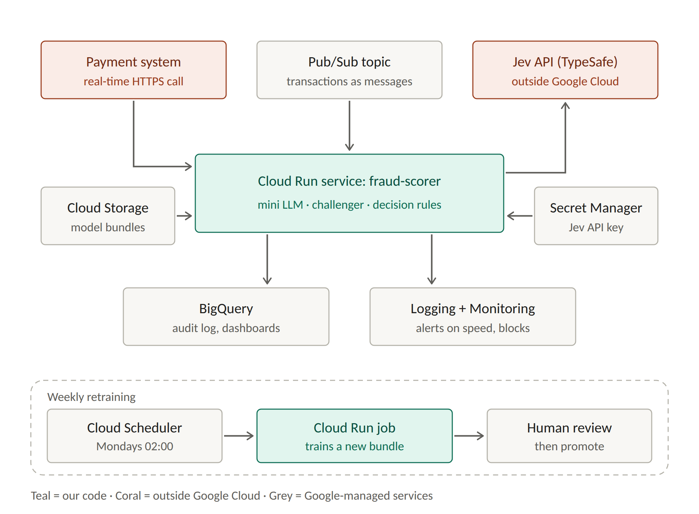

\title Jev + Mini LLM Fraud Detection
\subtitle A step-by-step guide in plain English: how it works, how it decides, and how to run it on Google Cloud
\subtitle github.com/Kwetng/tiny-llm2 · September 2026

\pagebreak

\toc

\pagebreak

# How to use this guide

The guide has six parts. You can stop after any of them.

| Part | What you will learn | Who it is for |
|---|---|---|
| **A. The basics** | What the system does and who does what | Everyone |
| **B. Follow one payment** | Every step of one real decision, with every number | Everyone |
| **C. How well it works** | The test results, in plain words | Everyone |
| **D. Run it on your computer** | Install it, run it, start the web service | Anyone who can open a terminal |
| **E. Run it on Google Cloud** | Set up Google Cloud, put the service online, send it payments, keep an audit log, monitor it, retrain it | Anyone with a Google Cloud account |
| **F. Keeping it safe** | What can go wrong and what the rules say | Managers, risk and compliance |

**Words in bold** are explained where they first appear. A full glossary is at the end.

> **Important:** all the data is invented ("synthetic"). The code is for learning, not for a real bank. The results marked "Jev" come from a stand-in that imitates Jev's answers, because the real Jev service was not reachable when this was built (section C4).

\pagebreak

# Part A. The basics

## A1. The problem in one minute

Every time someone pays by card or sends money from their banking app, the bank has a fraction of a second to decide: **is this payment safe?**

Think of airport security. Most passengers walk straight through. A few are asked a question. A very few have their bag opened. Almost nobody is stopped. Good security catches the dangerous few **without** annoying everyone else.

This system does the same for payments. It looks at each payment, gives it a **risk score** (a number from 0% to 100%), and picks the lightest action that keeps the customer safe.

## A2. The four possible answers

| Answer | What happens | Airport comparison | How often (in the test) |
|---|---|---|---|
| **ALLOW** | The payment goes through | Walk straight through | About 96 in 100 payments |
| **STEP-UP** | The customer taps "confirm" in their app. Transfers to a new person also show a scam warning | "Where are you flying today?" | About 3 in 100 |
| **HOLD** | The payment waits while a fraud analyst phones the customer | "Please step aside, we need to check your bag" | Under 1 in 100 |
| **BLOCK** | The payment is stopped and the card or login is frozen | "You cannot board" | About 1 in 250 |

## A3. The three kinds of fraud it looks for

| Kind | What happens | Typical warning signs |
|---|---|---|
| **Card fraud** | A criminal uses stolen card details online | Many small payments in a short time, a new computer, a shop abroad, a strange hour |
| **Account takeover** | A criminal gets into the customer's online banking | New phone, password just reset, money sent minutes after logging in, to a brand-new payee |
| **APP scam** (authorised push payment) | The real customer is tricked into sending money, for example by someone pretending to be the bank | The customer's own phone at a normal time, but a large payment to a new, recently opened account, often with tell-tale words such as "SAFE ACCOUNT" |

**APP scams are the hardest to catch.** The real customer is making the payment, so most alarms stay quiet. Since October 2024, UK banks must refund APP scam victims up to £85,000 per claim. Every scam stopped is money the bank would otherwise pay back.

## A4. The team: five parts, each with one job


| Part | Its one job | Everyday comparison |
|---|---|---|
| **Jev** | Reads the payment and answers two questions: "How likely is this fraud?" and "Which kind?" | An experienced officer who judges at a glance, without needing past cases |
| **Mini LLM** | Reads only the payment's description ("TESCO STORES", "RENT OCT") and measures how *unusual* the words are | A clerk who has read thousands of normal payment references and notices one that sounds wrong |
| **Challenger** | A second model, trained on thousands of past payments whose outcome is known, gives its own risk score | A second officer who learned from the bank's own case files |
| **Rules** | Fixed rules, such as "always block payments to a known criminal account" | The rulebook nobody can override |
| **Decision engine** | Combines everything into ALLOW, STEP-UP, HOLD or BLOCK, then writes down why | The supervisor who makes the call and fills in the log |

**What is an LLM?** A **large language model** is software that has learned patterns in text by predicting the next letter or word, over and over. ChatGPT and Claude are large ones. The **mini LLM** here is tiny (built from scratch in this project) and it **never writes anything**. It only measures how surprising a piece of text is. That means it can't make anything up.

**What is Jev?** A new kind of AI model from TypeSafe AI, released in September 2026. Instead of writing text, it returns numbers: a probability ("73% likely fraud") or a choice from a list ("account takeover"). It needs no training data: you describe the question in plain words.

\pagebreak

# Part B. Follow one payment, step by step

This is a real decision from the test run. The customer is being tricked by someone pretending to be the bank's security team.

## Step 1. The payment arrives

The payment system sends the payment **and** what the bank already knows about this customer. In a real bank a **feature store** (a fast database of customer facts) supplies the second half.

| What is sent | Value | Plain meaning |
|---|---|---|
| Amount | £842.28 | |
| Channel | faster_payment | A bank transfer from the app |
| Description | SAFE ACCOUNT TRANSFER | The reference the customer typed |
| Time | 11:55 | |
| Customer's usual payment | £17.22 | Their median (middle) payment |
| New payee? | Yes | First time paying this account |
| Payee account age | 46 days | The receiving account is new |
| New device? | No | Their normal phone |
| Password reset in the last day? | No | |
| Minutes since login | 4.5 | |
| Payments in the last hour | 0 | |
| On the shared list of criminal ("mule") accounts? | No | |

## Step 2. Compare with the customer's normal behaviour

£842 means nothing on its own. It could be rent. So the system compares it with **this** customer:

- £842.28 ÷ £17.22 = **49 times** their usual payment.
- First payment to this person, whose account is only 46 days old. Criminals often use new accounts to receive stolen money.
- Sent 4.5 minutes after logging in.

## Step 3. The mini LLM reads the description

The mini LLM has read 40,000 normal payment descriptions. It tries to predict each letter of the new description. The harder that is, the more unusual the text. The result is measured in **bits per character**: roughly, how many yes/no guesses it needs per letter.

| Description | Surprise | Meaning |
|---|---|---|
| ONE4ALL GIFT CARD | 0.34 bits | Very familiar |
| HOUSE DEPOSIT | 0.65 bits | Familiar |
| DRINKS LATE | 1.65 bits | A bit unusual |
| **SAFE ACCOUNT TRANSFER** | **6.18 bits** | **More unusual than every normal description it has seen** |

It takes about **1 millisecond**. On its own this proves nothing, but it's a strong clue.

## Step 4. Jev answers two questions

Jev receives the payment and the customer facts as structured data (**JSON**, a standard text format for data) and answers:

| Question | Type | Answer |
|---|---|---|
| "Is this fraud or a scam?" | Yes/no, returned as a probability | **63.9%** |
| "Which kind?" | Pick one from a list | **Authorised push payment scam** |

## Step 5. The challenger gives a second opinion

The challenger is a **gradient-boosted tree model**: hundreds of small decision trees, each asking yes/no questions such as "Is the amount more than 5 times usual?". It learned from 14,400 past payments whose outcome was known. It also uses the mini LLM's surprise score.

Its answer: **99.0%** likely fraud.

## Step 6. Combine the two opinions

Combined risk = the average of the two = (63.9% + 99.0%) ÷ 2 = **81.5%**.

Then the risk is placed in a band:

| Combined risk | Action | Why these numbers |
|---|---|---|
| Below 8.1% | ALLOW | |
| 8.1% to 32.5% | STEP-UP | Set so about 3 in 100 payments get a confirm tap |
| 32.5% to 73.5% | HOLD | Set so the analyst team can phone everyone held |
| **73.5% and above** | **BLOCK** | Set so about 1 in 250 payments is blocked |

81.5% is above 73.5%, so the action is **BLOCK**.

The bands come from **capacity** (how many calls the analysts can make, how many taps customers will tolerate), not from a fixed 50% line.

## Step 7. Check the rules

The rules can only make an action **stricter**, never softer:

| Rule | Minimum action | Did it apply here? |
|---|---|---|
| Payee is on the shared list of criminal accounts | BLOCK | No |
| 10 or more card payments in the last hour ("card testing") | BLOCK | No (not a card payment) |
| Big transfer (5× usual) to a new payee **and** the description is in the top 0.5% for surprise | at least STEP-UP | Yes, but the action is already stricter |
| Either model is at least 90% sure | at least HOLD | Yes (challenger 99%), but already stricter |

Final answer: **BLOCK**.

## Step 8. Write down why

The system never writes free text. The customer message and **reason codes** (short, fixed explanations) come from templates:

- Payment 5 minutes after login
- Amount is 49x the customer's median (£17)
- First payment to this payee or merchant
- Payee account opened 46 days ago
- Description unlike normal payments (mini LLM surprise 6.2 bits/char)

Every decision is also saved in an **audit log** with the version of every model and a fingerprint of the input, so anyone can later check exactly why it happened.

## Step 9. The other five examples, in brief

| Payment | Truth | Jev | Challenger | Combined | Action | Why |
|---|---|---|---|---|---|---|
| £750 "DRINKS LATE" at 22:30 | Account takeover | 87.7% | 99.3% | 93.5% | **BLOCK** | New device, password just reset, 5 minutes after login, 20× usual |
| £64 "ONE4ALL GIFT CARD" | Card fraud | 69.2% | 89.4% | 79.3% | **BLOCK** | 7 payments in an hour from a new laptop. The words were normal |
| £249 "HOLIDAY VILLA BOOKING" | APP scam | 15.8% | 32.8% | 24.3% | **STEP-UP** + scam warning | Only the behaviour looked odd. The customer is warned |
| £847 "HOUSE DEPOSIT" at 00:56 | **Genuine** | 64.7% | 31.5% | 48.1% | **HOLD** | A false alarm: new phone, 1 a.m., 33× usual. One phone call sorts it out |
| £1,359 "CAR PURCHASE DEALER" | APP scam | 12.2% | 2.6% | 7.4% | **ALLOW** | **Missed.** A fake car advert that looked exactly like a genuine purchase |

No system catches everything. The honest answer to "what does it miss?" is: **well-disguised purchase scams**.

\pagebreak

# Part C. How well it works

## C1. The test

24,000 invented payments, about 1.5% of them fraud. The models learned from 14,400 and were tested on the other 9,600, which they had never seen. Those 9,600 included 144 frauds worth £92,391.

## C2. Who spots fraud best?

**PR-AUC** is a score from 0 to 1 for how well a model puts the frauds at the top of its list. Guessing at random would score about 0.015 here.

| Model | PR-AUC | Share of fraud caught if analysts check the riskiest 2% |
|---|---|---|
| Stand-in for Jev (no training data) | 0.61 | 63% |
| Challenger without the mini LLM | 0.84 | 84% |
| **Challenger with the mini LLM** | **0.96** | **94%** |
| Mini LLM on its own | 0.36 | 37% |

**What this shows:** on its own, the mini LLM is weak, because most fraud uses ordinary words. As **one extra clue** it gives the biggest single improvement, from 0.84 to 0.96. It helps most with APP scams: their descriptions average 4.1 bits of surprise, against 1.0 for genuine payments.

## C3. What it saves


| Design | Fraud lost | Cost of bothering customers | Total |
|---|---|---|---|
| No checks at all | £92,391 | £0 | £92,391 |
| Simple rules only | £29,232 | £1,100 | £30,332 |
| **Full system** | **£7,884** | **£177** | **£8,061** |

- **97 in 100 genuine customers noticed nothing.** Of the 260 interrupted, 254 just tapped "confirm".
- **70 of the 75 held payments were real fraud**, so the analysts' calls were well spent.
- **Stopped:** 88% of card fraud, 99% of account takeovers, 82% of APP scams.

The £ figures depend on assumptions (for example, that a scam warning stops 35% of APP scams). Replace them with your bank's own figures.

## C4. The real Jev and the stand-in

Jev runs as an online service and needs a paid key. It wasn't reachable when this was built, so every "Jev" number above comes from a **stand-in**: a short hand-written rule that answers in exactly Jev's format. **It is not Jev.** Add a key and re-run (Part D or E) to test the real model. Jev has published results for spam, not for bank fraud, so it must be tested on the bank's own data.

\pagebreak

# Part D. Run it on your own computer

You need a computer with **Python 3.11** or newer and **Git**. Everything below is typed in a **terminal**: Terminal on a Mac, PowerShell on Windows. On Windows, write `set` instead of `export`.

## D1. Download the project

```
git clone https://github.com/Kwetng/tiny-llm2.git
cd tiny-llm2/jev-fraud-detection
```

## D2. Install the libraries

```
python -m venv .venv
source .venv/bin/activate          # Windows: .venv\Scripts\activate
pip install -r gcp/service/requirements.txt pytest httpx
```

A **virtual environment** (`.venv`) keeps these libraries separate from the rest of your computer.

## D3. Run the whole experiment

```
cd code
python fraud_jev_llm.py --offline
```

This takes about 2 minutes. It creates the invented payments, trains the mini LLM and the challenger, tests everything, and writes the results to `code/fraud_outputs/`:

| File | What is in it |
|---|---|
| `metrics.json` | All the results in section C |
| `case_*.md` | The six worked examples |
| `audit_log.jsonl` | One line per decision, as a bank would keep |
| `model_card.md` | A one-page summary for model risk |

To use the real Jev, set your key first: `export TYPESAFE_API_KEY=your-key`, then run without `--offline`.

## D4. Save the trained models as a "bundle"

The web service needs the trained models saved to files:

```
python fraud_jev_llm.py --offline --export-bundle ../gcp/model_bundle
cd ..
```

The bundle is 1.7 MB:

| File | What it is |
|---|---|
| `mini_llm.pt` | The mini LLM's learned weights |
| `challenger.joblib` | The challenger model |
| `baseline_surprise.npy` | What "normal" surprise looks like, for the top-0.5% rule |
| `engine.json` | The bands, rules, questions for Jev and message templates |
| `samples.json` | The six example payments and the decisions they should get |

A bundle is already included in the repository, so this step is optional.

## D5. Run the tests

```
pytest -q tests
```

You should see `14 passed`. The tests check, among other things, that the web service gives **exactly** the same decision as the experiment for all six examples.

## D6. Start the web service on your computer

```
cd gcp/service
export JEV_OFFLINE=true BUNDLE_DIR=../model_bundle PYTHONPATH=../../code
uvicorn main:app --port 8080
```

(On Windows PowerShell: `$env:JEV_OFFLINE="true"; $env:BUNDLE_DIR="../model_bundle"; $env:PYTHONPATH="../../code"`.)

Leave that window open. In a **second** terminal, from the `jev-fraud-detection` folder:

```
curl http://localhost:8080/healthz
python gcp/send_test_transactions.py http://localhost:8080
```

You should see:

```
genuine_large_new_payee  HOUSE DEPOSIT          -> HOLD     risk 48.1% (expected HOLD)
app_scam                 HOLIDAY VILLA BOOKING  -> STEP-UP  risk 24.3% (expected STEP-UP)
app_scam_scam_wording    SAFE ACCOUNT TRANSFER  -> BLOCK    risk 81.5% (expected BLOCK)
account_takeover         DRINKS LATE            -> BLOCK    risk 93.5% (expected BLOCK)
card_fraud               ONE4ALL GIFT CARD      -> BLOCK    risk 79.3% (expected BLOCK)
missed_fraud             CAR PURCHASE DEALER    -> ALLOW    risk 7.4% (expected ALLOW)
```

Each answer takes a few milliseconds. You can also open **http://localhost:8080/docs** in a browser: FastAPI shows every endpoint with a "Try it out" button.

**The service has three addresses (endpoints):**

| Endpoint | Used for |
|---|---|
| `GET /healthz` | "Are you alive?" Google Cloud checks this |
| `POST /score` | Send one payment, get the decision back straight away |
| `POST /pubsub` | Receive payments as messages from Google Pub/Sub (section E9) |

\pagebreak

# Part E. Run it on Google Cloud, step by step

## E0. What Google Cloud does for us

**Google Cloud Platform (GCP)** rents out computers, storage and ready-made services by the minute. You pay for what you use. For this project we use ten services:

| Service | What it is | Everyday comparison | Used for |
|---|---|---|---|
| **Project** | A folder that holds everything and receives the bill | A company account | Keeping this demo separate |
| **IAM and service accounts** | Who is allowed to do what. A **service account** is an identity for a program, not a person | Staff badges that open only certain doors | Each part gets only the access it needs |
| **Cloud Build** | Builds our program into a **container** | A factory that packs the program and everything it needs into one box | Making the container image |
| **Artifact Registry** | Stores containers | A warehouse for those boxes | Keeping each version |
| **Cloud Run** | Runs a container as a web service; starts more copies when busy, stops them when idle | A taxi rank that adds cars when the queue grows | The fraud scorer and the retraining job |
| **Secret Manager** | A safe for passwords and keys | A key cabinet with a log of who opened it | The Jev API key |
| **Cloud Storage** | Stores files ("objects") in "buckets" | A shared drive | Model bundles |
| **Pub/Sub** | Passes messages between systems | A post room | Payments sent as messages |
| **BigQuery** | A database for very large tables, queried with SQL | A giant spreadsheet you can ask questions | The audit log and reports |
| **Logging, Monitoring, Scheduler** | Collects logs, draws charts, sends alerts, runs jobs on a timetable | A CCTV room with an alarm and a wall calendar | Watching the service; weekly retraining |



**Two ways in:**

- **Real time:** the payment system calls the service over the internet (HTTPS) and waits a few milliseconds for the answer. Use this for approving payments.
- **Messages:** other systems drop payments onto a **Pub/Sub topic**; Pub/Sub delivers each one to the service. Use this for screening in bulk, or when the sender shouldn't wait.

**All the commands in this part are in one script,** `gcp/deploy.sh`, as numbered steps (`step1_project`, `step2_identities`, …). Each step below shows what the command does and what you should see.

> **Please note:** the commands were written for this guide and checked for syntax, and the service they deploy passes its 14 tests. They have **not** been run against a live Google Cloud account from the environment that built this guide. Read each command before you run it, and use a new, empty project.

## E1. Before you start

1. **Create a Google account and a Google Cloud account** at console.cloud.google.com. New accounts usually get free credit.
2. **Create a new project.** In the console: the project picker at the top, then *New project*. Write down the **project ID** (for example `my-fraud-demo-123`). It's different from the display name.
3. **Link billing** to the project: *Billing* in the menu.
4. **Set a budget alert** so nothing surprises you: *Billing*, then *Budgets & alerts*, then *Create budget*, for example £20 a month with an email at 50%, 90% and 100%.
5. **Open Cloud Shell.** Click the terminal icon (**>_**) at the top right of the console. **Cloud Shell** is a free Linux terminal in your browser with `gcloud`, `bq`, `git` and Python already installed. It is the easiest way to follow this guide. To work on your own computer instead, install the Google Cloud CLI from cloud.google.com/sdk and run `gcloud auth login`.
6. **Download the project in Cloud Shell:**

```
git clone https://github.com/Kwetng/tiny-llm2.git
cd tiny-llm2/jev-fraud-detection
export PROJECT_ID=my-fraud-demo-123      # your project ID
export REGION=europe-west2               # London
source gcp/deploy.sh
```

`source` loads the settings and the step functions without running anything yet.

## E2. Point gcloud at your project and switch on the services

```
step1_project
```

This runs:

```
gcloud config set project $PROJECT_ID
gcloud config set run/region $REGION
gcloud services enable run.googleapis.com cloudbuild.googleapis.com artifactregistry.googleapis.com \
  secretmanager.googleapis.com bigquery.googleapis.com pubsub.googleapis.com storage.googleapis.com \
  cloudscheduler.googleapis.com logging.googleapis.com monitoring.googleapis.com
```

Google Cloud services are switched off in a new project. `services enable` switches on the ten we need. It can take a minute or two and ends with *Operation finished successfully*.

**Why London (`europe-west2`)?** Customer data should stay in the UK or EU. Choosing the region once, and using it for everything, keeps it there.

## E3. Create an identity for each part

```
step2_identities
```

This creates four **service accounts**:

| Service account | Who uses it | What it may do (granted in later steps) |
|---|---|---|
| `fraud-scorer` | The scoring service | Read the Jev key, read model bundles, write to the audit table |
| `pubsub-push` | Pub/Sub | Call the scoring service |
| `fraud-retrain` | The weekly retraining job | Write new model bundles |
| `scheduler` | Cloud Scheduler | Start the retraining job |

This is the **principle of least privilege**: if one part is misused, it can't do anything else. A bank's auditors will ask for it.

## E4. Put the Jev key in the safe

If you have a Jev API key:

```
export TYPESAFE_API_KEY=your-key
step3_jev_key
```

This runs:

```
printf '%s' "$TYPESAFE_API_KEY" | gcloud secrets create typesafe-api-key --data-file=- \
  --replication-policy=user-managed --locations=$REGION
gcloud secrets add-iam-policy-binding typesafe-api-key \
  --member="serviceAccount:fraud-scorer@$PROJECT_ID.iam.gserviceaccount.com" \
  --role="roles/secretmanager.secretAccessor"
```

The key is stored encrypted, only in London, and only the scoring service may read it. It never appears in the code or the container.

**No key?** Skip this step. The service will use the stand-in and say so on every decision (`"decision_model": "LOCAL STAND-IN (not Jev)"`).

## E5. Create the storage: a bucket and two BigQuery tables

```
step4_storage
```

| Command | What it does |
|---|---|
| `gcloud storage buckets create gs://$BUCKET --location=$REGION --uniform-bucket-level-access` | Creates a bucket for model bundles. Uniform access means permissions are set for the whole bucket, which is simpler and safer |
| `gcloud storage cp gcp/model_bundle/* gs://$BUCKET/bundles/initial/` | Uploads the first bundle |
| `gcloud storage buckets add-iam-policy-binding ...` | Lets the scorer **read** bundles and the retraining job **write** them |
| `bq --location=$REGION mk --dataset $PROJECT_ID:fraud` | Creates a BigQuery **dataset** (a folder of tables) called `fraud` |
| `bq mk --table --time_partitioning_field=decided_at ... fraud.decisions gcp/bigquery_schema.json` | Creates the audit-log table, one row per decision. **Partitioned** by day, so queries on recent days are fast and cheap |
| `bq mk --table ... fraud.outcomes gcp/outcomes_schema.json` | Creates a table for the analysts' verdicts (FRAUD or GENUINE) |
| `bq add-iam-policy-binding ... fraud.decisions` | Lets the scorer add rows to the audit table, and to nothing else |

**Why two tables?** Rows streamed into BigQuery can't be edited for a while afterwards. So analysts' verdicts go in their own table, and the two are joined by `decision_id` when needed.

## E6. Build the container

```
step5_build
```

This runs:

```
gcloud artifacts repositories create fraud --repository-format=docker --location=$REGION
gcloud builds submit --config gcp/cloudbuild.yaml --substitutions=_REGION=$REGION,_TAG=v1 .
```

1. The first command creates a private **repository** for container images in London.
2. The second uploads the project folder to **Cloud Build**. Cloud Build follows the recipe in `gcp/Dockerfile`:
   - start from a small Linux with Python 3.11
   - install the libraries (the CPU-only version of PyTorch, to keep it small)
   - copy in the three program files and the model bundle
   - run as an ordinary user, not as administrator
3. The finished **image** is stored as `europe-west2-docker.pkg.dev/PROJECT_ID/fraud/fraud-scorer:v1`.

It takes about 5–10 minutes the first time and ends with *SUCCESS*. The file `.gcloudignore` stops unneeded folders (documents, diagrams) from being uploaded.

## E7. Put the service online with Cloud Run

```
step6_deploy
```

The main command:

```
gcloud run deploy fraud-scorer --image=$IMAGE --region=$REGION \
  --service-account=fraud-scorer@$PROJECT_ID.iam.gserviceaccount.com \
  --no-allow-unauthenticated --cpu=2 --memory=2Gi --min-instances=0 --max-instances=5 \
  --concurrency=20 --timeout=15 \
  --set-env-vars=BQ_TABLE=$PROJECT_ID.fraud.decisions,TORCH_THREADS=2,BUNDLE_URI=gs://$BUCKET/bundles/initial \
  --set-secrets=TYPESAFE_API_KEY=typesafe-api-key:latest
```

What each part means:

| Setting | Meaning |
|---|---|
| `--service-account` | The service runs with the `fraud-scorer` badge from E3 |
| `--no-allow-unauthenticated` | **Private:** only callers with permission can use it |
| `--cpu=2 --memory=2Gi` | Size of each copy (2 processors, 2 GB of memory) |
| `--min-instances=0` | No copies run when idle, so it costs nothing, but the first request after a pause is slow (a **cold start**, a few seconds) |
| `--max-instances=5` | Never more than 5 copies, which caps the cost |
| `--concurrency=20` | Each copy handles up to 20 payments at once |
| `--timeout=15` | Give up after 15 seconds |
| `BQ_TABLE` | Write every decision to the audit table |
| `BUNDLE_URI` | Load the models from the bucket at start-up |
| `--set-secrets` | Hand the Jev key to the program from Secret Manager |

The script then gives **you** permission to call the service (`roles/run.invoker`) and prints its address, for example `https://fraud-scorer-abc123-nw.a.run.app`.

## E8. Send it payments

```
step7_test
```

The script does three things.

**1. Health check:**

```
curl -H "Authorization: Bearer $(gcloud auth print-identity-token)" $SERVICE_URL/healthz
```

`gcloud auth print-identity-token` creates a short-lived **identity token** that proves who you are. Without it the service answers `403 Forbidden`, which is exactly what should happen.

**2. Score one payment**, the "SAFE ACCOUNT TRANSFER" example from Part B:

```
curl -X POST -H "Authorization: Bearer $(gcloud auth print-identity-token)" \
  -H "Content-Type: application/json" -d @gcp/sample_transaction.json $SERVICE_URL/score
```

The answer (shortened):

```
{
 "action": "BLOCK",
 "risk": 0.8147,
 "p_jev": 0.6395,
 "jev_fraud_type": "authorised push payment scam",
 "p_challenger": 0.99,
 "llm_surprise_bits": 6.179,
 "reason_codes": ["Payment 5 minutes after login",
                  "Amount is 49x the customer's median (£17)",
                  "First payment to this payee or merchant",
                  "Payee account opened 46 days ago",
                  "Description unlike normal payments (mini LLM surprise 6.2 bits/char)"],
 "decision_model": "LOCAL STAND-IN (not Jev) - set TYPESAFE_API_KEY to use the real model",
 "decision_id": "64fac21c-...",
 "latency_ms": 8.3
}
```

**3. All six examples:** `python gcp/send_test_transactions.py $SERVICE_URL`. You should see the same six lines as in D6.

**How the payment system would call it** (Python, with `pip install requests google-auth`):

```
import google.auth.transport.requests, google.oauth2.id_token, requests
token = google.oauth2.id_token.fetch_id_token(google.auth.transport.requests.Request(), SERVICE_URL)
r = requests.post(SERVICE_URL + "/score", json=payment, headers={"Authorization": "Bearer " + token}, timeout=2)
action = r.json()["action"]          # ALLOW, STEP-UP, HOLD or BLOCK
```

The caller runs with its own service account, which needs the `roles/run.invoker` role on this service. Always set a short timeout, and decide in advance what happens if the scorer doesn't answer in time (usually STEP-UP rather than ALLOW).

## E9. Receive payments as messages (Pub/Sub)

```
step8_pubsub
```

| Command | What it does |
|---|---|
| `gcloud pubsub topics create transactions` | Creates a **topic**: a named mailbox that systems publish payments to |
| `gcloud run services add-iam-policy-binding fraud-scorer --member=serviceAccount:pubsub-push@... --role=roles/run.invoker` | Lets Pub/Sub call the service |
| `gcloud pubsub subscriptions create transactions-to-scorer --topic=transactions --push-endpoint=$SERVICE_URL/pubsub --push-auth-service-account=pubsub-push@...` | Creates a **push subscription**: every message on the topic is posted to `/pubsub`, signed with the `pubsub-push` identity |
| `gcloud pubsub topics publish transactions --message="$(cat gcp/sample_transaction.json)"` | Sends one test payment |

**How it behaves:**

- If the service answers with success, Pub/Sub marks the message as done.
- If the service fails, Pub/Sub tries again later, so nothing is lost.
- A message that can never work (for example, not valid JSON) is logged and accepted, so it doesn't loop forever.
- In production, add a **dead-letter topic** to catch messages that keep failing.

## E10. Read the audit log

```
step9_audit
```

**In BigQuery** (from Cloud Shell, or in the console under *BigQuery*, then the `fraud` dataset):

```
bq query --use_legacy_sql=false \
 'SELECT decided_at, transaction_id, action, ROUND(risk, 3) AS risk, reason_codes
  FROM `my-fraud-demo-123.fraud.decisions` ORDER BY decided_at DESC LIMIT 10'
```

**In Cloud Logging:** every decision is also written as a structured log line.

```
gcloud logging read 'resource.type="cloud_run_revision" AND jsonPayload.message="fraud_decision"' --limit=5
```

In the console: *Logging*, then *Logs Explorer*, then filter on `jsonPayload.message="fraud_decision"`.

**Recording an analyst's verdict** after a HOLD:

```
bq query --use_legacy_sql=false \
 "INSERT INTO fraud.outcomes (decision_id, analyst_decision, reviewed_by, reviewed_at)
  VALUES ('64fac21c-...', 'GENUINE', 'analyst.jones', CURRENT_TIMESTAMP())"
```

**A dashboard in 5 minutes:**

1. Open lookerstudio.google.com and choose *Create*, then *Data source*, then *BigQuery*.
2. Pick the `fraud.decisions` table.
3. Add a time chart of decisions by `action`, and a table of the latest HOLDs.

The file `gcp/monitoring.sql` has four ready-made health-check queries:

1. Actions per day against the planned capacity
2. The 95th-percentile response time
3. The average mini LLM surprise, which rises when normal wording changes
4. The share of HOLDs that turned out to be real fraud

## E11. Watch it and get alerts

```
step10_monitoring
```

This creates a **log-based metric** called `fraud_blocks`: a counter that goes up every time the service decides BLOCK.

Then create two alerts in the console: *Monitoring*, then *Alerting*, then *Create policy*.

1. **Too slow:**
   - Metric: *Cloud Run Revision → Request latencies*, filtered to service `fraud-scorer`.
   - Condition: 95th percentile above 500 ms for 5 minutes.
   - Notification: your email.
2. **Unusual number of BLOCKs:**
   - Metric: *Logs-based metric → user/fraud_blocks*.
   - Condition: more than, say, three times the normal hourly count.
   - A sudden jump means either an attack or a broken model. Both need a person.

**What to check every week:**

- **Actions:** the share of STEP-UP, HOLD and BLOCK stays close to plan.
- **HOLD precision:** the share of HOLDs that are real fraud (query 4) doesn't fall.
- **Wording drift:** the average mini LLM surprise doesn't creep up. If it does, retrain.

## E12. Retrain every week, and let a person approve

```
step11_retraining
```

| What it creates | What it does |
|---|---|
| **Cloud Run job** `fraud-retrain` | Runs `retrain.py` from the same container: trains new models and saves a new bundle to `gs://BUCKET/bundles/YYYY-MM-DD-HHMM/`, together with its `metrics.json` |
| **Cloud Scheduler** job `fraud-retrain-weekly` | Starts the job every Monday at 02:00, London time |

To run it now: `gcloud run jobs execute fraud-retrain --region=$REGION --wait`.

**The new model does not go live automatically.** Promotion works like this:

1. **Review.** Download `metrics.json` for the new bundle and compare it with the current one: PR-AUC, HOLD precision, total cost.
2. **Try it on a small share of traffic (canary):**

```
gcloud run services update fraud-scorer --region=$REGION \
  --update-env-vars=BUNDLE_URI=gs://$BUCKET/bundles/2026-10-05-0200 --no-traffic --tag=candidate
gcloud run services update-traffic fraud-scorer --region=$REGION --to-tags=candidate=10
```

   This sends 10% of payments to the new version while 90% stay on the old one.

3. **Promote:** `gcloud run services update-traffic fraud-scorer --region=$REGION --to-latest`.
4. **Roll back** at any time by sending 100% of traffic back to the previous revision (the console's *Revisions* tab lists them all).

**In this demo** the job invents new data each time. With real data, `retrain.py` would read last week's decisions from `fraud.decisions` joined to the analysts' verdicts in `fraud.outcomes`.

## E13. From demo to a real bank: the extra controls

| Control | What to do on Google Cloud | Why |
|---|---|---|
| **No public address** | `--ingress=internal-and-cloud-load-balancing`; callers reach it only from the bank's own network | Payments should never cross the open internet |
| **Data boundary** | Put the project inside **VPC Service Controls** | Stops data being copied out, even by someone with valid access |
| **Your own encryption keys** | **Cloud KMS** keys for the bucket, BigQuery and Cloud Run (`--key=...`) | The bank can revoke Google's access to the data |
| **Fixed outgoing address for Jev** | Direct VPC egress plus **Cloud NAT** with a reserved IP address | TypeSafe can allow only the bank's address to use the key |
| **Only approved regions** | Organisation policy `gcp.resourceLocations` = UK and EU | Nobody can create resources elsewhere by mistake |
| **Only approved images** | **Binary Authorization** | Only images built by the bank's pipeline can run |
| **Less data sent to Jev** | Send only the fields in `jev_state()`, never names or account numbers; **Sensitive Data Protection** can mask free text | Data minimisation under GDPR |
| **Always warm** | `--min-instances=2` | No cold starts during payment hours |
| **Full access logs** | Turn on **Data Access audit logs** for BigQuery, Storage and Secret Manager | Who read what, and when |
| **Model risk** | Register the model, have it independently validated, keep this guide and the tests as evidence | PRA SS1/23 |

## E14. What it costs, and how to delete everything

**Costs** (check the pricing pages for your region):

- With `--min-instances=0`, Cloud Run charges only while it is working. A few hundred test payments cost pennies.
- Cloud Build, Artifact Registry, BigQuery and Cloud Storage are also very cheap at this size.
- The biggest cost to watch is **keeping instances always on** (`--min-instances` above 0). Keep it at 0 while learning.
- The budget alert from E1 is your safety net.

**To delete everything this guide created:**

```
cleanup
```

It removes the scheduler job, the retraining job, the Pub/Sub topic and subscription, the service, the metric, the BigQuery dataset (**including the audit log**), the bucket, the image repository, the secret and the service accounts.

To remove absolutely everything, delete the project: `gcloud projects delete $PROJECT_ID`.

## E15. When something goes wrong

| What you see | Likely cause | What to do |
|---|---|---|
| `PERMISSION_DENIED` during `gcloud builds submit` | The Cloud Build account can't write to Artifact Registry | In IAM, give the build service account (shown in the error) the **Artifact Registry Writer** role |
| `403 Forbidden` when calling the service | No identity token, or you lack the invoker role | Add the `Authorization: Bearer $(gcloud auth print-identity-token)` header; re-run the `add-iam-policy-binding` line in step 6 |
| `Service account ... does not exist` | IAM changes take a minute to spread | Wait a minute and run the step again |
| `The bucket name is already taken` | Bucket names are global | Set `export BUCKET=something-unique` and `source gcp/deploy.sh` again |
| The first request takes several seconds | A cold start: the models are loading | Normal with `--min-instances=0`; use 1 or more in production |
| Decisions work but BigQuery stays empty | The scorer can't write to the table | In Logs Explorer, search for `bigquery_insert_failed` and check the step-4 permission. The payment decision itself is never blocked by this |
| Pub/Sub messages keep retrying | The push identity can't call the service | Check the invoker role for `pubsub-push` (step 8). Older projects may also need the Pub/Sub service agent to have **Service Account Token Creator** |
| `Jev HTTP 401` in the logs | Wrong or expired Jev key | Save the new key in a file and run `gcloud secrets versions add typesafe-api-key --data-file=newkey.txt`, delete the file, then redeploy (step 6) |
| Error loading `challenger.joblib` | The scikit-learn version differs from the one that trained it | Keep the versions pinned in `requirements.txt`; retrain inside the same container |

\pagebreak

# Part F. Keeping it safe and fair

| Risk | Example | How the design protects against it |
|---|---|---|
| **Fraud that looks genuine** | The fake car dealer | Several independent clues; shared mule-account lists; Confirmation of Payee; customer education |
| **Too many false alarms** | Genuine customers blocked at the till | Bands sized to capacity; most interruptions are one tap; 1 genuine BLOCK in 9,456 |
| **Criminals change their words** | New scam scripts | New wording is *more* surprising to the mini LLM, which helps; weekly retraining |
| **Normal wording changes** | A new popular shop looks "surprising" | Watch the average surprise (E10) and retrain |
| **A model's percentages drift** | Jev's 70% no longer means 70% | Weekly checks; every decision records model versions |
| **The AI makes something up** | A false reason in a case file | The mini LLM never writes; all messages are templates |
| **Data leaves the bank** | Payment details sent to Jev | Send the minimum; contract and data-protection review first; fixed outgoing address (E13) |
| **A service outage** | The scorer doesn't answer | The payment system uses a pre-agreed fallback (usually STEP-UP); Cloud Run restarts copies automatically |
| **Unfair treatment** | One group is stopped more often | Monitor STEP-UP and HOLD rates by customer segment |

**What the rules say:**

- **UK APP scams:** since 7 October 2024, mandatory reimbursement up to £85,000 per claim, shared between the sending and receiving banks.
- **Model risk (PRA SS1/23):** a fraud model is a model. It must be listed in the model inventory, independently validated, monitored, and changed only through a controlled process. That is why promotion in E12 needs a person.
- **EU AI Act:** AI used to detect financial fraud is specifically excluded from the high-risk "creditworthiness" category. GDPR still applies.
- **Cloud outsourcing (PRA SS2/21):** running a critical service on Google Cloud needs an outsourcing assessment, an exit plan and resilience testing.

# Glossary

| Term | Plain meaning |
|---|---|
| **APP scam** | Authorised push payment scam: the real customer is tricked into sending money |
| **Account takeover** | A criminal controls the customer's online banking |
| **Audit log** | A permanent record of every decision and why it was made |
| **Bits per character** | How many yes/no guesses the mini LLM needs per letter; high means unusual text |
| **Bucket** | A container for files in Cloud Storage |
| **Canary** | Sending a small share of traffic to a new version before switching everyone |
| **Challenger** | A second, independent model used to check the first |
| **Cloud Run** | Google's service that runs a container as a web service and scales it automatically |
| **Cloud Shell** | A free terminal in the browser with Google Cloud tools installed |
| **Cold start** | The delay while a new copy of a service starts up |
| **Container / image** | A program packed with everything it needs, so it runs the same everywhere |
| **Endpoint** | An address on a web service, such as `/score` |
| **Feature store** | A fast database of facts about each customer, used at decision time |
| **Gradient-boosted trees** | Many small decision trees whose answers are added up |
| **Identity token** | A short-lived digital pass that proves who is calling |
| **JSON** | A standard text format for structured data |
| **LLM** | Large language model: software that learned patterns in text |
| **Mule account** | A bank account used to receive and pass on stolen money |
| **Partitioned table** | A BigQuery table split by day, so recent data is quick and cheap to read |
| **PR-AUC** | A 0-to-1 score for how well a model ranks rare frauds at the top |
| **Pub/Sub, topic, subscription** | Google's messaging service; a topic is a mailbox, a subscription delivers its messages |
| **Reason codes** | Short, fixed explanations of why a payment was flagged |
| **Service account** | An identity for a program, with its own permissions |
| **STEP-UP** | Asking the customer to confirm, often with a warning |
| **Synthetic data** | Realistic but invented data |

# Sources

- Simon Willison, "Jev introduces a new shape of LLM" (21 September 2026) — simonwillison.net/2026/Sep/21/jev/
- Jev AI, "Jev: the System One model for fast, calibrated AI decisions" — jevai.net/articles/what-is-system-one-jev/
- P. Niessen, "jev-test" benchmark (API request format) — github.com/pniessen/jev-test
- Payment Systems Regulator, APP scams reimbursement and PS25/5 — psr.org.uk
- Google Cloud documentation: Cloud Run, Secret Manager, Pub/Sub push subscriptions, BigQuery, Cloud Scheduler — cloud.google.com/docs
- Code: `jev-fraud-detection/code/` (experiment), `jev-fraud-detection/gcp/` (service, container, deployment script), `jev-fraud-detection/tests/` (14 tests)
