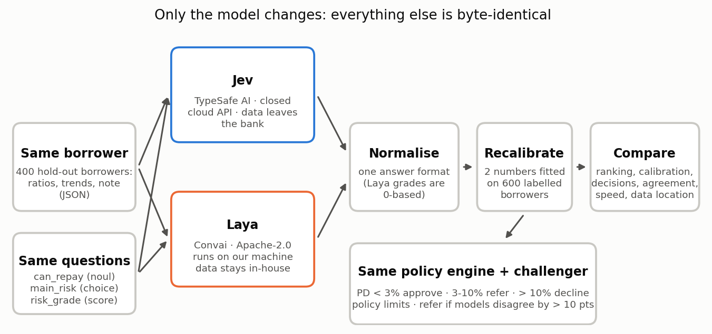

\title Laya vs Jev: Credit Decisions
\subtitle A plain-English guide to comparing an open-source and a closed decision model on the same loans
\subtitle github.com/Kwetng/tiny-llm2 · September 2026

\pagebreak

\toc

\pagebreak

# 1. The question in one minute

In the Jev credit project, a decision model called **Jev** answered one question about each company that wanted to borrow: **"Will this borrower meet every payment over the next 12 months?"** It gave back a probability, for example *97% likely to repay*, instead of text.

Jev is made by TypeSafe AI. It is **closed**: you send the borrower's data to TypeSafe's servers and pay per call.

**Laya** is a new **open-source** model that answers the same kind of question. You download it and run it on your own computer. The borrower's data never leaves the building, and there is no fee per call.

So a bank has a real choice, and this project sets up a fair contest:

- **Same borrowers:** the same 400 test companies as the Jev project, optionally 3,600 more.
- **Same questions:** byte for byte.
- **Same rules afterwards:** the same policy limits, the same second-opinion scorecard and the same approve / refer / decline bands.

Only the model changes.

> **In one sentence:** accuracy is only half of the decision. A bank also has to ask where the data goes, whether it can validate and fix the model, and what happens if the vendor changes it.

# 2. What Laya is

Laya was released in September 2026 by Convai Innovations (developer Nandakishor M) under the **Apache 2.0** licence, which allows commercial use. It installs with `pip install laya`.

Like Jev, it does not generate text. It reads the input once and returns numbers for three types of question:

| Question type | What it returns | Example in this project |
|---|---|---|
| **noul** | The probability that a statement is true | "Will this borrower repay?" → 0.97 |
| **choice** | One option from a list, with a probability for each | Main risk: leverage, liquidity, profitability, outlook or none |
| **score** | A position on an ordered scale | Risk grade from Strong to Very weak |

Laya comes as three downloadable "checkpoints", which are versions of the model:

| Checkpoint | Size | Reads up to | Best for |
|---|---|---|---|
| `laya` (English) | 421M parameters | 512 tokens | English text and JSON; used by default here |
| `laya-multilingual` | 322M parameters | 1,024 tokens (8,192 optional) | 100+ languages |
| `laya-typed-decisions` | 421M parameters | 1,024 tokens | Fine-tuned for business decisions; try it with `--b laya:typed-decisions` |

**Why it can be so fast:** a chat model writes an answer one word at a time. Laya, like Jev, answers all questions in a single pass through the network, which is why its author reports about 30–40 milliseconds per question on a graphics card.

# 3. Jev and Laya side by side

| | **Jev** | **Laya** |
|---|---|---|
| **Maker** | TypeSafe AI | Convai Innovations |
| **Licence** | Closed, commercial | Open source (Apache 2.0) |
| **Where it runs** | TypeSafe's cloud; you call an API | Your own laptop, server or private cloud |
| **Does borrower data leave the bank?** | Yes | No |
| **Cost** | Pay per call | No fee; you pay for your own hardware |
| **Can you see the weights?** | No | Yes |
| **Can you fine-tune it on your own loan history?** | No | Yes (the author supplies a notebook) |
| **Who controls version changes?** | The vendor (`jev-latest` can change) | You: pin an exact version and check file fingerprints (SHA-256) before loading |
| **Speed reported by the makers** | Jev measured at 236–276 ms per question | 33–40 ms per question on a T4 graphics card; about 0.3 s per question on a laptop CPU |
| **Question format** | noul / choice / score | noul / choice / score (the same) |
| **One trap** | none found | Its **score** answers start at 0, not 1: a grade of 1–5 comes back as 0.0–4.0. The harness corrects for this |

# 4. What the published benchmarks say, and don't say

Laya's author published a comparison with Jev. It is useful, but read it carefully: **the Jev numbers were not measured by Laya's author.** They are taken from what others have published, so the test sets and prompts are not identical.

| Test (from Laya's BENCHMARKS.md) | Laya | Jev (published) |
|---|---|---|
| Typed business decisions (2,000 decisions) | **0.766**, fine-tuned checkpoint | 0.727 |
| Same test, base English checkpoint | 0.361 | — |
| News topic (AG News) | **0.953** | 0.910 |
| Banking intents, 77 options (banking77) | 0.492 | **0.870** |
| Calibration error after refitting (ECE, lower is better) | **0.081** | 0.246 |
| Calibration error **as shipped** | 0.466 | — |

**Three things stand out:**

1. **Out of the box, the base model is weak on business decisions.** It scored 0.361, below the 0.461 you would get by always choosing the most common answer. All of its strength on that test came from fine-tuning.
2. **As shipped, it is over-confident.** Refitting its confidence on held-out data fixes this, which is exactly the recalibration step this project applies to both models.
3. **Nothing was tested on credit.** No published test covers probability of default, and that is the gap this project fills.

# 5. How the contest works



## Step 1 — Same borrowers, same questions

The borrowers are synthetic companies with eight quarters of ratios, a four-quarter trend and an analyst's note. The generator, seed and split are identical to the Jev credit project, and a test checks this.

## Step 2 — Ask both models

Jev is called over the internet with eight calls in parallel. Laya runs on your own machine, one borrower at a time. Every answer is saved to a cache, so a re-run never pays for the same call twice.

## Step 3 — Put the answers into one format

The two models return slightly different shapes (see the "one trap" row in section 3). A small adapter turns both into the same record: probability of repaying, main risk and a grade from 1 to 5.

## Step 4 — Recalibrate both on the bank's own history

**The problem.** Suppose a model says "20% chance of default" for 100 borrowers, and only 5 of them actually default. The ranking may be fine (riskier borrowers still score higher), but the numbers are too high.

**The fix.** On 600 past borrowers whose outcomes we know, we fit two numbers that stretch and shift the model's probabilities until they match reality. This is called *Platt scaling*.

- It can change 20% into, say, 5%.
- It can never change which borrower looks riskier, so it cannot help a model that ranks badly.

A bank would do this with any bought-in model, so both models are compared **as shipped and after recalibration**.

## Step 5 — Run the same policy engine

Each recalibrated PD (probability of default = 1 − probability of repaying) goes through the same rules:

| Rule | Effect |
|---|---|
| PD below 3% | APPROVE (recommend) |
| PD 3% to 10% | REFER to the credit committee |
| PD above 10% | DECLINE (recommend) |
| Leverage above 6.0x or interest cover below 1.5x | An APPROVE becomes REFER |
| Model and challenger scorecard differ by more than 10 points | An APPROVE or DECLINE becomes REFER |

## Step 6 — Compare on five things

| What | Measured by | Plain meaning |
|---|---|---|
| **Ranking** | AUC | If you pick one borrower who defaulted and one who repaid, how often does the model rate the defaulter as riskier? 0.5 is a coin toss, 1.0 is perfect |
| **Calibration** | Brier score, ECE, mean PD against actual default rate | When it says 5%, do about 5% default? |
| **Decisions** | Approve / refer / decline counts and the default rate inside each band | Would the loan book be safer? How much work goes to the committee? |
| **Agreement** | Rank correlation, same band, same main risk | Do the two models see the same borrowers as risky? |
| **Operations** | Time per borrower, where the data went | Is it fast enough, and can we use it at all? |

# 6. How big a test is big enough?

This matters more than any single number.

Only about **4 in 100** borrowers default, so the original 400 test borrowers contain just **17 defaults**. With so few, luck dominates. When we tested the harness, even the "perfect" model, which knows each borrower's true probability, could not be shown to beat the ordinary scorecard: the 95% range of the difference ran from −0.06 to +0.17.

With `--extra-test 3600` there are **4,000 test borrowers and 176 defaults**. The range shrinks to about ±0.035, and the perfect model's lead over the scorecard becomes clear (+0.043, range +0.008 to +0.078).

So the harness reports a **paired bootstrap interval** for the AUC gap between Jev and Laya: it re-draws the test set 2,000 times. If the interval includes zero, the two models rank borrowers equally well on this evidence, and no one should claim otherwise.

# 7. Deciding before we look

Good model validation sets the decision rules **before** seeing the results, so nobody is tempted to move the goalposts. These are the rules for this contest:

| If the results show… | Then… |
|---|---|
| The AUC interval includes zero, and recalibrated Brier scores are within 10% of each other | The models are equivalent on accuracy. **Laya is preferred**: data stays in-house, no per-call fee, versions under the bank's control |
| Jev ranks significantly better (interval above zero) | **Jev is the champion**, and Laya is kept as an in-house challenger and fallback if the API is down or changes |
| Laya ranks significantly better (interval below zero) | **Laya is the champion**; Jev may be dropped |
| Either model's risk grade disagrees with its own PD (rank correlation below 0.5) | Its answers are internally inconsistent; investigate before any use |
| Either model is badly off even after recalibration | Neither is used without fine-tuning (only possible with Laya) or more data |

Whatever happens, the **credit committee still decides** every loan, and the policy limits still apply.

# 8. Results

<!-- RESULTS:START -->

**Results pending.** This session could not reach either model: the Jev API needs a paid key, and Laya's weights are downloaded from Hugging Face, which this build environment blocks. No numbers have been invented.

To produce the results, run the three commands in section 10 on any laptop with internet access. They score both models, write `outputs/comparison_report.md` with the charts, and rebuild this guide with the real numbers in this section.

**What the harness test did show** (two hand-written stand-ins, clearly not Jev or Laya): two models that rank borrowers identically but differ in confidence had very different raw Brier scores (0.075 and 0.218), and the **same** score after recalibration (0.042). That is the point of Step 4: recalibration fixes over-confidence but cannot fix a model that ranks badly. It also means **ranking (AUC) is the fairest way to compare zero-shot models**.

<!-- RESULTS:END -->

# 9. Governance: what changes with an open-source model

| Topic | Jev (closed, cloud) | Laya (open, in-house) |
|---|---|---|
| **Data protection (GDPR)** | Client data goes to a third party: data protection impact assessment, contract terms and data-residency checks first | Data stays in the bank's environment, which is much simpler |
| **Third-party risk (PRA SS2/21, SS1/23 principle 4)** | Vendor due diligence; the bank cannot see inside the model; ask for change notifications | Supply-chain risk instead: pin the exact version and verify file fingerprints (Laya supports both) |
| **Model validation (SS1/23)** | Validate the outputs only; the internals are a black box | Full validation possible, including the weights. Once fine-tuned on the bank's data, **it is the bank's own model** and needs full model-risk treatment |
| **Change control** | `jev-latest` can change under you, so pin a version if the vendor allows it | Nothing changes unless the bank changes it |
| **Resilience** | Depends on the vendor's uptime | Depends on the bank's own infrastructure |
| **EU AI Act** | Lending to companies is not in the high-risk list; scoring individuals would be | Same |
| **Monitoring** | Monthly calibration check against actual defaults for both, with an alert if the Brier score or the approve-band default rate moves beyond agreed limits | Same |

# 10. How to run it

```bash
cd laya-vs-jev-credit
pip install -r requirements.txt
export TYPESAFE_API_KEY=...                      # your Jev key from typesafe.ai

python code/compare_credit.py --a jev --b laya --extra-test 3600
python code/build_guide.py                      # puts the results into this guide (needs node)
```

**Options:**

- `--b laya:typed-decisions` uses Laya's fine-tuned business checkpoint instead of the English one.
- `--a laya --b laya:typed-decisions` compares two Laya checkpoints without any API key.
- `--dry-run` tests the harness with two stand-ins. It is not a comparison.

**How long it takes:** 4,600 borrowers (600 for recalibration plus 4,000 tests).

- Laya on a graphics card: a few minutes.
- Laya on a laptop CPU: roughly an hour, at about 0.7 s per borrower for 3 questions. Set `LAYA_THREADS` to your number of physical cores; Laya's own benchmark found this up to 12 times faster than the default.
- Jev: depends on the API's rate limits.

The first Laya run downloads the checkpoint, about 1–2 GB.

**Tests:** `pytest -q tests` runs without a key and without weights. One test pushes a borrower through the **real** Laya router with only the model weights replaced by a stand-in, to prove the adapter reads Laya's answers correctly.

# 11. Sources

- Laya repository, README and BENCHMARKS.md: https://github.com/NandhaKishorM/laya
- Laya model weights: https://huggingface.co/convaiinnovations/laya
- Laya on PyPI (version 0.3.20 used here): https://pypi.org/project/laya/
- "Laya: open-source alternative to TypeSafe Jev, runs locally": https://brainfunctioncollapse.com/laya
- "Jev vs Laya: The Same AI Idea, One Closed and One Open", DEV Community: https://dev.to/jamilxt/jev-vs-laya-the-same-ai-idea-one-closed-and-one-open-3c6e
- "Laya AI Model: How It Works, Run It Locally, and Evaluate It", Hugging Face blog: https://huggingface.co/blog/sora-2/laya-ai-model-how-it-works-run-it-locally-and-eval
- TypeSafe AI, "Introducing System One Models & Jev": https://typesafe.ai/blog/introducing-system-one-models-and-jev
- Tom's Hardware on Jev: https://www.tomshardware.com/tech-industry/artificial-intelligence/typesafe-ais-jev-offers-an-alternative-to-llms-that-claims-to-be-193x-faster-and-445x-cheaper-system-one-type-model-is-bespoke-for-probabilistic-decision-making

*Synthetic borrowers; educational code, not a production credit model, and not financial advice.*
