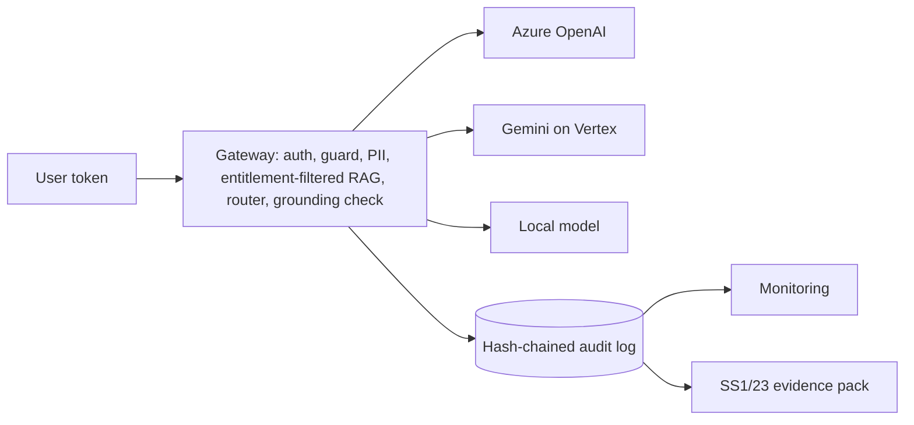

# Sentinel AI Platform

**A governed GenAI platform for a regulated bank, as a working reference implementation.**

This is the platform a new AI Engineering function would build first. It gives Capital Markets and Corporate Banking one governed gateway for every model call. Every use case on it inherits the same controls: entitlement-aware retrieval, prompt-injection defence, PII redaction, grounding checks, model routing across Azure and GCP, a tamper-evident audit trail, an evaluation gate in CI, drift monitoring, and automatically generated model-risk evidence.

**[Plain-English guide](docs/sentinel-guide.md)** ([Word version](docs/Sentinel_AI_Platform_Guide.docx)) · **[Demo walkthrough](docs/demo-walkthrough.md)**

It runs entirely on a laptop. A deterministic local model answers when no cloud credentials are set, so the tests and the release gate need no cloud account.



## What it demonstrates

| Capability | Where it is |
|---|---|
| LLM-based services and APIs | FastAPI gateway (`sentinel/gateway.py`); router with pinned versions and fallback (`sentinel/providers.py`) |
| RAG pipelines | Clause-level chunks, BM25 + vector hybrid search, rank fusion, **entitlement filter before scoring**, forced citations, abstention (`sentinel/rag.py`) |
| Agentic workflows | Least-privilege tools, human approval with segregation of duties, step budget, refusal of unsupported tasks (`sentinel/agent.py`) |
| Document intelligence | ISDA/CSA term extraction to a schema, with confidence, clause lineage, amendment resolution and a human review queue (`sentinel/extract.py`) |
| Secure engineering | PII redaction, prompt-injection guard and context quarantine, HTTPS-only model calls, tamper-evident audit (`sentinel/pii.py`, `guard.py`, `audit.py`) |
| Azure and GCP | Terraform for Azure OpenAI / AI Search / Key Vault / immutable storage and for Vertex AI / VPC-SC / KMS / Cloud Run (`infra/terraform/`) |
| MLOps and DevSecOps | CI: tests, evaluation gate, Bandit, dependency audit, secret scan, Terraform validate, Checkov (`.github/workflows/sentinel-ci.yml` at the repository root) |
| Model monitoring and drift | Quality, safety, operations, cost and input-drift alerts from the audit log (`sentinel/monitoring.py`) |
| EU AI Act, PRA SS1/23, GDPR, ISO 42001, NIST AI RMF | Use-case register, control mapping, generated evidence pack (`governance/`) |
| Building and leading the function | Team design, RACI, 90-day plan, path to production, ADRs (`docs/`) |

## Results

| Check | Result |
|---|---|
| Unit and API tests | 21 passed |
| Evaluation gate ([report](evals/reports/latest.md)) | **Passed all 12 thresholds.** 21 answerable questions (recall@5 1.0, correctness 1.0, faithfulness 1.0); 8 must-refuse questions (all refused); 0 entitlement leaks; 7/7 direct attacks blocked; poisoned passage quarantined every time; no raw PII in the audit log; 18/18 CSA fields correct |
| Drift simulation ([report](monitoring/latest.md)) | Users start asking about sanctions screening, which isn't in the library: similarity to known questions fell from 1.0 to 0.52, refusals rose to 54%, and both alerts fired |
| Terraform security scan (Checkov) | 73 passed, 0 failed, 2 skipped with written justification |
| Code security scan (Bandit) | No medium or high findings |

**The gate earned its keep on the first run.** Asked about *staff parking permits*, the local model quoted an unrelated policy sentence because generic words ("bank", "policy", "staff") matched, and the abstention threshold failed. The fix was to stop generic words counting as evidence.

**Read the numbers honestly.** The golden set is small and was written alongside the system, so perfect scores show the controls work, not that answer quality is proven. Model Risk should add an independent, expert-written set before any real use.

## Quick start

```bash
cd sentinel-ai-platform
pip install -r requirements.txt
pytest -q                               # 21 tests
python -m evals.run_evals               # the release gate: exits non-zero on any breach
python scripts/simulate_traffic.py      # 200 requests with topic drift, then the monitoring report
python governance/build_evidence_pack.py
uvicorn sentinel.gateway:app            # API docs at http://localhost:8000/docs
```

**Try it** (these tokens are demo identities):

```bash
curl -s localhost:8000/v1/ask -H "Authorization: Bearer tok-alice" -H "Content-Type: application/json" \
  -d '{"question": "Who approves an exposure above personal delegated authority?"}'
curl -s localhost:8000/v1/ask -H "Authorization: Bearer tok-bob" -H "Content-Type: application/json" \
  -d '{"question": "What is the margin on the Project Heron term loan B?"}'          # information barrier: refuses
curl -s localhost:8000/v1/extract/csa -H "Authorization: Bearer tok-frank"             # CSA terms with lineage
curl -s localhost:8000/v1/agent/run -H "Authorization: Bearer tok-alice" -H "Content-Type: application/json" \
  -d '{"task": "Check Northwind Energy for a covenant breach"}'                          # stops at awaiting approval
curl -s localhost:8000/v1/audit/verify -H "Authorization: Bearer tok-erin"             # hash chain intact?
```

| Token | User | Can see |
|---|---|---|
| `tok-alice` | Relationship manager, Corporate Banking | Group and corporate policies up to confidential |
| `tok-bob` | Rates trader, Capital Markets | Group and markets policies up to confidential |
| `tok-carol` | Credit risk officer | Both business lines, but not behind information barriers |
| `tok-dan` | Project Heron deal team | Restricted Heron term sheet |
| `tok-erin` | Internal audit | Internal documents; audit verification and metrics |
| `tok-frank` | Operations manager | CSA extraction; approves agent actions |

**Hosted models:**
- **Azure OpenAI:** set `AZURE_OPENAI_ENDPOINT` plus `AZURE_OPENAI_AD_TOKEN` (or `AZURE_OPENAI_API_KEY`), and `AZURE_OPENAI_DEPLOYMENT`.
- **Gemini:** set `GOOGLE_CLOUD_PROJECT`, `GOOGLE_ACCESS_TOKEN` and `VERTEX_MODEL`.
- **Jev** (TypeSafe AI): set `TYPESAFE_API_KEY` to replace the pattern guard with Jev's calibrated classifier.

Each hosted model must pass the same evaluation gate before it is relied on.

## Repository layout

| Path | Contents |
|---|---|
| `sentinel/` | Gateway, identity, PII, audit, guard, providers, retrieval, extraction, agent, monitoring |
| `data/` | Synthetic policy library (with access labels, a restricted deal file and a planted injection), CSA contracts, client data |
| `evals/` | Golden set, red-team suite, extraction golden set, `thresholds.yaml`, gate runner, latest report |
| `governance/` | Use-case register and risk tiers, control mapping, evidence-pack generator and latest pack |
| `infra/terraform/` | Azure and GCP landing zones |
| `monitoring/` | Latest monitoring report |
| `docs/` | Plain-English guide (Markdown and Word), architecture, ADRs 0001–0005, operating model, demo walkthrough |
| `tests/` | Unit and API tests |

## Limitations

- **Demo scale.** Synthetic data and demo identities; in production, identities come from Entra ID or Cloud IAM tokens.
- **The local model** quotes rather than writes and abstains readily. Hosted models give fluent answers but must pass the gate first.
- **The guard** is pattern-based unless the Jev API is configured, and novel attacks can evade patterns.
- **The Terraform** was parsed and security-scanned here but not deployed or run through `terraform validate`, because this environment has no Terraform binary or cloud accounts. CI runs `validate`.
- **Retrieval** uses TF-IDF vectors as a stand-in for embedding models.
- **The CSA extractor** uses transparent rules. In production it wraps Azure AI Document Intelligence or Google Document AI.

All data is synthetic. Any resemblance to real companies or transactions is coincidental.
