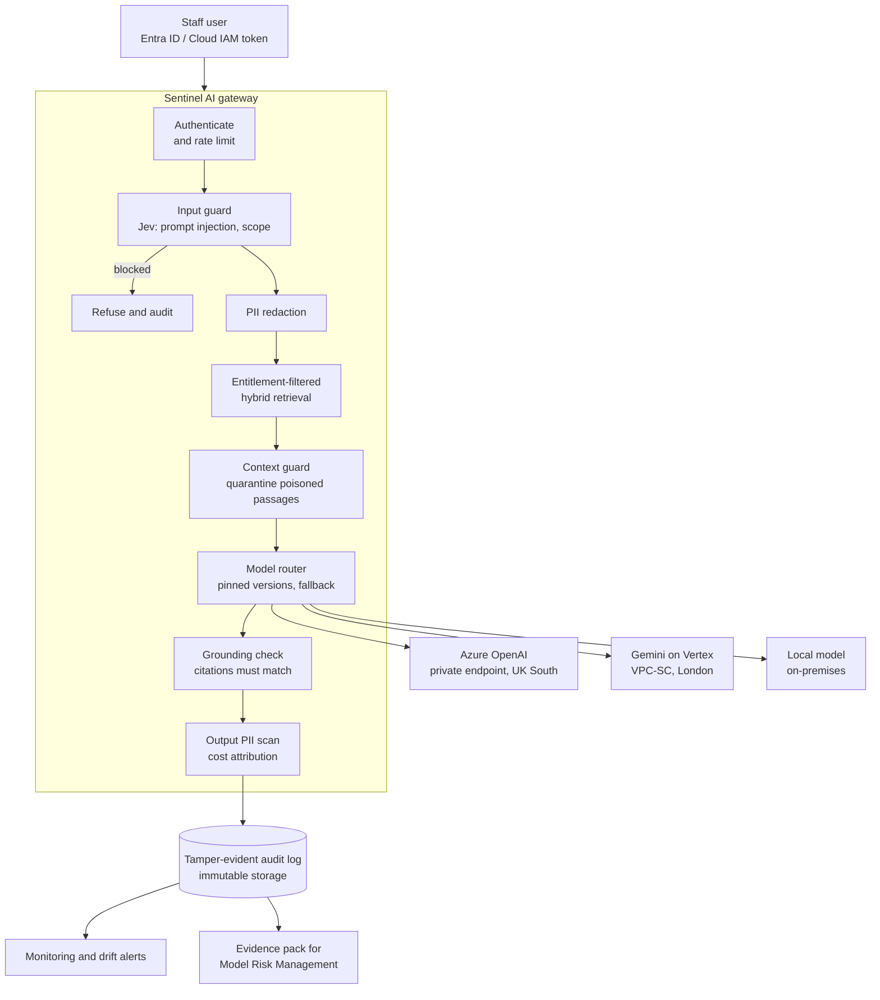

# Architecture

## Request flow

## Shared services

Every use case reuses the same services, so a new use case inherits the controls and their evidence.

| Service | Module | What it guarantees |
|---|---|---|
| Gateway | `sentinel/gateway.py` | One governed entry point: every model call is identity-bound, rate limited, costed and logged |
| Identity and entitlements | `sentinel/identity.py` | The AI acts as the user; access (classification, business line, information barriers) is decided in code |
| Retrieval | `sentinel/rag.py` | Unentitled content is filtered out *before* scoring, so it can never be ranked, shown to a model or cited |
| Guard | `sentinel/guard.py` | Direct attacks are blocked; poisoned documents are quarantined before reaching the model |
| Model router | `sentinel/providers.py` | Pinned versions per risk tier; automatic fallback on outage; HTTPS only |
| Grounding check | `sentinel/gateway.py` | An answer is shown only if every citation matches a retrieved, entitled clause; otherwise the system abstains |
| Audit | `sentinel/audit.py` | Hash-chained records; any edit, deletion or reordering is detected |
| Extraction | `sentinel/extract.py` | Fixed schema, confidence per field, clause lineage, amendments applied, human review below 0.80 |
| Agent | `sentinel/agent.py` | Least-privilege tools; irreversible actions need an independent approver; unsupported tasks refused |
| Monitoring | `sentinel/monitoring.py` | Quality, safety, operations, cost and input drift from the audit log |
| Evaluation gate | `evals/` | Twelve release thresholds enforced in CI |

## Design decisions

The reasoning behind the main choices is recorded as architecture decision records in [`docs/adr/`](adr/).
