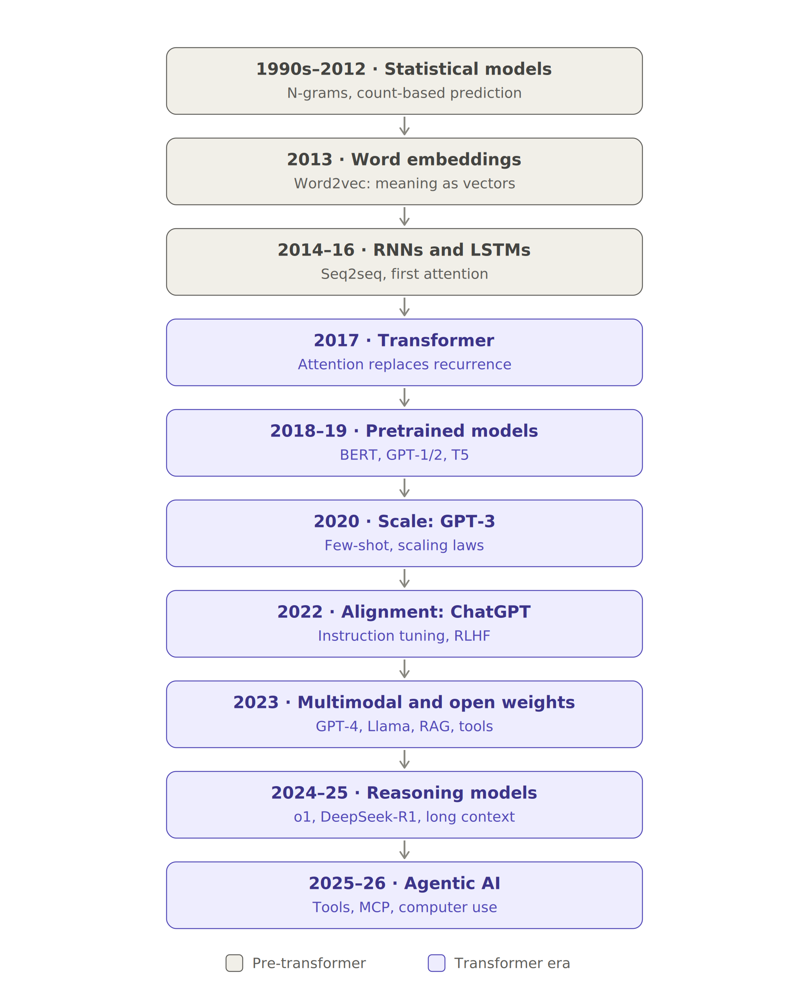
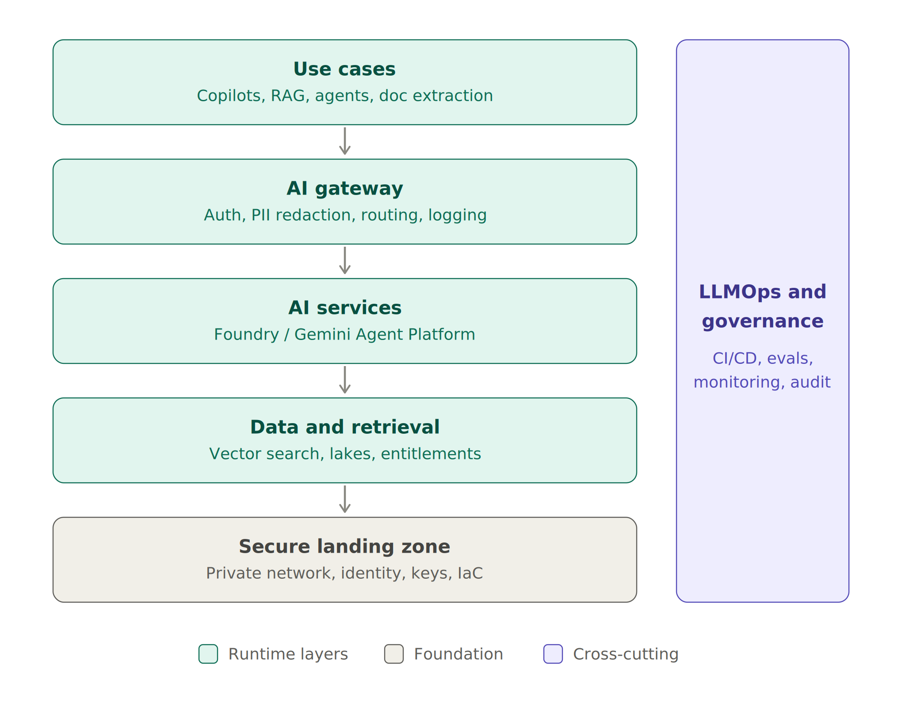
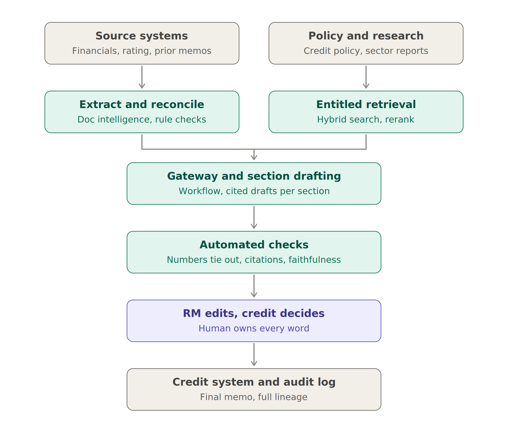

\title SMBC Group EMEA — Head of AI Engineering
\subtitle Interview Preparation Pack: from Foundations to Expert Level
\subtitle Prepared for Kwet · September 2026

\pagebreak

\toc

\pagebreak

# How to use this pack

This pack collects the full preparation programme in the order it was built:

- **Level 1 — Foundations:** what the role really is, how you fit, and your opening pitch
- **Level 2 — Core GenAI engineering:** LLM services, RAG, agents, document intelligence
- **Job ad summary and the evolution of LLMs**, with a flowchart and a detailed stage-by-stage history
- **How to build an LLM from scratch**, with complete, tested Python code
- **Level 3 — Platform and production:** Azure, GCP, MLOps, DevSecOps, infrastructure-as-code
- **Level 4 — Secure and responsible AI:** security controls, EU AI Act, UK regulation, SS1/23, GDPR, ISO 42001, NIST AI RMF
- **Level 5 — Leadership and delivery:** building the team, operating model, stakeholders, behavioural questions
- **Level 6 — Expert level:** system-design cases and the mock panel

Regulatory and product facts reflect the position as of September 2026. Check for updates in the week before the interview.

\pagebreak

# Level 1: Foundations

## The roadmap

1. **Foundations:** what the role really is, how you fit, and your opening pitch
2. **Core GenAI engineering:** LLM services, RAG, agents, document intelligence
3. **Platform and production:** Azure and GCP services, MLOps, DevSecOps, infrastructure-as-code
4. **Secure and responsible AI:** security controls, the EU AI Act, PRA SS1/23, ISO 42001, NIST AI RMF
5. **Leadership and delivery:** building a team from zero, stakeholders, prioritisation, behavioural questions
6. **Expert level:** live system-design cases for Capital Markets and Corporate Banking, then a full mock panel

## 1. What the job actually is

- **It's a new function.** "Newly formed" means you'd hire, define the operating model, and set engineering standards from scratch. Expect questions about your first 90 days.
- **It's an engineering role, not a strategy role.** The AI Innovation and Transformation teams decide *what* to build. You own *how* it's built, secured and run in production. You need to be clear about that boundary.
- **It's hands-on.** They will test whether you can design and critique real systems, not only govern them.
- **The domain is Capital Markets and Corporate Banking.** Use cases will likely include research and document summarisation, credit memo drafting, KYC and onboarding document extraction, trader and RM copilots, and regulatory Q&A over policy libraries.
- **The context is a Japanese megabank.** SMBC's EMEA hub is in London. The culture tends to be consensus-driven and risk-conscious, and Tokyo alignment matters. "Trust and Integrity" and "Risk Management" are listed competencies for a reason.

## 2. The four things they'll assess

| Pillar | What they want to hear |
|---|---|
| Technical depth | Trade-offs in LLM, RAG and agent design, and knowing when *not* to use an LLM |
| Platform | Concrete Azure OpenAI, Azure ML, Vertex AI and Gemini experience, with CI/CD and monitoring |
| Secure, compliant AI | Controls built into the pipeline rather than bolted on at the end |
| Leadership | Building, mentoring and scaling engineers, and influencing risk, legal and architecture teams |

## 3. Your fit: honest map

### Strong differentiators

- **30+ years in financial services** across investment banking, the Big Four and retail banking. You know Capital Markets from the inside.
- **Model validation background** (SR 11-7, SS1/23). This is your biggest edge. Most AI engineering candidates can't speak model risk fluently, and PRA SS1/23 explicitly covers AI/ML models.
- **AI in Digital Assets and quant research** at Morgan Stanley, plus your consultancy's AI governance and audit work.
- **PhD in AI and quantum computing**, which matches their "postgraduate advantageous" line.
- **Hands-on building** of your own systems. Use these as proof that you still write and ship code.

### Gaps to prepare for, because they will probe them

- **Leading engineering teams across front-end and back-end at scale.** Find your best examples of leading technical teams, even if they were quant or validation teams.
- **Production Azure and GCP depth.** You'll need specific services, architectures and lessons learned. Level 3 closes this. A quick Azure AI Engineer certification would also help.
- **Moving after about four months at Morgan Stanley.** Prepare a clean, positive answer, framed as a pull toward building a function rather than a push away from your current role.

## 4. Your 60-second pitch (draft to adapt)

> "I've spent 30 years at the intersection of quantitative finance and technology: pricing and validating models in investment banking, advising through the Big Four, and now working on AI for digital assets and quantitative trading research at Morgan Stanley. What's unusual about my profile is that I've both *built* models and *challenged* them as a validator. In a regulated bank, that's exactly the tension an AI engineering function has to resolve: shipping fast while staying audit-ready under SS1/23 and the EU AI Act. I'm also hands-on. I build production AI systems myself, and I'm completing a PhD in AI. This role appeals to me because it's a chance to build the function from the ground up, with engineering standards that make risk and compliance an accelerator rather than a blocker."

## 5. Level 1 tasks

1. **Rewrite the pitch in your own voice.** Keep it to 150 words or fewer.
2. **List three stories** in the format *situation → what you did → measurable result*: one leadership story, one technical delivery story, and one risk or governance story.
3. **Draft your answer to "Why SMBC, and why now?"**

\pagebreak

# Level 2: Core GenAI Engineering

There are four building blocks: **LLM services → RAG → agents → document intelligence**. Each one follows the same pattern: the plain-English idea, how it works, the design trade-offs, and what the interviewer will probe.

## 2.1 LLM-based services and APIs

### Plain English

An LLM is a prediction engine. It predicts the next piece of text given everything before it. It has no memory of your bank's data and no idea what's true, only what's plausible. Everything we build around it exists to add knowledge (RAG), actions (tools and agents), and control (guardrails and evaluation).

### Core concepts you must use fluently

- **Tokens and context window:** text is split into tokens, and the context window is how much the model can "see" at once. Cost and latency scale with tokens.
- **System prompt vs user prompt:** the system prompt carries the bank's fixed instructions, and the user prompt carries the variable request.
- **Temperature:** low means consistent and deterministic, high means creative. Most banking use cases run low.
- **Structured outputs and function calling:** the model returns JSON matching a schema or requests a tool call. This is how LLMs plug into real systems.
- **Hallucination:** a fluent but false answer. It's controlled through grounding, citations and evaluation. It can't be eliminated.

### The key bank pattern: the LLM gateway

In a regulated bank, applications should never call a model provider directly. Everything goes through a central **AI gateway**, which handles:

- **Authentication and entitlements:** who is calling, and for which use case
- **PII and confidential-data handling:** detection and redaction before prompts leave the boundary
- **Prompt and response logging:** needed for audit, incident investigation and SS1/23 evidence
- **Rate limiting and cost attribution** per business line
- **Model routing:** a cheap, fast model for simple tasks and a stronger model for reasoning, with fallback if a provider fails
- **Content safety filters** and prompt-injection checks
- **Version pinning:** a model upgrade is a model change and needs validation

> **Interview line:** "The gateway is where engineering and model risk meet. It turns every LLM call into a governed, logged, attributable event."

### Model selection trade-offs

| Option | Pros | Cons |
|---|---|---|
| Hosted frontier models (Azure OpenAI, Gemini on Vertex) | Best quality, no infrastructure to run | Data residency questions, vendor dependency, version changes |
| Open-weight models, self-hosted | Full control, data stays in the bank's tenancy | GPU cost, you own patching and safety tuning |
| Small or specialised models | Cheap, fast, easier to validate | Narrow capability |

Your answer should be **"a portfolio, routed by use case risk and complexity,"** not a single vendor.

## 2.2 Retrieval-Augmented Generation (RAG)

### Plain English

Instead of hoping the model "knows" the bank's credit policy, you **look up the relevant pages first and hand them to the model** with the question. It's an open-book exam rather than a memory test. This gives current knowledge, citations, and access control, with no retraining.

### The pipeline

**Ingest → Parse → Chunk → Embed → Index → Retrieve → Rerank → Generate with citations → Evaluate**

| Stage | What it does | Design decisions they'll probe |
|---|---|---|
| Parse | Extracts text and tables from PDFs, Word files and emails | Tables and scanned documents are where quality dies. Use layout-aware parsing. |
| Chunk | Splits documents into passages | Size and overlap. Structure-aware chunking (by section or clause) beats fixed-size chunks. |
| Embed | Converts chunks into vectors that capture meaning | Choice of embedding model; re-embedding cost when you change it |
| Index | Stores vectors plus metadata | Azure AI Search or Vertex AI Vector Search; metadata for filtering |
| Retrieve | Finds relevant chunks | **Hybrid search**: keyword (BM25) plus vector. Pure vector search misses exact terms like ISINs, clause numbers and acronyms. |
| Rerank | Re-orders the top results with a stronger model | Big quality gain for modest cost |
| Generate | Answers from the retrieved context only | Force citations and allow "I don't know" |

### The bank-specific point that separates seniors from juniors

**Entitlements must be enforced at retrieval time.** If a Corporate Banking RM asks a question, the retriever must never return a chunk from a Capital Markets deal-team document behind an information barrier. Access control labels travel with every chunk as metadata and are filtered *before* the LLM sees anything. The LLM is never the security boundary.

### Common failure modes and fixes

- **Wrong chunk retrieved:** hybrid search, reranking, query rewriting, and metadata filters (date, jurisdiction, product)
- **Right chunk, wrong answer:** better prompts, smaller context, and a faithfulness check
- **Stale content:** incremental re-indexing, and document versioning with effective dates
- **Tables and numbers garbled:** layout-aware parsing, or keeping tables as structured data

### Evaluating RAG (your model-validation edge)

Measure the two halves separately:

- **Retrieval quality:** did the correct source appear in the top-k results (recall@k)?
- **Generation quality:** **faithfulness** (is every claim supported by the retrieved text?), answer relevance, and citation accuracy

Build a **golden test set** with subject-matter experts, run it on every change in CI, and monitor in production with sampled human review. LLM-as-judge is useful but must itself be calibrated against human labels.

> **Interview line:** "I treat a RAG system like a model under SS1/23: a documented design, a golden-set validation, performance thresholds, ongoing monitoring, and change control when the embedding model, the chunking or the LLM changes."

### RAG vs fine-tuning

- **RAG** is for *knowledge*: facts that change, need citations, or need access control.
- **Fine-tuning** is for *behaviour*: format, tone, and domain-specific classification.
- In banking, default to RAG and fine-tune rarely. Fine-tuning bakes data into weights, which makes deletion rights, entitlements and auditability harder.

## 2.3 Agentic workflows and orchestration

### Plain English

A plain LLM answers. An **agent** decides what to do next: it plans, calls a tool (search, a database query, an API), looks at the result, and repeats until the task is done. It's the difference between a clever assistant who advises and a junior analyst who actually does the steps.

### Spectrum of autonomy (know this cold)

1. **Single LLM call:** summarise this document.
2. **Deterministic workflow:** fixed steps, some of them LLM-powered, such as extract → validate → draft → human review. **This is most of what a bank should build.**
3. **Router:** the LLM picks which fixed path to take.
4. **Tool-using agent:** the LLM chooses tools in a loop.
5. **Multi-agent:** a supervisor agent delegates to specialist agents.

> **Interview line:** "I use the least autonomy that solves the problem. Autonomy is a risk dial, and every step up needs a stronger control case."

### Orchestration building blocks

- **Tools:** well-defined functions with schemas (for example `get_client_exposure(client_id)`)
- **State and memory:** what the agent has done so far, persisted for audit
- **Frameworks:** LangGraph, Semantic Kernel (strong on Azure), Google's Agent Development Kit, and the **Model Context Protocol (MCP)** as a standard way to expose tools and data to models
- **Observability:** full traces of every thought, tool call, input and output. This is non-negotiable for audit.

### Controls for agents in a bank

- **Least-privilege tools:** read-only by default, scoped to the user's entitlements (the agent acts *as* the user, never as a super-user)
- **Human-in-the-loop** for anything irreversible or client-facing: payments, trades, emails, and changes to booking systems
- **Budgets:** caps on steps, tokens, time and cost to prevent runaway loops
- **Prompt-injection defence:** content retrieved from documents or emails is treated as *data*, never as instructions. Tool outputs are sanitised, and privileged actions need confirmation.
- **Kill switch and fallback** to a manual process

### Evaluating agents

Judge **task success** (did it reach the correct end state?), **trajectory quality** (sensible steps, no unsafe tool calls), cost and latency. Test with scenario suites, including adversarial ones.

## 2.4 Document intelligence and GenAI applications

### Plain English

Banks run on documents: loan agreements, ISDAs, KYC packs, term sheets, financial statements. Document intelligence turns unstructured pages into **validated structured data** that systems can use.

### Reference pipeline

**Classify document → OCR and layout → extract fields to a schema → validate → confidence routing → human review queue → system of record**

- **Tools:** Azure AI Document Intelligence and Google Document AI for OCR and layout, then multimodal LLMs (GPT-class, Gemini) for complex extraction and reasoning
- **Validation:** business rules (dates consistent, amounts reconcile, the counterparty exists in the client master)
- **Confidence routing:** high-confidence results go straight through, low-confidence results go to a human. The threshold is tuned against error cost.
- **Lineage:** every extracted field links back to its page and bounding box for audit.

### Use cases to name (your background makes these credible)

- **ISDA / CSA term extraction:** thresholds, minimum transfer amounts, eligible collateral, feeding CCR and XVA systems. This is your home turf.
- **Credit memo drafting** from financials and prior memos, in Corporate Banking
- **KYC and onboarding** document checks
- **Loan agreement covenant monitoring**
- **Research and regulatory summarisation** with citations

## 2.5 Cross-cutting themes interviewers love

- **When *not* to use an LLM:** deterministic calculations, pricing and risk numbers, anything where a rule or a classical model works. LLMs orchestrate and explain; they don't compute exposures.
- **Cost and latency:** caching, model routing, smaller models for classification, and batching.
- **Evaluation-driven development:** no golden set, no deployment.
- **Build vs buy:** buy commodity capabilities (copilot tools, OCR), and build the differentiated ones (your data, your workflows, your controls).
- **Reusable platform over one-off projects:** one gateway, one RAG service, one evaluation harness, and one observability stack, reused across use cases. This is how a new function scales.

## 2.6 Likely questions with answer skeletons

1. **"Design a RAG assistant over our credit policy library."** Start with the users and the risk tier. Then cover layout-aware parsing, clause-level chunks with metadata, hybrid search plus reranking, entitlement filtering, generation with forced citations and "I don't know", a golden set built with the credit team, monitoring, and change control.
2. **"How do you stop hallucinations?"** You can't eliminate them; you reduce and detect them. Cover grounding, citations, restricting answers to the provided context, faithfulness checks, confidence thresholds, human review for high-impact outputs, and user interface cues.
3. **"Agent or workflow?"** Use a workflow when the steps are known, and an agent only when the path genuinely varies. Every step up in autonomy needs a stronger control case.
4. **"How do you handle prompt injection?"** Retrieved content is data, not instructions. Cover least-privilege tools, output validation, confirmation for privileged actions, red-teaming, and monitoring.
5. **"A new model version comes out. Do you upgrade?"** Not automatically. Treat it as a model change: run the regression golden sets, check safety and cost, shadow-test, then do a staged rollout with rollback.
6. **"How would you measure success of a GenAI use case?"** Business KPIs (time saved, straight-through processing rate, error rate) plus quality metrics (faithfulness, accuracy) plus risk metrics (incidents, overrides) plus adoption.
7. **"How is validating an LLM different from validating a pricing model?"** This is your standout answer. Outputs are non-deterministic and open-ended, there's no closed-form benchmark, and the behaviour depends on the prompt, data and version. So you shift from one-off validation to **continuous, evaluation-based assurance**, with the same SR 11-7 and SS1/23 principles of conceptual soundness, outcomes analysis, and ongoing monitoring.

## Level 2 self-test

1. Why is hybrid search better than pure vector search for banking documents?
2. Where exactly should entitlements be enforced in a RAG system, and why not in the prompt?
3. Give one Capital Markets use case where you'd refuse to use an agent, and explain why.

\pagebreak
# The Job Advert: Main Details

| Item | Detail |
|---|---|
| **Role** | Head of AI Engineering, ITSD Department, SMBC Group EMEA (London) |
| **Mandate** | Lead a **newly formed** AI Engineering function that builds secure, production-grade AI for **Capital Markets and Corporate Banking** |
| **What you'd build** | LLM-powered services, agentic workflows, RAG pipelines, document intelligence and GenAI applications |
| **Key partners** | AI Innovation and Transformation teams (priorities and architecture), Architecture & Engineering, wider IT, and cyber, legal and risk teams |
| **Style of role** | Hands-on and delivery-focused, combining engineering leadership with regulatory awareness |
| **Salary** | £132,000–£198,000 (the ad's "£132,00" is a typo), plus a discretionary bonus, pension and benefits |
| **Education** | Degree in CS, Engineering or Maths; an MSc or PhD in AI/ML is an advantage; Azure, GCP or AI engineering certifications are desirable |
| **Must-have experience** | Secure AI delivery in regulated FS; hands-on **Azure** (Azure OpenAI, Azure ML) and **GCP** (Vertex AI, Gemini); leading front-end and back-end teams; MLOps and DevSecOps (CI/CD, monitoring, drift detection, IaC) |
| **Security** | Encryption, access control, secure context injection, audit logging |
| **Regulation** | EU AI Act, FCA/PRA guidance, GDPR, ISO/IEC 42001, NIST AI RMF |
| **Competencies** | Customer Focus, Driving Change, Driving Results, Embraces Diversity, Enterprise Leadership, Judgement and Decision Making, Risk Management, Strategic and Visionary, Trust and Integrity |
| **Culture signals** | Hybrid working, D&I networks, wellbeing focus |

**The three things they care about most:** (1) building a team and a platform from zero, (2) shipping real systems on Azure and GCP, and (3) doing it safely enough to satisfy risk and regulators.

# The Evolution of LLMs



## How to use this history in the interview

Don't recite dates. Use the history to show you understand **why** each shift matters for engineering in a bank:

- **The Transformer (2017)** made models parallelisable and scalable. Everything the role covers is built on it.
- **Scale (2020)** gave general capability, but with no grounding in facts. That's why hallucination is a structural property you engineer around, not a bug that gets patched.
- **Alignment (2022)** made models usable by non-experts. That shifted the problem from "can it work?" to "can we control it?", which is where governance, SS1/23 and the EU AI Act come in.
- **RAG and tools (2023)** connected models to the bank's own data and systems. This is exactly the role's core stack, and where entitlements and audit logging become critical.
- **Open weights (2023 onward)** made self-hosting possible. That's your data-residency and vendor-risk argument for a multi-model portfolio across Azure and GCP.
- **Reasoning models (2024–25)** improved multi-step accuracy at the price of higher cost and latency. This is why model routing belongs in the gateway.
- **Agentic AI (2025–26)** moves models from answering to *acting*, which is the biggest new risk surface. It's why "least autonomy, least privilege, human-in-the-loop" should be your stated design principle.

> "Each generation of LLMs moved risk from *capability* to *control*. Today the hard problems aren't making models smarter; they're making them grounded, entitled, auditable and safe to let act. That's what an AI engineering function in a bank exists to solve."

## The ten stages in detail

Each stage covers the **plain-English idea**, **what changed technically**, the **limitation that drove the next stage**, and **why it matters in your interview**.

### Stage 1: Statistical language models (1990s–2012)

- **Idea:** predict the next word by counting how often word sequences appear. "Interest rate" is followed by "rise" X% of the time.
- **Technical:** n-gram models (bigrams, trigrams) with smoothing for unseen sequences. They powered early speech recognition and machine translation.
- **Limitation:** they can only look a few words back, and they have no notion of meaning. "Loan" and "credit" are unrelated symbols to them.
- **Interview relevance:** these are the ancestors of the keyword search (BM25) still used today in **hybrid RAG**. Old techniques remain useful for exact matching of ISINs, clause numbers and tickers.

### Stage 2: Word embeddings (2013)

- **Idea:** represent each word as a point in space, so that words with similar meanings sit close together. The famous example is *king − man + woman ≈ queen*.
- **Technical:** Word2vec (Google, 2013) and later GloVe learned dense vectors from context: "you know a word by the company it keeps."
- **Limitation:** each word has one fixed vector. "Bank" (river) and "bank" (finance) get the same point in space.
- **Interview relevance:** this is the conceptual root of **embeddings and vector search in RAG**. Modern embedding models are the contextual descendants.

### Stage 3: RNNs, LSTMs and seq2seq (2014–2016)

- **Idea:** read text word by word, carrying a running "memory" forward.
- **Technical:** recurrent networks, with LSTMs to reduce forgetting. Encoder–decoder (seq2seq) architectures handled translation. **Attention** (Bahdanau, 2014) let the decoder look back at any input word rather than rely on one compressed memory.
- **Limitation:** processing is sequential, so it's slow to train and can't use GPUs efficiently. Long-range memory is still weak.
- **Interview relevance:** mostly historical. LSTMs remain in some time-series and quant models, which is a nice bridge to your trading background.

### Stage 4: The Transformer (2017)

- **Idea:** drop the word-by-word reading. Every word looks at every other word at once and decides which ones matter.
- **Technical:** Google's paper "Attention Is All You Need" introduced **self-attention** (query, key and value vectors), multi-head attention, positional encodings, and stacked layers. It's fully parallelisable on GPUs.
- **Breakthrough:** training can scale with hardware. This is the foundation of every modern LLM.
- **Limitation:** attention cost grows with the square of sequence length, which is why context windows were initially small.
- **Interview relevance:** be able to explain attention in one sentence: *"each token computes how relevant every other token is, and builds its meaning as a weighted blend of them."*

### Stage 5: Pretrained models (2018–2019)

- **Idea:** first learn language in general from huge text corpora (**pretraining**), then adapt it cheaply to a task (**fine-tuning**).
- **Limitation:** you still needed a fine-tuned model per task.
- **Interview relevance:** **BERT-style models are still the right tool** for many bank tasks: document classification, entity extraction, embeddings and reranking. They're cheaper, faster and easier to validate than a frontier LLM.

| Family | Example | Trained to | Best at |
|---|---|---|---|
| Encoder-only | BERT (Google, 2018) | Fill in masked words | Understanding: classification, search, extraction |
| Decoder-only | GPT-1 and GPT-2 (OpenAI) | Predict the next word | Generation |
| Encoder–decoder | T5 (Google, 2019) | Text-to-text tasks | Translation, summarisation |

### Stage 6: Scale, with GPT-3 (2020)

- **Idea:** make the model vastly bigger and it starts doing tasks it was never trained for, just from examples in the prompt.
- **Technical:** GPT-3 had 175 billion parameters and showed **few-shot / in-context learning**. **Scaling laws** (OpenAI 2020, refined by DeepMind's Chinchilla in 2022) showed that performance improves predictably with more parameters, data and compute.
- **Limitation:** raw GPT-3 was a text completer, not an assistant. It was unhelpful, unpredictable and prone to confident falsehoods (hallucination).
- **Interview relevance:** **prompting replaced model training as the main development method.** Prompts became code, which is why they need version control, testing and change management in your platform.

### Stage 7: Alignment and ChatGPT (2022)

- **Idea:** teach the model to follow instructions and behave like a helpful assistant.
- **Instruction tuning:** fine-tune on (instruction, good answer) pairs.
- **RLHF (reinforcement learning from human feedback):** humans rank outputs, a reward model learns their preferences, and the LLM is optimised against it. Described in InstructGPT (early 2022).
- **Chain-of-thought prompting (2022):** asking the model to reason step by step improves accuracy.
- **ChatGPT (November 2022)** put this in front of the public, and enterprise adoption began.
- **Limitation:** models knew only their training data, couldn't see private data, and couldn't act.
- **Interview relevance:** alignment is *probabilistic*, not guaranteed. That's why a bank still needs its own guardrails, content filters and red-teaming on top of vendor safety.

### Stage 8: Multimodal, open weights, RAG and tools (2023)

- **Multimodal:** GPT-4 (March 2023) accepted images as well as text. This enables **document intelligence** on scanned contracts, charts and statements.
- **Open weights:** Meta's Llama (2023), then Mistral and others. Banks can now **self-host** models inside their own tenancy.
- **Mixture of Experts (MoE):** only part of the model activates per token, giving large capability at lower running cost (for example Mixtral, late 2023).
- **RAG goes mainstream:** first proposed in a 2020 research paper, it became the standard enterprise pattern in 2023.
- **Function calling:** models output structured tool requests (mid-2023), connecting LLMs to APIs and databases.
- **Limitation:** multi-step reasoning was still brittle, and context windows limited how much could be retrieved.
- **Interview relevance:** **this is the core of the job spec.** RAG, document intelligence, LLM APIs and the Azure-versus-self-hosted decision all come from this stage.

### Stage 9: Long context and reasoning models (2024–2025)

- **Long context:** windows grew from a few thousand tokens to hundreds of thousands, and even **a million tokens** (Gemini 1.5, 2024). Whole loan agreements or ISDA packs fit in one prompt.
- **Reasoning models:** OpenAI's o1 (2024) and DeepSeek-R1 (early 2025) were trained with reinforcement learning to "think" before answering. This is **test-time compute**: spending more computation per question buys accuracy.
- **Limitation:** higher latency and cost per query, and reasoning traces aren't guaranteed to be faithful explanations.
- **Interview relevance:** long context doesn't kill RAG. RAG still wins on **cost, freshness, citations and entitlements**. Reasoning models justify **model routing**: hard analytical tasks to reasoning models, simple ones to small, fast models.

### Stage 10: Agentic AI (2025–2026)

- **Idea:** models that don't just answer but **plan and act**: search, call systems, write and run code, and operate software.
- **Technical:** tool use in loops (plan → act → observe → repeat); the **Model Context Protocol (MCP)**, introduced by Anthropic in late 2024 and now widely adopted; **computer use**; and multi-agent orchestration frameworks (LangGraph, Semantic Kernel, Google's Agent Development Kit).
- **New risks:** prompt injection through documents and emails, excessive permissions, runaway loops, and unclear accountability for actions.
- **Interview relevance:** **this is the frontier SMBC is hiring for.** Your positioning: least autonomy, least privilege, human approval for irreversible actions, full traceability, and agents acting under the *user's* entitlements.

## Key concepts glossary

| Term | Plain English |
|---|---|
| Parameters | The model's learned "knobs"; more knobs means more capacity |
| Pretraining | Reading a huge amount of text to learn language and general knowledge |
| Fine-tuning | Extra training on specific examples to shape behaviour |
| Self-attention | Each word weighs the relevance of every other word |
| Context window | How much text the model can see at once |
| Hallucination | A fluent but unsupported or false output |
| RLHF | Humans rank answers, and the model learns to prefer the preferred style |
| MoE | Only a subset of "expert" sub-networks runs per token, making it cheaper |
| Test-time compute | Letting the model think longer to get a better answer |
| Open weights | Model files you can download and run yourself |
| MCP | A standard protocol for connecting models to tools and data |

## Interview questions this history prepares you for

1. **"Why not just fine-tune a model on our data?"** Knowledge changes and needs citations and entitlements, so use RAG for knowledge. Fine-tuning shapes behaviour but bakes data into the weights, which makes deletion, access control and audit harder.
2. **"Does long context make RAG obsolete?"** No, because of cost, latency, freshness, citations, and above all entitlements.
3. **"Should we use one frontier model for everything?"** No. Route by task: BERT-class or small models for classification and extraction, frontier models for generation, reasoning models for complex analysis, and self-hosted open weights where data sensitivity requires it.
4. **"What's the biggest change in AI risk in the last two years?"** The move from generating content to taking actions. Agents expand the risk surface from *wrong answers* to *wrong actions*.

\pagebreak

# How to Build an LLM from Scratch

**The whole thing in one sentence:** feed a neural network huge amounts of text, make it guess the next token over and over, adjust its weights every time it's wrong, then teach it to behave like an assistant.

There are **three phases**:

1. **Pre-training** builds a model that knows language (Steps 1–6).
2. **Post-training** turns it into an assistant (Steps 7–8).
3. **Deployment** serves it safely (Steps 9–10).

The code at the end of this section (`mini_gpt.py`) implements Steps 1–6 and inference. It was tested on a CPU: 0.81M parameters, about 2.5 minutes of training.

## Phase 1: Pre-training

### Step 1 — Data

- **Idea:** the model can only learn what it reads.
- **Real scale:** trillions of tokens from web crawls, books, code, scientific papers and multilingual text.
- **The hard work:** filtering spam, toxic and low-quality text; de-duplication; removing personal data; balancing domains. Data quality matters more than model size.
- **Lesson from the test run:** the sample text repeats 40 times, so train and validation loss look identical. The model has simply *memorised* the text. This is **data leakage from duplication**, and it's exactly why real pipelines de-duplicate before splitting. That's a good validation anecdote for the interview.

### Step 2 — Tokeniser

- **Idea:** computers need numbers, so text is chopped into pieces (tokens) and each gets an ID.
- **In the code:** character-level, giving 35 tokens.
- **Real models:** **Byte-Pair Encoding (BPE)** with 50k–200k sub-word tokens. It starts from characters and repeatedly merges the most frequent pairs, so "derivative" might become `deriv` + `ative`.
- **Why it matters:** tokenisation affects cost, context length, and how well the model handles numbers, tickers and non-English text.

### Step 3 — Training objective

- **Idea:** hide the next token and make the model guess it.
- **In the code:** the target `y` is the input `x` shifted one position. One sentence becomes dozens of training examples.
- **The loss** is **cross-entropy**, a measure of how surprised the model was by the true answer. Lower is better.

### Step 4 — Architecture (the Transformer)

The data flows through four stages: **Token IDs → embeddings → N × [attention + feed-forward] → scores for every possible next token**

| Component | Plain English |
|---|---|
| Token embedding | Turns each ID into a vector that represents its meaning |
| Positional embedding | Adds word order, since attention on its own ignores order |
| **Self-attention** | Each token asks "which earlier tokens are relevant to me?" and blends their information |
| Causal mask | Stops the model cheating by looking at future tokens |
| Multi-head | Several attention patterns run in parallel (for example grammar, topic, entities) |
| Feed-forward (MLP) | Per-token processing; stores much of the factual knowledge |
| Residual connections and LayerNorm | Keep training stable when many layers are stacked |
| Output head | Converts the final vector into a probability for each possible next token |

**Scale comparison:** the code's model has 0.8M parameters, 4 layers and 128-dimensional vectors. GPT-3 has 175B parameters, 96 layers and 12,288-dimensional vectors. It's the same architecture, just bigger.

### Step 5 — Training loop

It repeats millions of times:

1. **Forward pass:** make predictions.
2. **Loss:** measure the error.
3. **Backward pass (backpropagation):** work out how each weight contributed to the error.
4. **Update:** nudge the weights using the AdamW optimiser.

In the test run, the output went from random characters to recognisable finance sentences in 1,500 steps:

- Before training: `The bank advIttyq rseCh.uM...`
- After training: `The bank manages credit risk by ass...`

**At real scale** this needs thousands of GPUs for weeks or months, with data, tensor and pipeline parallelism across machines, mixed precision (bf16), checkpointing, and recovery from hardware failures. Frontier runs cost tens to hundreds of millions of dollars.

### Step 6 — Evaluation during training

- Compare **training loss with validation loss** on held-out data. If validation loss rises while training loss falls, the model is over-fitting.
- Real labs add benchmark suites for reasoning, maths, code and knowledge, plus contamination checks to make sure benchmark answers weren't in the training data.
- **Scaling laws** predict the final loss from small pilot runs before committing the full budget.

**The result of Phase 1 is a *base model*.** It's brilliant at continuing text, but it doesn't follow instructions.

## Phase 2: Post-training

### Step 7 — Supervised fine-tuning (SFT)

- **Idea:** show it examples of good assistant behaviour.
- Tens of thousands to millions of high-quality (instruction, ideal answer) pairs, many written by experts.
- The model learns the format: answer the question, follow instructions, refuse harmful requests.

### Step 8 — Preference alignment

- **RLHF:** humans compare two answers, a reward model learns their preferences, and the LLM is optimised against it with reinforcement learning.
- **DPO (Direct Preference Optimisation):** a simpler alternative that learns directly from preference pairs, with no separate reward model.
- **RL on verifiable tasks:** reward the model for correct maths or code that passes tests. This is how reasoning models learn to "think".
- **Safety training and red-teaming:** attack the model deliberately, then fix the weaknesses.

## Phase 3: Deployment

### Step 9 — Inference (the `generate()` function in the code)

- The model predicts one token, appends it, and repeats.
- **Temperature** controls randomness (low means consistent). **Top-k and top-p** restrict choices to the most likely candidates.
- **Production optimisations:** the KV cache (reuse earlier computation), quantisation (smaller numbers, so cheaper and faster), batching, and speculative decoding.

### Step 10 — Serving and governance

An API, rate limits, content filters, logging, monitoring, versioning, and a model card documenting data, limitations and evaluation results.

## How to run the code

```
pip install torch
python mini_gpt.py                   # built-in finance text
python mini_gpt.py my_text.txt       # your own corpus
python mini_gpt.py my_text.txt 5000  # train longer
```

For a meaningful experiment, try a few MB of varied text (for example public-domain books). Output quality improves visibly with more data and steps.

## Test-run output

```
Vocabulary: 35 tokens | Parameters: 0.81M

Before training: The bank advIttyq rseCh.uM T,.tAblcTwokxACcnfoh.xAmfaobLyoeg.O.folLIM
step     0 | train loss 3.753 | val loss 3.749
step   250 | train loss 1.563 | val loss 1.579
step   500 | train loss 0.343 | val loss 0.332
step   750 | train loss 0.140 | val loss 0.136
step  1000 | train loss 0.104 | val loss 0.103
step  1250 | train loss 0.089 | val loss 0.089
step  1500 | train loss 0.080 | val loss 0.079

After training:  The bank manages cred manougits the procal asses.
Iniquidity pricesk the risk that of caderalts bsefore def eounerlyments ...
The bank manages credit risk by ass

Saved weights to mini_gpt.pt
```

## The interview angle, which matters most

**SMBC will never build an LLM from scratch, and you should say so.** The value of knowing this pipeline is judgement:

- **"Build, fine-tune or use?"** Pre-training costs tens of millions and needs data a bank doesn't have. The realistic options, in order, are **prompting → RAG → light fine-tuning (for example LoRA) of an open-weight model → hosted frontier models**. Choose by risk, data sensitivity and cost.
- **Model risk:** knowing the training pipeline lets you ask vendors the right SS1/23 questions. What data was it trained on? How was it aligned? What evaluations and red-teaming were done? What changes between versions?
- **Why hallucinations happen:** the objective is *plausible next token*, not *true statement*. So grounding and verification must be engineered around the model.
- **Why temperature matters in banking:** use low temperature for consistency and reproducibility in regulated outputs.

> "I understand how these models are built from the tokeniser up, which is why I don't treat them as black boxes. In a bank the question is never 'can we build one?' but 'which adaptation layer gives us the capability we need with the smallest, best-understood risk surface?'"

## Complete code: mini_gpt.py

```python
"""
mini_gpt.py - a complete GPT-style language model built from scratch.

Runs on a laptop CPU in a few minutes. Each numbered STEP matches the
step-by-step explanation. Only dependency: PyTorch (pip install torch).

Usage:
    python mini_gpt.py                  # uses the built-in sample text
    python mini_gpt.py my_corpus.txt    # train on your own text file
"""
import sys, math, torch
import torch.nn as nn
import torch.nn.functional as F

torch.manual_seed(42)

# ---------------------------------------------------------------------------
# STEP 1 - DATA: collect and clean text
# Real LLMs use trillions of tokens (web, books, code), heavily filtered
# and de-duplicated. Here we use a small finance-flavoured corpus.
# ---------------------------------------------------------------------------
SAMPLE = """
The bank manages credit risk by assessing the probability of default of each counterparty.
Market risk arises from movements in interest rates, exchange rates and equity prices.
A derivative is a contract whose value depends on an underlying asset such as a bond or a stock.
The trader hedges the option position by buying or selling the underlying asset.
Counterparty credit risk is the risk that the other side of a trade defaults before settlement.
Model risk is the risk of loss caused by decisions based on incorrect or misused models.
The validation team challenges the assumptions, data and performance of every model.
Liquidity risk is the risk that the bank cannot meet its obligations when they fall due.
Operational risk comes from failed processes, people, systems or external events.
The regulator expects the bank to hold enough capital to absorb unexpected losses.
Interest rate swaps exchange fixed payments for floating payments over an agreed period.
The collateral agreement defines thresholds, minimum transfer amounts and eligible assets.
""" * 40

text = open(sys.argv[1], encoding="utf-8").read() if len(sys.argv) > 1 else SAMPLE

# ---------------------------------------------------------------------------
# STEP 2 - TOKENISER: turn text into integers
# Production models use sub-word tokenisers (BPE / SentencePiece, ~100k
# tokens). A character-level tokeniser keeps the idea transparent.
# ---------------------------------------------------------------------------
chars = sorted(set(text))
vocab_size = len(chars)
stoi = {c: i for i, c in enumerate(chars)}
itos = {i: c for c, i in stoi.items()}
encode = lambda s: [stoi[c] for c in s]
decode = lambda ids: "".join(itos[i] for i in ids)

data = torch.tensor(encode(text), dtype=torch.long)
split = int(0.9 * len(data))
train_data, val_data = data[:split], data[split:]   # hold-out set = validation

# ---------------------------------------------------------------------------
# Hyper-parameters (GPT-3 scale for comparison in brackets)
# ---------------------------------------------------------------------------
block_size = 64      # context window in tokens          [2,048+]
batch_size = 32      # sequences per training step
n_embd     = 128     # size of each token vector          [12,288]
n_head     = 4       # attention heads per layer          [96]
n_layer    = 4       # transformer blocks stacked         [96]
dropout    = 0.1
lr         = 3e-4
max_iters  = int(sys.argv[2]) if len(sys.argv) > 2 else 1500
eval_every = 250

def get_batch(split):
    """STEP 3 - TRAINING OBJECTIVE: inputs x, targets y = x shifted by one.
    The model learns to predict the next token at every position."""
    d = train_data if split == "train" else val_data
    ix = torch.randint(len(d) - block_size - 1, (batch_size,))
    x = torch.stack([d[i:i + block_size] for i in ix])
    y = torch.stack([d[i + 1:i + block_size + 1] for i in ix])
    return x, y

# ---------------------------------------------------------------------------
# STEP 4 - ARCHITECTURE: the Transformer (decoder-only, like GPT)
# ---------------------------------------------------------------------------
class CausalSelfAttention(nn.Module):
    """Each token asks 'which earlier tokens matter to me?' (query vs key),
    then blends their information (values). The causal mask stops it
    peeking at future tokens."""
    def __init__(self):
        super().__init__()
        self.qkv = nn.Linear(n_embd, 3 * n_embd)
        self.proj = nn.Linear(n_embd, n_embd)
        self.drop = nn.Dropout(dropout)
        self.register_buffer("mask", torch.tril(torch.ones(block_size, block_size)))

    def forward(self, x):
        B, T, C = x.shape
        q, k, v = self.qkv(x).split(n_embd, dim=2)
        # split into heads: (B, heads, T, head_dim)
        q, k, v = (t.view(B, T, n_head, C // n_head).transpose(1, 2) for t in (q, k, v))
        att = (q @ k.transpose(-2, -1)) / math.sqrt(k.size(-1))     # relevance scores
        att = att.masked_fill(self.mask[:T, :T] == 0, float("-inf"))  # no looking ahead
        att = self.drop(F.softmax(att, dim=-1))                      # scores -> weights
        out = (att @ v).transpose(1, 2).contiguous().view(B, T, C)   # weighted blend
        return self.proj(out)

class FeedForward(nn.Module):
    """Per-token 'thinking' layer; stores much of the model's knowledge."""
    def __init__(self):
        super().__init__()
        self.net = nn.Sequential(nn.Linear(n_embd, 4 * n_embd), nn.GELU(),
                                 nn.Linear(4 * n_embd, n_embd), nn.Dropout(dropout))
    def forward(self, x):
        return self.net(x)

class Block(nn.Module):
    """One transformer layer: attention (communicate) + MLP (compute),
    each with layer-norm and a residual connection for stable training."""
    def __init__(self):
        super().__init__()
        self.ln1, self.ln2 = nn.LayerNorm(n_embd), nn.LayerNorm(n_embd)
        self.attn, self.ff = CausalSelfAttention(), FeedForward()
    def forward(self, x):
        x = x + self.attn(self.ln1(x))
        x = x + self.ff(self.ln2(x))
        return x

class MiniGPT(nn.Module):
    def __init__(self):
        super().__init__()
        self.tok_emb = nn.Embedding(vocab_size, n_embd)   # token id -> vector (meaning)
        self.pos_emb = nn.Embedding(block_size, n_embd)   # position -> vector (order)
        self.blocks = nn.Sequential(*[Block() for _ in range(n_layer)])
        self.ln_f = nn.LayerNorm(n_embd)
        self.head = nn.Linear(n_embd, vocab_size)         # vector -> score per token

    def forward(self, idx, targets=None):
        B, T = idx.shape
        x = self.tok_emb(idx) + self.pos_emb(torch.arange(T))
        logits = self.head(self.ln_f(self.blocks(x)))
        loss = None
        if targets is not None:   # cross-entropy = how surprised the model is
            loss = F.cross_entropy(logits.view(-1, vocab_size), targets.view(-1))
        return logits, loss

    @torch.no_grad()
    def generate(self, idx, max_new_tokens, temperature=0.8, top_k=20):
        """STEP 7 - INFERENCE: predict one token, append it, repeat."""
        for _ in range(max_new_tokens):
            logits, _ = self(idx[:, -block_size:])
            logits = logits[:, -1, :] / temperature           # low temp = safer choices
            v, _ = torch.topk(logits, top_k)
            logits[logits < v[:, [-1]]] = -float("inf")       # keep top-k candidates
            nxt = torch.multinomial(F.softmax(logits, dim=-1), 1)
            idx = torch.cat([idx, nxt], dim=1)
        return idx

model = MiniGPT()
print(f"Vocabulary: {vocab_size} tokens | Parameters: {sum(p.numel() for p in model.parameters())/1e6:.2f}M")

# ---------------------------------------------------------------------------
# STEP 5 - PRE-TRAINING LOOP: forward -> loss -> backward -> update
# ---------------------------------------------------------------------------
optimizer = torch.optim.AdamW(model.parameters(), lr=lr, weight_decay=0.1)

@torch.no_grad()
def estimate_loss():
    """STEP 6 - EVALUATION: compare train vs held-out loss (over-fitting check)."""
    model.eval()
    out = {}
    for s in ("train", "val"):
        out[s] = torch.stack([model(*get_batch(s))[1] for _ in range(20)]).mean().item()
    model.train()
    return out

prompt = torch.tensor([encode("The bank ")], dtype=torch.long)
print("\nBefore training:", decode(model.generate(prompt, 60)[0].tolist()))

for it in range(max_iters + 1):
    if it % eval_every == 0:
        l = estimate_loss()
        print(f"step {it:5d} | train loss {l['train']:.3f} | val loss {l['val']:.3f}")
    xb, yb = get_batch("train")
    _, loss = model(xb, yb)
    optimizer.zero_grad(set_to_none=True)
    loss.backward()                                          # compute gradients
    torch.nn.utils.clip_grad_norm_(model.parameters(), 1.0)  # stability
    optimizer.step()                                         # nudge the weights

print("\nAfter training: ", decode(model.generate(prompt, 200)[0].tolist()))
torch.save(model.state_dict(), "mini_gpt.pt")
print("\nSaved weights to mini_gpt.pt")
```

\pagebreak

# Level 3: Platform and Production

This level covers Azure, GCP, MLOps, DevSecOps and infrastructure-as-code. Level 2 was about *what* you build; this is about *where* it runs and *how* it gets safely to production and stays healthy there.

**Plain English:** Level 2 designed the car. Level 3 is the factory, the quality-control line, the MOT, and the dashboard warning lights.

## 3.1 Get the names right first (this shows you're current)

The job ad uses some older product names. Both clouds have rebranded, so using the current names signals hands-on currency.

- **Microsoft:** Azure AI Studio became Azure AI Foundry, and it is now **Microsoft Foundry**. **Azure OpenAI** still exists as the model service, but it is now consumed *inside* Foundry.
- **Google:** at Cloud Next '26, **Vertex AI became the Gemini Enterprise Agent Platform**. People still say "Vertex", so use both names: *"Vertex, now the Gemini Enterprise Agent Platform."*

## 3.2 The bank's AI platform: reference architecture

Every use case (credit copilot, ISDA extraction, research assistant) sits on the same shared layers. Building these layers once is how a new function scales.



## 3.3 Azure and GCP service map

This is the table to memorise. For every capability, know the service on each cloud.

| Capability | Microsoft Azure | Google Cloud |
|---|---|---|
| **AI platform (umbrella)** | Microsoft Foundry | Gemini Enterprise Agent Platform (formerly Vertex AI) |
| **Frontier LLMs** | Azure OpenAI in Foundry, plus the Foundry model catalogue | Gemini models in Model Garden (plus third-party models) |
| **Classic ML training, registry and pipelines** | Azure Machine Learning | Vertex-era pipelines, training and Model Registry |
| **Agents** | Foundry Agent Service; Semantic Kernel / Agent Framework SDK | Agent Development Kit (ADK), Agent Runtime, Agent Studio |
| **Retrieval / vector search** | Azure AI Search (hybrid and semantic ranking); Foundry IQ (preview) | Vector Search; AlloyDB / BigQuery vector capabilities |
| **Document intelligence** | Azure AI Document Intelligence; Content Understanding | Document AI |
| **Content safety** | Azure AI Content Safety (prompt shields, groundedness detection) | Model Armor; safety filters |
| **AI gateway** | Azure API Management (AI gateway policies) | Apigee; Agent Gateway |
| **Identity** | Microsoft Entra ID, managed identities | Cloud IAM, Workload Identity Federation; Agent Identity |
| **Secrets and keys** | Azure Key Vault (customer-managed keys) | Cloud KMS, Secret Manager (CMEK) |
| **Network isolation** | Private Endpoints, VNets, Private Link | VPC Service Controls, Private Service Connect |
| **Policy as code** | Azure Policy | Organization Policy |
| **Monitoring** | Azure Monitor, Application Insights | Cloud Logging and Monitoring; Agent Observability |
| **Security posture** | Microsoft Defender for Cloud (AI threat protection) | Security Command Center; Agent Threat Detection |
| **Data platform** | Microsoft Fabric / OneLake, Databricks | BigQuery, Dataplex |
| **Infrastructure as code** | Bicep / ARM, Terraform | Terraform |

### Why a bank runs both clouds, and what to say about it

- **Plain English:** each cloud is best at different things, and depending on one vendor is a concentration risk that the PRA cares about (operational resilience, outsourcing and third-party risk under SS2/21).
- **Typical split:** Azure is strong where the bank is Microsoft-centric (M365, Entra ID, Teams copilots). GCP is strong for data and analytics (BigQuery) and Gemini's long-context and multimodal work.
- **Your design principle:** *"Abstract at the gateway, not everywhere."* Applications call one internal AI gateway, which routes to either cloud. Standardise the things that must be consistent: identity, logging, evaluation and policy.
- **Exit strategy:** keep prompts, evaluation sets, embeddings pipelines and orchestration code portable. Re-embedding and re-evaluating are the real switching costs.

## 3.4 The secure landing zone (the foundation layer)

**Plain English:** before any model runs, you build a locked-down neighbourhood for it to live in.

- **Private networking:** no public endpoints. Models are reached through Private Endpoints (Azure) or VPC Service Controls (GCP).
- **Identity everywhere:** no API keys in code. Use managed identities or workload identity; users' entitlements flow through to retrieval and tools.
- **Customer-managed keys (CMEK)** for data at rest, including vector indexes and logs.
- **Data residency:** pin model deployments to UK or EU regions where required, and check where the provider processes and stores prompts.
- **Provider data terms:** confirm contractually that prompts and outputs are not used for training, and understand abuse-monitoring retention.
- **Policy guardrails:** Azure Policy or Organization Policy blocks non-compliant resources automatically (for example "no public IP on AI services").

## 3.5 From MLOps to LLMOps

**Plain English:** MLOps is the discipline of getting models into production reliably and keeping them healthy. LLMOps is the same discipline, but the "model" is now a *system* of several changing parts.

| Classic MLOps | LLMOps adds |
|---|---|
| You train the model | You mostly *consume* a model someone else trains |
| Version: code, data, model | Version: **prompts, model version, embedding model, chunking config, index snapshot, tools, guardrail config, evaluation sets** |
| Accuracy on a test set | Faithfulness, relevance, safety, citation accuracy, task success |
| Retrain on drift | Re-prompt, re-index, re-route, or pin the model version |
| Deterministic outputs | Non-deterministic outputs, so evaluation is statistical |

**Key idea:** in a GenAI system, **the unit of change isn't just the model**. A new chunking strategy or a one-line prompt edit can change behaviour as much as a new model. All of them go through the same change control, which maps directly onto SS1/23's model-change requirements.

## 3.6 The CI/CD pipeline for GenAI (with gates)

Think of it as the SR 11-7 validation cycle, automated and run on every change.

1. **Commit:** code, prompts, configs and IaC all live in Git. Nothing is changed by hand in a portal.
2. **Build and static checks:** lint, unit tests, type checks.
3. **Security scans:** SAST and dependency scanning with an SBOM; secrets scanning; IaC scanning (for example Checkov or tfsec); model supply chain checks (approved registry, `safetensors` over pickle, hash and provenance verification).
4. **Evaluation gate:** run the golden set. Deployment is blocked if faithfulness, accuracy or safety scores fall below thresholds, or regress against production.
5. **Red-team suite:** automated prompt-injection, jailbreak and data-leakage tests.
6. **Approval:** a human sign-off for high-risk tiers, with the evidence pack generated automatically.
7. **Deploy:** shadow mode → canary (a small percentage of users) → full rollout.
8. **Rollback:** one click back to the previous prompt, model or index version.

> "Every change to a prompt, a model version or an index goes through the same pipeline as code, with an evaluation gate. That turns model validation from a quarterly document into a continuous control, and it produces the audit evidence as a by-product."

## 3.7 Monitoring and drift detection

This is where your model-validation background is a real advantage. You already know PSI, backtesting and ongoing performance monitoring.

### Classic drift (for ML models like fraud or credit scoring)

- **Data drift:** the input distribution changes. Measure it with PSI, KS tests or Jensen–Shannon divergence.
- **Concept drift:** the relationship between inputs and outcomes changes, for example after a rate shock. Measure it against realised outcomes.

### Drift in GenAI systems

| Drift type | Example | How to detect it |
|---|---|---|
| **Input drift** | Users start asking about a new product or regulation | Cluster query embeddings and track topic shifts |
| **Corpus drift** | The policy library is updated but not re-indexed | Index freshness checks, document version tracking |
| **Provider drift** | The vendor updates the model behind the same endpoint | Pin versions; daily canary evaluations against the golden set |
| **Quality drift** | Faithfulness slowly degrades | Sampled LLM-as-judge scoring plus human review |
| **Behaviour drift (agents)** | More tool calls, loops, or escalations | Trace analytics: steps per task, tool error rates |

### The monitoring dashboard: four panels

1. **Quality:** faithfulness, answer relevance, thumbs-up/down ratio, human override rate
2. **Safety:** blocked prompts, prompt-injection attempts, PII detections, policy violations
3. **Operations:** latency (p50/p95), error rates, throttling, availability
4. **Cost:** tokens and spend per use case and business line, and cost per successful task

Each metric gets a threshold and an owner. Breaches trigger an incident, a rollback, or a fallback to a manual process.

## 3.8 Infrastructure-as-code (IaC)

**Plain English:** describe the entire environment in text files, so it can be recreated identically, reviewed like code, and audited.

- **Tools:** Terraform for multi-cloud; Bicep for Azure-native work.
- **Everything is code:** networks, AI deployments, model versions, quotas, search indexes, gateway policies, monitoring alerts and access roles.
- **Environments:** identical dev, test and production, promoted through the pipeline.
- **Policy as code:** Azure Policy, Organization Policy, or Open Policy Agent enforce the rules before resources are created.
- **Infrastructure drift detection:** a scheduled `terraform plan` detects manual changes made outside the pipeline, a common audit finding.
- **Why the regulator cares:** reproducibility, segregation of duties, and a complete change history.

## 3.9 Likely questions, with answer skeletons

1. **"How would you set up the AI platform in your first six months?"** Month 1–2: landing zone, identity, gateway, logging, and one golden-path CI/CD template. Month 3–4: shared RAG service and evaluation harness, with two lighthouse use cases. Month 5–6: agent runtime with controls, self-service onboarding, and dashboards reported to the AI governance forum.
2. **"Azure or GCP for this use case?"** It depends on data location, model capability for the task, existing integrations, resilience, and cost. Decide per use case through the gateway, not by ideology.
3. **"The vendor silently updated the model and outputs changed. What do you do?"** Prevention: pin versions and subscribe to deprecation notices. Detection: daily canary evaluations. Response: roll back, raise an incident, and re-validate before adopting the new version.
4. **"How do you detect drift in an LLM application with no ground truth?"** Proxies: embedding-based input drift, LLM-as-judge faithfulness calibrated against human labels, user feedback, and override rates, plus a small monthly human-labelled sample.
5. **"How do you secure the model supply chain?"** Approved model registry, provenance and hash verification, safetensors, dependency scanning, an SBOM, and isolated fine-tuning and inference environments.
6. **"How do you keep GenAI costs under control?"** Per-use-case token budgets at the gateway, model routing (small models first), caching, prompt compression, and showback reports per business line.

## 3.10 Closing your gap: evidence to build before the interview

- **Certifications the ad names:** Azure AI Engineer Associate (AI-102) and Google Professional Machine Learning Engineer. Even "booked for [date]" signals commitment.
- **A small portfolio project:** deploy a RAG service on Foundry *and* on the Gemini Enterprise Agent Platform behind one gateway, with Terraform, an evaluation gate in GitHub Actions, and a monitoring dashboard.
- **Bring your own systems into it:** frame the tools you've built yourself in LLMOps language: versioning, evaluation, monitoring.

## Level 3 self-test

1. Name the Azure and GCP services for vector search, document extraction and secret management.
2. List four artefacts, other than the model, that must be version-controlled in an LLM system.
3. Your faithfulness score drops from 0.93 to 0.85 overnight with no deployment. What are three possible causes, and what's your first action?

\pagebreak

# Level 4: Secure and Responsible AI

This is the level where your background gives you the strongest edge. Most AI engineering candidates are weak on regulation and model risk; you've lived it.

**Plain English:** there are three questions a bank must answer about every AI system.

1. **Security:** can someone attack it, or can it leak data?
2. **Governance:** who is accountable, and has it been independently checked?
3. **Regulation:** what does the law require, and can we prove we did it?

Your pitch is that **one well-designed set of engineering controls answers all three at once**: build the control once and get compliance with many frameworks from it.

## 4.1 The AI threat model: OWASP Top 10 for LLM Applications

| Threat | Plain English | Control |
|---|---|---|
| **Prompt injection** (direct and indirect) | Malicious instructions hidden in a user message, email or document | Treat retrieved content as data; input shields; restrict what tools can do |
| **Sensitive information disclosure** | The model reveals client data or secrets | Entitlement-filtered retrieval, PII redaction, output scanning, no secrets in prompts |
| **Supply chain** | A compromised model, library or dataset | Approved model registry, SBOM, hash verification, safetensors |
| **Data and model poisoning** | Tampered training data or RAG corpus | Controlled ingestion, document provenance, write-access controls on the index |
| **Improper output handling** | Model output executed or rendered blindly | Validate against schemas; never pass output straight to SQL, shell or HTML |
| **Excessive agency** | An agent with too many permissions | Least privilege, human approval for irreversible actions, budgets |
| **System prompt leakage** | Internal instructions extracted by users | No secrets or security logic in prompts; enforce security in code |
| **Vector and embedding weaknesses** | Cross-user leakage via a shared index | Per-chunk access labels, tenant isolation, filtering before retrieval |
| **Misinformation** | Confident, wrong answers | Grounding, citations, faithfulness checks, human review for high impact |
| **Unbounded consumption** | Runaway cost or denial of service | Rate limits and token budgets at the gateway |

Also mention **MITRE ATLAS**, the adversarial-AI counterpart to MITRE ATT&CK, which the cyber team will know.

## 4.2 The four security controls named in the job ad

### Encryption

- **In transit:** TLS everywhere, with private networking so traffic doesn't touch the public internet.
- **At rest:** customer-managed keys for documents, **vector indexes, prompt logs and caches**. People often forget the last three, and embeddings can leak the content they encode.
- **Key separation:** different keys per business line or sensitivity level, so access can be revoked selectively.

### Access control

- **Identity propagation:** the AI system acts *as the user*, with the user's entitlements, never as an all-powerful service account.
- **Enforced at retrieval and at the tool layer**, never in the prompt. The LLM is not a security boundary.
- **Information barriers:** Capital Markets and Corporate Banking data separated at the index or metadata level, critical for MAR and inside-information controls.
- **Privileged access:** separate roles for people who can change prompts, models and indexes (segregation of duties).

### Secure context injection

"Context injection" means putting information into the model's prompt: system instructions, retrieved documents, user data, tool results. Doing it *securely* means:

1. **Separate trust levels:** bank instructions (trusted) are structurally separated from retrieved documents and user input (untrusted).
2. **Only entitled content enters the context:** filtering happens before injection.
3. **Minimisation:** inject only what the task needs; mask or tokenise PII where the answer doesn't require it.
4. **Provenance tags:** every injected chunk carries its source ID, so answers are traceable and citable.
5. **Sanitisation:** strip hidden text, instructions and active content from documents and tool outputs.
6. **No secrets in context:** credentials and security logic stay in code, never in prompts.

> "Secure context injection is the RAG equivalent of parameterised queries. You never let untrusted content be interpreted as instructions."

### Audit logging

- **What to log:** user identity, timestamp, use case, model and version, prompt template version, retrieved document IDs, the output, tool calls and their results, guardrail triggers, and any human approval.
- **Integrity:** append-only, tamper-evident storage with retention aligned to records policy (for example MiFID II record-keeping).
- **The GDPR tension:** logs contain personal data. Resolve it with access control on logs, pseudonymisation, defined retention, and a documented lawful basis.
- **Purpose:** incident investigation, regulatory evidence, model monitoring, and dispute resolution.

## 4.3 The regulatory landscape (as of September 2026)

### EU AI Act

**Plain English:** a product-safety law for AI, where the obligations scale with risk.

| Tier | Examples | Obligation |
|---|---|---|
| Prohibited | Social scoring, manipulative AI, most emotion recognition at work | Banned (since February 2025) |
| High-risk (Annex III) | **Creditworthiness assessment of natural persons**, some life and health insurance pricing, HR tools | Risk management, data governance, documentation, logging, human oversight, accuracy and robustness, conformity assessment |
| Transparency (Article 50) | Chatbots, AI-generated content | Tell people they're interacting with AI; mark synthetic content |
| General-purpose AI models | GPT, Gemini, Claude and similar | Obligations fall mainly on the **providers** (the model vendors) |
| Minimal risk | Most internal productivity tools | Voluntary codes |

**Latest timeline:** the **Digital Omnibus on AI entered into force in late July 2026** and amended the deadlines:

- **Annex III high-risk obligations** moved from 2 August 2026 to **2 December 2027**
- **Annex I (AI embedded in regulated products)** moved to **2 August 2028**
- **Still on schedule:** prohibitions, general-purpose AI obligations, and Article 50 transparency (with a grace period to 2 December 2026 for watermarking systems already on the market)
- **AI literacy** was softened to an obligation to support staff literacy

**Two nuances that impress panels:**

1. **Corporate lending isn't Annex III.** The creditworthiness category covers *natural persons*. A Corporate Banking credit-memo copilot is probably not high-risk under the Act, though it's still material under SS1/23. HR tools used on employees can be high-risk.
2. **Provider versus deployer.** SMBC is mostly a *deployer*. But substantially modifying a system or putting its own name on it can make it a *provider*, with much heavier duties.

> "The delay is a gift of time, not a reason to pause. The controls high-risk systems need — logging, human oversight, data governance, documentation — are exactly what we should build into the platform anyway."

### UK: FCA, PRA and Bank of England

- **Principles-based and technology-neutral.** The regulators consider major AI-specific rule changes premature.
- **SM&CR:** a named senior manager is accountable. Have a view on accountability when AI performs functions humans used to oversee: clear ownership per use case, mapped to an SMF.
- **Consumer Duty:** relevant wherever AI touches retail customers.
- **PRA SS1/23 (model risk management):** the anchor (see below).
- **Operational resilience and outsourcing (SS2/21)**, plus the **Critical Third Parties regime**, for dependency on cloud and model vendors.
- **Innovation initiatives:** FCA **AI Live Testing** (pilot from October 2025, second cohort in 2026), the Supercharged Sandbox, and the AI Lab.
- **Coming soon:** FCA practical guidance by end-2026 on how existing rules apply to AI; the **Mills Review** (launched January 2026) on AI in retail financial services; Treasury Committee pressure for AI-specific stress testing and stronger oversight of critical third parties.

### PRA SS1/23 (your home ground)

Effective since May 2024. Five principles, applied to GenAI:

| Principle | Applied to GenAI |
|---|---|
| 1. Model identification and risk classification | Inventory includes vendor LLMs, prompts-plus-model *systems* and agents; tier by materiality and complexity |
| 2. Governance | Board-approved MRM policy covering AI; an SMF accountable for model risk |
| 3. Development, implementation and use | Documented design, data lineage, evaluation-driven development, controlled deployment |
| 4. Independent validation | Validators test the *system*: golden sets, red-teaming, robustness, faithfulness; vendor due diligence for black boxes |
| 5. Risk mitigants | Human oversight, usage limits, fallbacks, and post-model adjustments |

**The industry pain point** is scaling validation for GenAI and agents. Your answer: **automated, continuous evaluation** produces validation evidence on every change, so validators review the harness and thresholds instead of re-testing by hand.

### GDPR (EU) and UK GDPR

- **Lawful basis and a DPIA** for any AI system processing personal data.
- **Automated decision-making:** EU GDPR Article 22 restricts solely automated decisions with significant effects. The UK's Data (Use and Access) Act 2025 relaxed the UK version but kept safeguards (information, human review, a right to contest).
- **Data minimisation:** don't send more personal data to the model than the task needs.
- **Erasure and rectification:** you must be able to delete a person's data from documents, **vector indexes, caches and logs**, another reason to prefer RAG over fine-tuning.
- **International transfers:** know where the provider processes prompts, especially for group-level sharing with Tokyo.

### ISO/IEC 42001

- **Plain English:** "ISO 27001 for AI." A **certifiable management system standard**: policies, roles, risk assessment, AI impact assessment and continuous improvement (Plan–Do–Check–Act).
- **Engineering hook:** your pipeline evidence (evaluations, approvals, monitoring) is exactly what a 42001 auditor asks to see.

### NIST AI Risk Management Framework

- **Four functions:** **Govern**, **Map**, **Measure** and **Manage**.
- **Generative AI Profile (NIST AI 600-1):** GenAI-specific risks (confabulation, data privacy, information security, harmful content) with suggested actions.
- **Value:** voluntary, but widely used as a common language.

## 4.4 Control once, comply many

| Engineering control | EU AI Act | SS1/23 | GDPR | ISO 42001 | NIST AI RMF |
|---|---|---|---|---|---|
| AI inventory and risk tiering | Risk classification | Principle 1 | Records of processing | Risk assessment | Map |
| Evaluation gate in CI/CD | Accuracy and robustness | Principles 3–4 | Accuracy principle | Performance evaluation | Measure |
| Audit logging | Record-keeping | Evidence of use | Accountability | Documented information | Manage |
| Human-in-the-loop | Human oversight | Principle 5 | Article 22 safeguards | Operational controls | Manage |
| Entitlement-aware retrieval | Data governance | Data quality | Minimisation and security | Data controls | Map / Manage |
| Monitoring and drift alerts | Post-market monitoring | Ongoing monitoring | Integrity | Monitoring and improvement | Measure / Manage |
| Model cards and documentation | Technical documentation | Model documentation | Transparency | Documented information | Govern |

> "Compliance should be a *property of the platform*, not a project for each use case. If a new use case runs on our golden path, it inherits most of the evidence it needs from day one."

## 4.5 Responsible AI in practice: risk tiering of use cases

| Tier | Example | Required controls |
|---|---|---|
| **Low** | Internal document summarisation, code assistant | Standard platform controls, user training, spot-check monitoring |
| **Medium** | RM copilot drafting client emails; research Q&A | Plus golden-set evaluation, citations, human review before anything goes external |
| **High** | Credit memo drafting feeding credit decisions; KYC risk flags; HR screening | Plus independent validation, fairness testing, mandatory human decision-maker, explainability, enhanced monitoring |
| **Not permitted without exception** | Autonomous trading or payments; decisions on individuals without human review | Governance-forum approval and regulatory assessment first |

- **Fairness:** test outcomes across protected groups where individuals are affected; document the metrics chosen.
- **Explainability:** in GenAI this means *traceability* (citations and retrieved sources) more than feature attributions.
- **Transparency:** users know when content is AI-generated; clients are told where required.
- **Human oversight:** must be meaningful. Design against *automation bias* by showing confidence and sources, and by sampling reviews.

## 4.6 The operating model: three lines of defence

- **First line (your team plus the business):** builds and runs controls, owns use-case risk, produces evidence.
- **Second line (model risk, compliance, data protection, cyber risk):** sets policy, independently validates, challenges.
- **Third line (internal audit):** tests whether the whole system works.

An AI governance forum approves high-tier use cases and policy. The AI inventory is the single source of truth. Each use case has a named business owner and a senior manager mapped under SM&CR.

> "AI Engineering is first line. We make the right thing the easy thing: the golden path is secure and compliant by default, so teams don't need to be experts to get it right."

As a Japanese group, SMBC will have group-level AI policy set in Tokyo. Show awareness that EMEA engineering must align with group standards *and* local regulation.

## 4.7 Likely questions, with answer skeletons

1. **"How do you balance speed of innovation with regulatory compliance?"** Tier the risk so low-risk use cases move fast; build a golden path so compliance is inherited; automate evidence through the pipeline; bring risk and compliance in at design time.
2. **"A business wants GenAI to assess the creditworthiness of individual clients."** Annex III high-risk (from December 2027), high materiality under SS1/23, GDPR automated-decision rules. Require a human decision-maker, fairness testing, documentation, logging and independent validation, and question whether an LLM is the right tool at all.
3. **"How would you prevent a RAG assistant leaking data across the information barrier?"** Access labels on every chunk, filtering before retrieval, identity propagation, separate indexes for the most sensitive areas, red-team tests, and logging of retrieved document IDs.
4. **"How do you validate a vendor LLM you can't see inside?"** Vendor due diligence, system-level testing on your own golden sets, red-teaming, version pinning, and compensating controls proportionate to the tier.
5. **"What does the EU AI Act delay mean for your roadmap?"** Nothing changes in the controls; only the external deadline moved.
6. **"Who's accountable when an AI agent makes a mistake?"** The named business owner and the mapped senior manager, never "the AI". Engineering is accountable for controls working as designed.

## Level 4 self-test

1. Explain "secure context injection" in two sentences, as if to a non-technical Managing Director.
2. Is a Corporate Banking credit-memo copilot high-risk under the EU AI Act? Is it in scope of SS1/23? Justify both.
3. Name three places personal data can hide in a RAG system that a GDPR erasure request must reach.
\pagebreak

# Level 5: Leadership and Delivery

**Plain English:** a Head of AI Engineering is judged on four things:

1. **The team:** did you hire and grow good people?
2. **The platform:** did you build foundations others can reuse?
3. **The relationships:** do risk, architecture and the business trust you?
4. **Delivery:** did real systems reach production and create value?

Levels 2–4 proved you *know* the material. Level 5 proves you can *lead* it. For senior hires, this is usually where the decision is made.

## 5.1 Building the team from zero

### The team shape (first 12 months)

Start small and senior, then grow. A sensible first-year shape is **10–15 people**:

| Role | Number | Why |
|---|---|---|
| **Engineering leads** (platform, applications) | 2 | Your deputies; they set standards and unblock others |
| **AI/LLM engineers** | 3–4 | RAG, agents, prompt and evaluation engineering |
| **Platform / MLOps engineers** | 2–3 | Gateway, CI/CD, infrastructure-as-code, monitoring |
| **Full-stack engineers** (front-end and back-end) | 2–3 | The ad explicitly asks for this; users need usable interfaces, not notebooks |
| **Data engineer** | 1–2 | Ingestion, document pipelines, entitlement metadata |
| **AI security / quality engineer** | 1 | Red-teaming, evaluation harness, security controls |

### Hiring strategy

- **Seed with two strong leads first.** They multiply your capacity and help hire everyone else.
- **Blend three sources:** internal transfers (domain knowledge and relationships), external hires (GenAI and cloud depth), and contractors (short-term speed, with knowledge transfer written into their contracts).
- **Hire for learning speed.** The field changes every six months.
- **Structured interview loop:** system design, a hands-on coding task, a "debug this RAG failure" scenario, and a values interview. The same loop for every candidate reduces bias, which ties to *Embraces Diversity*.

### Growing the team

- A **dual career ladder**, so great engineers can progress without becoming managers.
- A **guild model:** internal talks, paired work, and a shared "patterns library".
- A **learning budget and certifications**, the same ones the ad asks of you.
- **Rotate engineers** between platform work and use-case work, so the platform stays grounded in real needs.

## 5.2 The operating model

### Hub and spoke

- **Hub (platform team):** owns shared services — gateway, RAG service, evaluation harness, agent runtime, CI/CD templates, observability.
- **Spokes (delivery pods):** small squads building use cases *on* the platform, aligned to Capital Markets and Corporate Banking.
- **Why:** hub-only is slow and disconnected; spokes-only is duplicated, inconsistent and hard to govern.

### Who owns what: the RACI

| Activity | AI Innovation & Transformation | AI Engineering (you) | Architecture & Engineering | Risk / Compliance / Cyber | Business owner |
|---|---|---|---|---|---|
| Use-case ideas and business case | **Accountable** | Consulted | Informed | Consulted | Responsible |
| Prioritisation | Accountable (jointly) | Accountable (jointly) | Consulted | Consulted | Responsible |
| Solution design | Consulted | **Accountable** | Consulted (design authority) | Consulted | Informed |
| Build, test and deploy | Informed | **Accountable** | Consulted | Consulted | Informed |
| Validation and approval | Informed | Responsible (evidence) | Informed | **Accountable** | Consulted |
| Business outcome | Consulted | Consulted | Informed | Informed | **Accountable** |

> "Innovation owns the *what* and the *why*. Engineering owns the *how* and the *whether it's production-ready*. We share prioritisation, because feasibility and risk have to shape the roadmap, not just ambition."

## 5.3 The 30/60/90-day plan

### Days 1–30: Listen and map

- Meet every key stakeholder: AI Innovation, Architecture, the CISO's team, model risk, compliance, the DPO, business heads, and group counterparts in Tokyo.
- Inventory what exists: AI pilots, tools in use, cloud landing zones, skills in IT, and *shadow AI*.
- Understand constraints: budget, headcount, procurement timelines, vendor contracts, group policy.
- **Output:** a current-state assessment and a list of quick wins.

### Days 31–60: Design and decide

- Agree the target platform architecture with Architecture & Engineering.
- Agree the operating model and RACI with AI Innovation.
- Agree the risk-tiering and approval path with model risk and compliance.
- Select **two lighthouse use cases** (one per business line).
- Open the first senior hires.
- **Output:** a 12-month roadmap, hiring plan and platform blueprint, endorsed by stakeholders.

### Days 61–90: Start delivering

- Stand up the minimum platform: gateway, logging, CI/CD template, evaluation harness.
- Start building the lighthouse use cases *on the platform*, not beside it.
- Set up the metrics dashboard and reporting rhythm.
- **Output:** working software in a test environment, and a first steering-committee update.

### Months 4–12

Lighthouse use cases in production with measured value; the platform open for self-service onboarding; the agent runtime with controls; the team at full first-year strength; evidence packs ready for audit and EU AI Act readiness.

> "Listen before prescribing, but show working software within 90 days. Credibility in a bank comes from production, not slides."

## 5.4 Prioritisation: which use cases first?

Score each candidate on three axes: **value** (revenue, cost saved, risk reduced, strategic importance), **feasibility** (data availability and quality, technical maturity, integration effort) and **risk** (regulatory tier, client impact, reputational exposure).

**Lighthouse criteria:** high value, feasible in three to six months, low-to-medium risk, a committed sponsor, and **reusable components**.

### Good first candidates for SMBC

- **Corporate Banking:** a credit memo drafting assistant (a human decides); covenant extraction from loan agreements.
- **Capital Markets:** research and regulatory Q&A with citations; ISDA/CSA term extraction feeding collateral and CCR systems.
- **Cross-cutting:** a policy and procedure assistant for staff; KYC document processing.

### Avoiding the "proof-of-concept graveyard"

**Idea → proof of concept (4–6 weeks) → pilot (real users, limited scope) → production → scale.** Each gate has explicit exit criteria: value evidence, evaluation scores, risk sign-off, and a named owner for running costs. **Kill criteria matter as much as go criteria.**

> "I'd rather have three use cases in production than thirty in pilot. Every proof of concept must start on the platform, with a path to production defined up front."

## 5.5 Measuring delivery

| Family | Metrics |
|---|---|
| **Engineering health** (DORA metrics) | Deployment frequency, lead time for changes, change failure rate, time to restore service |
| **AI quality and risk** | Evaluation scores, incidents, guardrail triggers, human override rate |
| **Business value** | Hours saved, straight-through processing rate, cycle time, adoption and active users, cost per task |

Also track **platform leverage**: the time it takes to onboard a new use case.

## 5.6 Stakeholder management

| Stakeholder | What they care about | How you win them |
|---|---|---|
| **AI Innovation & Transformation** | Speed, visible wins, strategic narrative | Joint prioritisation; make them look good; be honest early about feasibility |
| **Architecture & Engineering** | Standards, reuse, no sprawl | Involve them in platform design; use enterprise patterns; no shadow infrastructure |
| **CISO and cyber** | Data leakage, new attack surface | Threat modelling from day one; invite red-team input; share telemetry |
| **Model risk (second line)** | Validation evidence, inventory, change control | Automated evidence packs; early design reviews; speak their language |
| **Compliance, legal, DPO** | Regulatory exposure, GDPR, client confidentiality | Risk tiering; DPIAs built into intake; clear data flows |
| **Business heads** | Value, reliability, ease of use | Solve real pain points; involve users in design; measure outcomes |
| **Tokyo / group** | Alignment with group AI strategy and standards | Regular updates; reuse group standards; share learnings upward |

### The Japanese-headquartered context

Japanese corporates often value **consensus built before formal meetings** (*nemawashi*), careful documentation, and long-term relationships. In practice: socialise proposals one-to-one before the steering committee; show risk awareness and thoroughness; be patient with approval cycles but plan around them. Mention this lightly and respectfully.

## 5.7 Leading engineers: culture and standards

- **Engineering standards:** code review, testing, documentation, and a definition of done that includes evaluation and security checks.
- **Blameless post-incident reviews:** learn from failures without scapegoating.
- **Psychological safety:** engineers must feel safe to say "this isn't ready" to senior stakeholders.
- **Hands-on credibility:** review designs, pair on hard problems, write code occasionally. Don't be a bottleneck, and don't be absent.
- **Handling underperformance:** clear expectations, specific feedback, support and a time-boxed plan. Act early.

## 5.8 Behavioural questions mapped to SMBC's nine competencies

Use **STAR** (Situation, Task, Action, Result), with the emphasis on *Action* and a *quantified Result*. Keep each story to about two minutes. Prepare **six to eight stories** that flex across competencies.

| Competency | Likely question | What good looks like | Story prompt from your background |
|---|---|---|---|
| **Customer Focus** | "Tell me about a solution you built around users' real needs." | Observed users, iterated, measured adoption | A model or tool redesigned after trader or risk-manager feedback |
| **Driving Change** | "Describe leading a significant change that met resistance." | Built a coalition, handled objections, sustained change | Introducing ML or AI into a traditional quant or validation process |
| **Driving Results** | "Tell me about delivering under pressure." | Clear prioritisation, obstacles removed, measurable outcome | A regulatory deadline met (FRTB, SS1/23, XVA) |
| **Embraces Diversity** | "How have you built an inclusive team?" | Diverse hiring, inclusive decisions, all voices heard | Multinational teams; your trilingual background |
| **Enterprise Leadership** | "When did you put the wider organisation ahead of your team's goals?" | Shared platform chosen over a local win | Reusable frameworks rather than one-off solutions |
| **Judgement and Decision Making** | "A hard decision with incomplete information?" | Structured reasoning, risk weighed, reversible where possible | A model approval or rejection decision as a validator |
| **Risk Management** | "When did you stop or change something because of risk?" | Spotted early, escalated well, offered an alternative | A model limitation that changed a business decision |
| **Strategic and Visionary** | "Where will AI in banking be in three years?" | Clear view, grounded in constraints, linked to SMBC | Your PhD, consultancy and Morgan Stanley perspective |
| **Trust and Integrity** | "When did you deliver an unwelcome message?" | Honest, timely, constructive, relationships preserved | Telling a sponsor their model failed validation |

**Your natural advantage:** ready-made *Risk Management*, *Judgement* and *Trust and Integrity* stories from validation. Put preparation effort into **Driving Change**, **Enterprise Leadership** and **Embraces Diversity**.

## 5.9 The tough questions

1. **"You joined Morgan Stanley in May. Why move now?"** Keep it positive: "This role is the chance to *build a function from zero* and lead AI engineering across Capital Markets and Corporate Banking — the natural combination of my quant, validation and AI work. Opportunities like this are rare." Never criticise your current employer.
2. **"Your background is quant and validation. Have you run an engineering team?"** Name the teams you've led and their size; point to systems you've built yourself; then: "I know what production-grade looks like from the side that has to sign it off."
3. **"How hands-on are you?"** "Hands-on enough to review any design and build a prototype myself. But my job is to multiply the team, so most of my time goes on architecture, standards and unblocking."
4. **"The Innovation team wants to launch something you think isn't ready."** Show the evidence, offer a path (a limited pilot with named mitigations and a date), and escalate jointly if you still disagree. Never block silently and never ship silently.
5. **"Tell me about a failure."** A real one with a clear lesson you've since applied. Own your part.
6. **"What would you do differently from other banks?"** Platform first, evaluation-driven, compliance as a property of the platform; fewer use cases, taken fully to production.

## 5.10 Questions to ask them

1. "What does success look like for this function at the end of year one, and who defines it?"
2. "How are responsibilities split today between AI Innovation & Transformation and this new function?"
3. "What's the current state of cloud readiness on Azure and GCP? Is there an existing landing zone for AI workloads?"
4. "How does EMEA AI strategy relate to group AI policy set in Tokyo?"
5. "Which use cases are already in the pipeline, and which have stalled? What stalled them?"
6. "What's the headcount and budget for the first year?"
7. "How does model risk currently approach validation of GenAI systems?"

## Level 5 homework

1. **Write two STAR stories**, one for *Driving Change* and one for *Enterprise Leadership*, each under 250 words with a number in the Result.
2. **Draft your answer to "Why move now?"** in under 80 words.
3. **Pick your two lighthouse use cases** and justify them with value, feasibility and risk scores.

\pagebreak

# Level 6: Expert Level — System Design and Mock Panel

## 6.1 SMBC Group's AI context

- **SMBC-GAI:** the group's internal AI assistant, launched in **July 2023** — the first proprietary assistant at a major Japanese banking group. **Built on Azure OpenAI and integrated into Microsoft Teams**, now at about **12,000 uses a day**.
- **A telling detail:** building SMBC-GAI took days; the remaining **three and a half months went on governance rules and guidelines**. Your "compliance as a property of the platform" message speaks directly to that pain.
- **Investment:** **¥1 trillion of IT investment over three years**, including a **¥50 billion AI budget over five years** held by the Group CDIO, with plans to nearly **triple** AI and cloud specialist headcount.
- **An AI Transformation Department** of about 200 people coordinates AI across the group; the current phase is **integrating scattered AI projects into a coordinated effort**.
- **Agentic ambition:** in July 2025 SMFG announced an **enterprise agentic AI venture in Singapore**, first internal, then for corporate clients. **SMBC Connect** already features a "CFO agent" and an "AI process builder".
- **Recognition:** named **DX Grand Prix Company** in 2026.
- **Guiding philosophy (CEO Toru Nakashima):** competitiveness rests on the *trust* of customers and society. Echo "trust" deliberately.

> "SMBC has proven adoption at scale with SMBC-GAI on Azure OpenAI, and is now moving from scattered projects to coordinated, agentic AI. The EMEA function's job is to bring that into Capital Markets and Corporate Banking under UK and EU regulation, on a platform that makes governance fast rather than a three-and-a-half-month bottleneck."

## 6.2 The system-design method (for a 45-minute case)

| # | Step | Time | Key questions |
|---|---|---|---|
| 1 | **Clarify** | 5 min | Who are the users? What decision or task? What volume? What does success look like? |
| 2 | **Risk tier** | 2 min | Does it affect clients or individuals? Which regulations apply? Is a human in the loop? |
| 3 | **Data** | 5 min | Sources, formats, quality, freshness, entitlements, personal data |
| 4 | **Architecture** | 10 min | Ingest → retrieve/extract → generate → validate → human → system of record |
| 5 | **Model strategy** | 3 min | Which model for which step, which cloud, routing, fallback |
| 6 | **Controls** | 8 min | Security, guardrails, logging, human oversight, failure modes |
| 7 | **Evaluation and monitoring** | 7 min | Golden set, metrics, thresholds, drift, feedback loop |
| 8 | **Rollout, cost and operations** | 5 min | Pilot → canary → scale; cost per task; ownership; kill criteria |

**Rules that separate expert answers:** ask before you design; state trade-offs explicitly; say where you would *not* use an LLM; name failure modes before they ask; quantify latency, volumes, cost and accuracy thresholds.

## 6.3 Worked case 1: Corporate Banking credit memo copilot

> **The prompt:** "Our relationship managers spend two to three days writing credit memos for corporate lending. Design an AI system to help."

### Step 1 — Clarify

- Who writes the memo (the RM or a credit analyst), and who approves it (the credit committee)?
- Inputs: audited financials, management accounts, the prior memo, rating model output, KYC data, industry research, news.
- Volume: say 2,000 memos a year across EMEA, 20–60 pages each.
- Which sections take longest? Usually the financial analysis, business description and risk factors.
- **Success:** preparation time from about two and a half days to under one day, with no drop in quality as rated by the credit team.

### Step 2 — Risk tier

- It supports a **credit decision**, so it's **high materiality under SS1/23**, even though the AI doesn't decide.
- **Not Annex III under the EU AI Act**: the borrowers are corporates, not natural persons. State this explicitly.
- **Confidential client data and possibly inside information**, so information barriers apply.
- **Design principle:** the AI *drafts*, the human *decides and owns* every word. The credit rating stays with the validated rating model.

### Step 3 — Data

- **Structured:** financial spreading output, rating score, facility details, exposure data.
- **Unstructured:** annual reports and financial statements (PDF), prior memos, industry reports, credit policy.
- **Entitlements:** the RM sees only their own clients' data; credit policy is open to all.
- **Quality:** layout-aware extraction, reconciled against spreading figures.

### Step 4 — Architecture



- **A deterministic workflow, not an autonomous agent.** Each memo section gets its own tuned prompt and retrieval scope: predictable, easier to validate, failures isolated.
- **Numbers are never generated by the LLM.** Figures come from the spreading system as structured data; the LLM writes the commentary, and a check confirms every number ties back to source.
- **Citations on every paragraph,** so the RM can click through to the source page.
- **Section-level regeneration:** the RM can regenerate or edit one section without redoing the memo.

### Step 5 — Model strategy

- **Drafting:** a frontier model through the gateway; Azure OpenAI is the natural choice, since SMBC-GAI already runs there.
- **Extraction:** Document Intelligence plus a multimodal model for complex tables.
- **Checks:** smaller, cheaper models for citation and faithfulness scoring.
- **Fallback:** a second model route; if both fail, the RM works manually.

### Step 6 — Controls

- Identity propagation; information-barrier labels on every chunk; documents treated as data.
- Full audit trail: which sources and model version produced which paragraph, and what the RM changed.
- **Against automation bias:** show confidence and source coverage, highlight weakly grounded sections, require RM confirmation per section, and sample AI-assisted memos against manual ones.

### Step 7 — Evaluation and monitoring

- **Golden set:** 50–100 historical memos with source packs, scored by senior credit officers.
- **Automated metrics:** number tie-out rate (target 100%), citation accuracy, faithfulness, section completeness.
- **Human metric:** share of AI text retained after RM editing, per section.
- **Production:** time to memo, committee send-backs, user feedback, cost per memo.

### Step 8 — Rollout, cost and operations

- **Pilot:** one sector team, 10 RMs, 8 weeks, alongside the manual process.
- **Gate to scale:** time saved of at least 40%, no increase in send-backs, model risk sign-off.
- **Cost:** tokens per memo versus 1.5 RM days saved — optimise for quality, not tokens.
- **Kill criterion:** if RMs don't adopt it, find out why before scaling.

> "The AI drafts, cites and checks; the RM owns and the credit committee decides. The numbers come from validated systems, never from the model. That's a design model risk can sign off, and one RMs will trust enough to use."

## 6.4 Worked case 2 (outline): ISDA/CSA term extraction

> **The prompt:** "Our collateral operations team manually abstracts terms from thousands of ISDA and CSA agreements. Automate it."

1. **Clarify:** number of agreements and amendments; the fields that matter (thresholds, minimum transfer amounts, eligible collateral and haircuts, independent amounts, valuation agent, dispute timelines, governing law, termination events); downstream consumers (collateral system, CCR and XVA engines, SA-CCR parameters).
2. **Risk:** errors flow into margin calls and exposure calculations — **high operational and model risk**, with capital impact.
3. **Architecture:** classify → OCR and layout → extraction into a **strict schema** → **amendment resolution** (the hard part) → business-rule validation → confidence routing → human review → golden source.
4. **Key choices:** schema-bound extraction; every field linked to page and clause; explicit amendment chains ("effective value as of date X"); **100% human review in the pilot**, then risk-based sampling per field.
5. **Evaluation:** field-level precision and recall against a hand-abstracted golden set, with separate thresholds for critical fields.
6. **Value:** abstraction time per agreement, fewer collateral disputes, faster counterparty onboarding.

**Curveballs:** conflicting amendments go to legal review — never let the model resolve legal ambiguity. Ongoing accuracy is checked by sampling and by using real margin-call disputes as a *natural error signal*. An agent isn't justified: the steps are known, so a workflow is more predictable and auditable.

## 6.5 Case 3 (practice): Capital Markets research assistant

> **The prompt:** "Our sales and trading desks want an AI assistant that can answer questions using internal research, market data and news, and draft client-ready commentary. Design it."

**Hints (attempt the case before reading):**

- Information barriers and MNPI; research publication timing (no front-running before distribution)
- Client-facing output needs compliance review, MiFID II investment-research rules and financial promotion rules
- Market data licensing may prohibit feeding data into LLMs or redistributing derived content
- Numbers must come from market data tools, never from model memory
- Record-keeping of AI-assisted client communications
- Whether an agent is justified (tools genuinely vary by question), and how to constrain it

## 6.6 Curveballs panels use to test depth

1. "The business says 95% accuracy isn't good enough. Now what?"
2. "Your model provider has an outage for four hours. What happens?"
3. "Model risk says they can't validate this within your timeline. What do you do?"
4. "Costs are three times the estimate after launch. Where do you look first?"
5. "A user discovers they can see another team's documents. Walk me through the first hour."
6. "Tokyo wants to reuse your system for Japan. What changes?"

## 6.7 The mock panel

### Format

Four interviewers, as in a typical senior SMBC panel:

- **Hiring manager**, Head of Architecture & Engineering (technical and delivery depth)
- **Head of AI Innovation & Transformation** (partnership and strategy)
- **Model risk / CISO representative** (risk and controls)
- **HR business partner** (competencies and motivation)

Each answer receives a score out of 5, what worked, what to sharpen, and a model answer excerpt where it helps, with an overall assessment at the end.

### First question

> **HR business partner:** "Thank you for joining us, Kwet. To start, could you walk us through your background and tell us why you're interested in leading AI Engineering at SMBC — and why now?"

Aim for about two minutes spoken, roughly 250–300 words.

# Sources

- SMBC-GAI: the inside story on SMBC Group's own AI assistant — smfg.co.jp/english/dx_link/article/0117.html
- SMBC Group's playbook for AI transformation — smfg.co.jp/english/dx_link/article/0250.html
- SMFG to establish enterprise AI venture in Singapore — hubbis.com
- EU AI Act Omnibus agreement (Gibson Dunn); AI Omnibus enters into force (European Commission, digital-strategy.ec.europa.eu); Lewis Silkin, 27 July 2026
- UK financial services regulators' approach to AI in 2026 — globalpolicywatch.com
- FCA: AI Live Testing; AI in financial services — fca.org.uk
- Microsoft Foundry naming explained — explainx.ai; Schneider IT Management
- Introducing Gemini Enterprise Agent Platform — cloud.google.com
- Yields: 2026 model risk management landscape — yields.io
