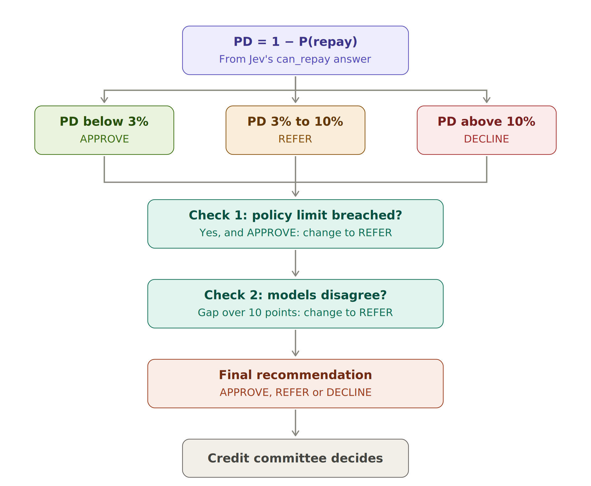
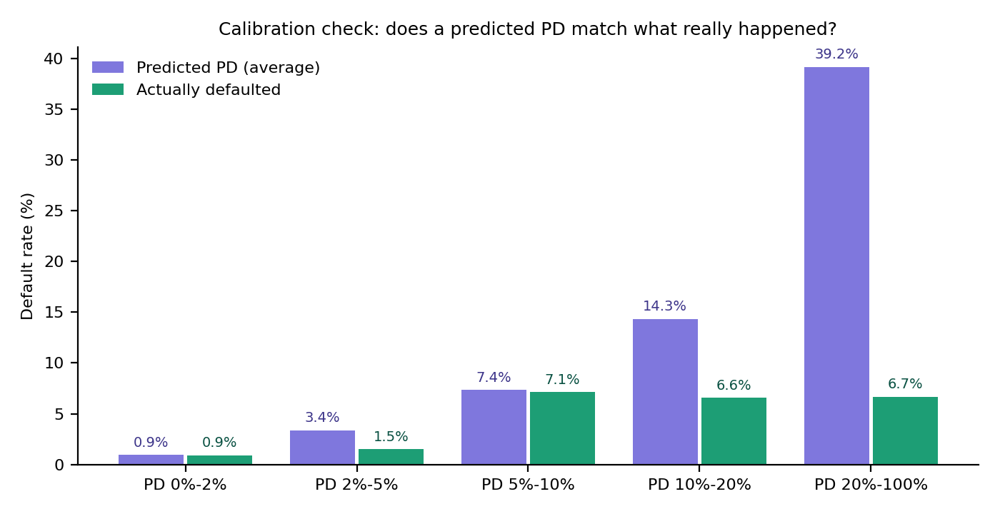

\title Jev + Tiny LLM Credit Model
\subtitle A plain-English guide to how the model works and how decisions are reached
\subtitle With simple examples · September 2026

\pagebreak

\toc

\pagebreak

# 1. The idea in one minute

A spam filter answers one question about every email: **"Is this spam?"** It doesn't write an essay. It gives a number, such as *97% likely spam*, and the mail system acts on it.

This model asks the same kind of question about a company that wants to borrow money: **"Will this borrower pay back every instalment on time over the next 12 months?"** The answer is a number, such as *99.3% likely to repay*.

That number comes from **Jev**, a new kind of AI model from TypeSafe AI, released in September 2026. Jev is built for exactly this: it reads information and returns a **calibrated probability** instead of text. "Calibrated" means that when Jev says 80%, it should be right about 80% of the time.

Around Jev we add four things, because a bank should never let one number decide a loan on its own:

1. **A second opinion:** a conventional credit scorecard.
2. **The bank's rulebook:** hard policy limits that no model can override.
3. **A writing assistant:** a tiny language model (LLM) that drafts the words of the credit memo.
4. **A human decision:** the credit committee always makes the final call.

> **In one sentence:** Jev gives a fast, calibrated judgement; the rules and the second opinion check it; the tiny LLM writes it up; and people decide.

# 2. The cast: who does what

| Part | What it does | Everyday comparison |
|---|---|---|
| **Jev ("System One")** | Reads the borrower's data and returns: probability of repaying, the main risk, and a risk grade from 1 to 5 | An experienced credit officer's quick, well-practised judgement |
| **Challenger scorecard** | A conventional statistical model, trained on past loans, that gives its own probability of default | A second doctor giving an independent opinion |
| **Policy rules** | Fixed limits such as "leverage must not exceed 6.0x" | The bank's rulebook — not negotiable |
| **Decision engine** | Combines everything into APPROVE, REFER or DECLINE | A checklist that turns opinions into a recommendation |
| **Tiny LLM ("System Two")** | Drafts the narrative paragraph of the credit memo, with no numbers in it | A junior analyst drafting prose for a senior to check |
| **Credit committee** | Reviews the memo and makes the actual decision | The people who sign the loan |

**Why "System One" and "System Two"?** The terms come from psychology (Daniel Kahneman). System One is fast, intuitive judgement — "this looks risky". System Two is slow and deliberate — writing, reasoning, explaining. Jev plays the System One role; the LLM plays the System Two role.

# 3. How it works, step by step


## Step 1 — Gather the borrower's data

Everything the model sees is put into one structured record (JSON). It holds exactly what a credit analyst would look at today:

- **Latest financial ratios** (see the box below for what they mean)
- **How those ratios changed** over the last four quarters
- **Leverage history** for the last eight quarters
- **The facility:** for example a 5-year senior secured term loan
- **The analyst's note:** a few sentences of qualitative view

### The ratios, in plain English

| Ratio | What it measures | Simple example | Good or bad? |
|---|---|---|---|
| **Leverage** (Debt ÷ EBITDA) | How many years of earnings it would take to repay the debt | Debt £57m, yearly earnings £10m → **5.7x** | Lower is safer; above 6x is very high |
| **Interest cover** (EBITDA ÷ interest) | How many times earnings cover the interest bill | Earnings £10m, interest £5m → **2.0x** | Higher is safer; below 1.5x is a warning |
| **Current ratio** | Short-term assets ÷ short-term debts | £6.7m assets vs £10m bills due → **0.67** | Below 1 means bills due soon exceed cash-like assets |
| **EBITDA margin** | Earnings as a share of sales | £5.5m earnings on £100m sales → **5.5%** | Higher means a more profitable business |

EBITDA means earnings before interest, tax, depreciation and amortisation — roughly, the cash profit from running the business.

### Example: the record for Borrower 2773 (a retailer)

```
{
  "sector": "retail",
  "facility": {"type": "senior secured term loan", "tenor_years": 5},
  "latest_quarter":         {"leverage_x": 1.9, "interest_cover_x": 9.4,
                             "current_ratio": 1.89, "ebitda_margin": 0.256},
  "change_over_4_quarters": {"leverage_x": -1.5, "interest_cover_x": +2.1},
  "analyst_note": "Outlook positive. Order book is strengthening and pricing
                   is firm. New contracts extend revenue visibility."
}
```

Reading it like an analyst: low debt (1.9x), earnings cover interest more than nine times, debt is falling, and the outlook is positive. This borrower looks strong.

## Step 2 — Ask Jev three questions

Jev can answer three kinds of question. Here they are first with everyday examples, then as used for credit.

| Question type | What it returns | Everyday example | Credit use in this model |
|---|---|---|---|
| **Noul** (yes/no) | A probability between 0 and 1 that the statement is true | "Is this email spam?" → 0.97 | `can_repay`: "Will the borrower meet every payment for 12 months?" |
| **Choice** | One option from a list, with its probability | "Is this support ticket about billing, hardware or software?" → hardware, 0.97 | `main_risk`: leverage, liquidity, profitability, business outlook, or none material |
| **Score** | A level on an ordered scale | "Rate this review from 1 to 5 stars" → 4 | `risk_grade`: 1 = strong … 5 = very weak |

All three questions go to Jev in **one request**, and the answers come back together. Each question includes written instructions and definitions of what "yes" and "no" mean, so Jev knows exactly what is being asked. **No training data is needed**: Jev judges from the instructions.

### Example: what Jev returned for Borrower 2773

| Question | Answer | Meaning |
|---|---|---|
| can_repay | 0.993 | 99.3% likely to meet every payment |
| main_risk | none material | No single risk stands out |
| risk_grade | 1 | Strong: very low risk |

## Step 3 — Turn "chance of repaying" into "chance of default"

Banks talk about the **probability of default (PD)** rather than the probability of repaying. The conversion is simple:

**PD = 1 − P(repay)**

Examples:

- Borrower 2773: 1 − 0.993 = **0.7% PD**
- A borrower with a 90% chance of repaying: 1 − 0.90 = **10% PD**
- A coin-flip borrower at 50%: **50% PD**

## Step 4 — Get a second opinion from the challenger scorecard

The challenger is a **logistic regression scorecard** — the kind of model banks have used for decades. It learned from 600 past borrowers whose outcomes (repaid or defaulted) are known. It looks at the latest ratios and their 4-quarter changes, and gives its own PD.

**Why have it?** Because two independent methods that agree give more confidence than one. If they strongly disagree, something needs a human look.

Example: for Borrower 2773 the challenger said **1.3% PD**; Jev said **0.7%**. A gap of 0.6 points — they agree.

## Step 5 — Check the bank's policy rules

These are fixed rules. They are simple on purpose, so that anyone can check them:

| Rule | Limit | Example that breaches it |
|---|---|---|
| Maximum leverage | 6.0x | A borrower at 8.6x |
| Minimum interest cover | 1.5x | A borrower at 0.1x |

A breach never lets a loan through automatically, whatever the models say.

## Step 6 — The decision engine reaches a recommendation



**First, the PD band:**

| PD | Starting recommendation | Plain meaning |
|---|---|---|
| Below 3% | APPROVE (recommend) | Low risk: recommend approval |
| 3% to 10% | REFER to credit committee | In between: needs a closer human look |
| Above 10% | DECLINE (recommend) | High risk: recommend declining |

**Then two safety checks can change it to REFER:**

1. **Policy check:** if a policy limit is breached and the band said APPROVE, the answer becomes REFER. A model cannot approve a loan that breaks the rulebook.
2. **Disagreement check:** if the band said APPROVE or DECLINE, but Jev and the challenger disagree by more than 10 percentage points, the answer becomes REFER. When the experts disagree, a human decides.

**The engine only ever recommends.** Every outcome — even APPROVE — goes to the credit committee as a draft.

## Step 7 — The tiny LLM drafts the narrative

The tiny LLM is the character-level GPT built from scratch in `mini_gpt.py` (about 0.36 million parameters). It learned to write by reading 2,000 analyst notes. It is given a starting phrase such as *"Outlook positive."* and continues the text.

**The strict rule:** the LLM writes **words only**. Every number in the memo — ratios, PDs, grades — is copied directly from the source data and the models. This follows a key principle: *numbers come from validated systems, never from text generation.*

**An honest example of why this rule matters.** For Borrower 2628, the tiny LLM wrote: *"Customer concentration is a concern after a key contract loss. Refinancing of the term loan is not yet agreed."* Neither statement is in that borrower's analyst note. The LLM produced plausible-sounding sentences it had seen in *other* notes. This is a small-scale version of **hallucination**, and it is exactly why the narrative is labelled "for RM review" and a person must check every sentence before the memo goes anywhere.

## Step 8 — Log everything for audit

Every recommendation is saved as one line in an audit log. A shortened example:

```
{
  "timestamp": "2026-09-26T09:43:...",
  "borrower_id": 2798,
  "input_hash": "3f9c...",           <- fingerprint of exactly what the model saw
  "model_versions": {"decision_model": "...", "questions": "...", "policy": "..."},
  "jev_answers": {"can_repay": {"noul": 0.727}, "main_risk": {"choice": "profitability"}},
  "pd": 0.273, "challenger_pd": 0.123,
  "recommendation": "REFER to credit committee",
  "override_reasons": ["decision model (27.3%) and challenger (12.3%) disagree by more than 10% points"],
  "human_decision": null, "decided_by": null     <- filled in by the committee
}
```

This lets anyone answer, months later: *what did the model see, which version was it, what did it recommend, why, and who made the final decision?* That is the evidence regulators expect under PRA SS1/23.

\pagebreak

# 4. Three worked examples

These are real outputs from running the code on synthetic borrowers.

## Example A — Borrower 2773 (retail): APPROVE

| Step | What happened |
|---|---|
| **Data** | Leverage 1.9x (down 1.5x), interest cover 9.4x (up 2.1x), current ratio 1.89, margin 25.6%. Note: "Outlook positive … order book strengthening." |
| **Jev** | P(repay) 99.3% → **PD 0.7%**. Main risk: none material. Grade 1 (strong). |
| **Challenger** | PD 1.3% — agrees (gap 0.6 points). |
| **Policy rules** | No breach (1.9x is well below 6.0x; 9.4x is well above 1.5x). |
| **PD band** | 0.7% is below 3% → **APPROVE**. |
| **Checks** | No breach, no disagreement → stays APPROVE. |
| **Result** | **APPROVE (recommend)**, sent to the committee as a draft. |

**Why it makes sense:** low debt, strong and improving earnings, positive outlook, and two independent models agree. This is the easy case.

## Example B — Borrower 2798 (energy): REFER, because the models disagree

| Step | What happened |
|---|---|
| **Data** | Leverage 5.7x (close to the 6.0x limit), interest cover 2.0x, current ratio 0.67 (short-term bills exceed liquid assets), margin 5.5%. Note: "Outlook negative … covenant headroom narrowing … working capital has absorbed cash." |
| **Jev** | P(repay) 72.7% → **PD 27.3%**. Main risk: profitability. Grade 4 (weak). |
| **Challenger** | PD 12.3%. |
| **Policy rules** | No breach — but only just (5.7x vs 6.0x limit). |
| **PD band** | 27.3% is above 10% → **DECLINE**. |
| **Checks** | Jev (27.3%) and challenger (12.3%) differ by 15 points, more than 10 → changed to **REFER**. |
| **Result** | **REFER to credit committee.** |

**Why it makes sense:** both models see high risk, but they disagree strongly on *how* high. The borrower sits just under the leverage limit with weak liquidity and a negative outlook. That is precisely the kind of borderline, judgement-heavy case a committee should look at, rather than a model declining automatically.

## Example C — Borrower 2628 (industrials): REFER, with two policy breaches

| Step | What happened |
|---|---|
| **Data** | Leverage 8.6x (rising), interest cover 0.1x (earnings barely cover a tenth of the interest bill), current ratio 0.30, margin −7.9% (loss-making). Note: "Outlook negative … softer orders … covenant headroom narrowing." |
| **Jev** | P(repay) 32.0% → **PD 68.0%**. Main risk: profitability. Grade 5 (very weak). |
| **Challenger** | PD 15.8%. |
| **Policy rules** | **Two breaches:** leverage 8.6x above 6.0x; interest cover 0.1x below 1.5x. |
| **PD band** | 68% is above 10% → **DECLINE**. |
| **Checks** | Models disagree by 52 points → changed to **REFER**. |
| **Result** | **REFER to credit committee**, with both breaches listed. |

**Why it makes sense:** every signal says this borrower is in serious trouble, and the committee will almost certainly decline. But the large gap between the two models is itself a warning that at least one model is badly calibrated for this kind of borrower (see section 5). Sending it to people, with the breaches spelled out, is the safe design.

## The three examples side by side

| | Borrower 2773 | Borrower 2798 | Borrower 2628 |
|---|---|---|---|
| Leverage | 1.9x | 5.7x | 8.6x |
| Interest cover | 9.4x | 2.0x | 0.1x |
| Jev PD | 0.7% | 27.3% | 68.0% |
| Challenger PD | 1.3% | 12.3% | 15.8% |
| Policy breaches | None | None | Two |
| PD band | APPROVE | DECLINE | DECLINE |
| Final recommendation | **APPROVE** | **REFER** (disagreement) | **REFER** (disagreement; breaches flagged) |

\pagebreak

# 5. How do we know if the model is any good?

A credit model must be tested on borrowers it has never seen, whose outcomes we know. The code holds back 400 borrowers for this.

## Three simple measures

**AUC (ranking power).** Pick one borrower who defaulted and one who repaid, at random. AUC is how often the model gives the defaulter the higher PD. 0.5 = coin toss; 1.0 = perfect.

**Brier score (accuracy of the probabilities).** The average squared gap between the PD and what happened (1 if defaulted, 0 if not). Lower is better. Example: a 10% PD for a borrower who repaid scores (0.10 − 0)² = 0.01.

**Calibration (do the percentages mean what they say?).** Group borrowers by predicted PD and compare the average prediction with the share that actually defaulted. If a group was predicted at 7%, about 7% should default.

## Results from the test run

| Model | AUC | Brier | Labels needed |
|---|---|---|---|
| Decision model (offline stand-in — see section 6) | 0.665 | 0.075 | 0 |
| Challenger scorecard | 0.673 | 0.043 | 600 |
| Best possible on this data (true synthetic PD) | 0.731 | 0.040 | — |



**Reading the chart:**

- **Low PDs are accurate.** Borrowers predicted below 2% defaulted at 0.9% — spot on. The 5–10% group predicted 7.4% and saw 7.1%.
- **High PDs are far too high.** Borrowers predicted at 39% on average actually defaulted at only 6.7%.
- **So the model ranks well but exaggerates risk at the top.** It sorts borrowers in roughly the right order (AUC close to the trained challenger), but its high percentages can't be taken literally.

**This is exactly what validation is for.** A model can look confident and still be wrong about *how* risky something is. The check caught it before any decision relied on those numbers. It is also why Examples B and C were sent to people rather than declined automatically.

## What happened to each recommendation band

| Band | Borrowers | Share that actually defaulted |
|---|---|---|
| APPROVE | 136 | 0.7% |
| REFER | 98 | 5.1% |
| DECLINE | 166 | 6.6% |

The APPROVE group is genuinely safe (fewer than 1 in 100 defaulted). The REFER and DECLINE groups carry most of the defaults — but the DECLINE group's default rate is not much higher than REFER's, which confirms the calibration problem at the high end. A real deployment would recalibrate before use.

\pagebreak

# 6. Important: the real Jev versus the offline stand-in

Jev runs as an online service at `api.typesafe.ai` and needs an API key. The environment where this code was built could not reach it, so the results above come from a **local stand-in**:

- **What the stand-in is:** a short, hand-written rule that looks at the ratios and key phrases in the analyst note and returns answers in exactly Jev's format.
- **What it is not:** it is **not Jev**, and its results say nothing about how good Jev is.
- **Why it exists:** so the whole pipeline — questions, checks, memo, audit log, validation — can be run and tested anywhere.

**To use the real Jev:**

```
export TYPESAFE_API_KEY=your-key
cd code
python credit_jev_llm.py
```

The same validation then runs on Jev's real answers. Whether Jev beats the challenger, and whether its calibration holds up on credit data, is exactly what that run will show. Jev's public benchmark results are for spam detection; its performance on credit has to be proven, not assumed.

# 7. What could go wrong, and how the design protects against it

| Risk | Simple example | Protection in this design |
|---|---|---|
| **Probabilities are wrong** | Model says 39% but only 6.7% default | Calibration check on held-out borrowers; retest regularly |
| **The LLM invents facts** | Narrative mentions a refinancing that isn't in the note | LLM writes no numbers; narrative marked "for RM review"; human checks every sentence |
| **A model approves a rule-breaker** | Low PD but leverage 7x | Policy rules override the model and force REFER |
| **One model is badly wrong** | Jev says 68%, challenger says 16% | Disagreement check forces REFER |
| **The vendor changes the model** | Jev is updated and answers shift | Model version recorded on every decision; re-validate after any change |
| **Client data leaves the bank** | Borrower details sent to an external API | Data-protection review, contract terms and model-risk approval before any real data is sent |
| **People stop thinking** | Committee rubber-stamps every APPROVE | Everything is a draft; decisions are recorded by name; sample reviews |
| **Unfair treatment** | Model penalises one sector for the wrong reasons | Monitor outcomes by sector; document the questions Jev is asked |

**Regulatory note.** Lending to companies is outside the EU AI Act's "high-risk" list, which covers credit decisions about *individuals*. A version of this model used for personal loans would be high-risk and need much stronger controls. In the UK, the model falls under PRA SS1/23 model risk management either way.

# 8. How to explain it in the interview (30 seconds)

> "Jev is a new type of model — a decision model rather than a text generator. You give it data and a precise question, like 'will this borrower meet every payment for twelve months?', and it returns a calibrated probability. I use it as the fast System One judgement, then wrap it in controls: fixed policy limits, a challenger scorecard, and an automatic refer when they disagree. A tiny LLM drafts the memo narrative but never produces a number. Every recommendation is logged with model versions, and the credit committee decides. Crucially, I validate the calibration on our own portfolio before trusting it — in my test, the stand-in ranked well but overstated risk at the top, which is exactly the kind of thing validation must catch."

# 9. Glossary

| Term | Plain meaning |
|---|---|
| **PD (probability of default)** | The chance a borrower fails to repay within a period, usually 12 months |
| **P(repay)** | The chance the borrower repays; PD = 1 − P(repay) |
| **Calibrated** | The percentages mean what they say: 20% predictions come true about 20% of the time |
| **Noul question** | Jev's yes/no question type; returns a probability |
| **Challenger model** | An independent model used to check the main one |
| **Logistic regression** | A classic, transparent statistical model that turns inputs into a probability |
| **AUC** | How well a model ranks risky borrowers above safe ones (0.5 = random, 1 = perfect) |
| **Brier score** | Average squared error of the probabilities; lower is better |
| **Leverage** | Debt divided by yearly earnings (EBITDA) |
| **Interest cover** | Yearly earnings divided by the yearly interest bill |
| **Hallucination** | When a language model writes something plausible but untrue |
| **Audit log** | A permanent record of what the model saw, what it said and who decided |
| **System One / System Two** | Fast intuitive judgement versus slow deliberate reasoning |
| **Synthetic data** | Realistic but invented data, used to build and test safely |

# Sources

- Simon Willison, "Jev introduces a new shape of LLM" (21 September 2026) — simonwillison.net/2026/Sep/21/jev/
- Jev AI, "Jev: the System One model for fast, calibrated AI decisions" — jevai.net/articles/what-is-system-one-jev/
- P. Niessen, "jev-test" benchmark (API request format and spam results) — github.com/pniessen/jev-test
- Code for this guide: `credit_jev_llm.py` and `jev_client.py` in the `smbc-interview-prep/code` folder
